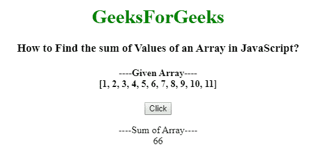
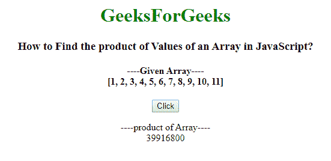
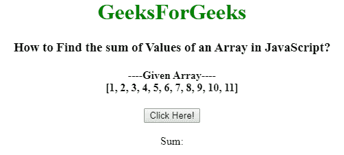
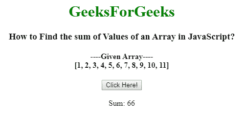
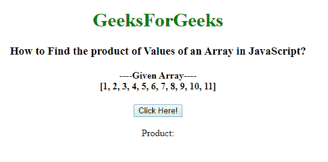
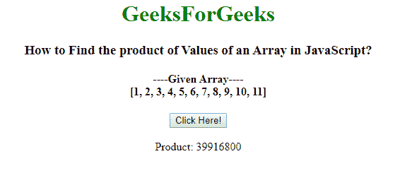

# 使用 JavaScript 的数组元素的和与积

> 原文:[https://www . geesforgeks . org/sum-and-product-of-array-elements-use-JavaScript/](https://www.geeksforgeeks.org/sum-and-product-of-array-elements-using-javascript/)

给定一个数组，任务是使用 JavaScript 找到数组值的和与积。

**简单方法:**它用一个简单的方法，通过一个索引号访问数组元素，并使用循环使用 JavaScript 找到一个 array 的值的和与积。

**示例 1:** 这个示例使用一个简单的方法，使用 JavaScript 找到 Array 元素的和。

```
<!DOCTYPE html>
<html>

<head>
    <title>
        How to Find the sum of Values
        of an Array in JavaScript?
    </title>
</head>

<body style="text-align:center;">

    <h1 style = "color:green;" > 
        GeeksForGeeks 
    </h1> 

    <h3>
        How to Find the sum of Values
        of an Array in JavaScript?
    </h3>

    <h4>
        ----Given Array----<br>
        [1, 2, 3, 4, 5, 6, 7, 8, 9, 10, 11]
    </h4>

    <button onclick="myFunction()">Click</button>

    <p id="gfg"></p>

    <script>
        $(document).ready(function() {
            $("button").click(function() {
                function sum(input) {
                    if (toString.call(input) !== "[object Array]")
                    return false;

                    var total = 0;
                    for(var i=0;i<input.length;i++) {                 
                        if(isNaN(input[i])) {
                            continue;
                        }

                        total += Number(input[i]);
                    }
                    return total;
                }
                document.getElementById("gfg").innerHTML
                        = "----Sum of Array----" + "<br>"
                        + sum([1, 2, 3, 4, 5, 6, 7, 8, 9, 10, 11]);
            });
        });
    </script>
</body>

</html>              
```

**输出:**

*   **之前点击按钮:**
    *   **After Click on the Button:**
    

    **示例 2:** 这个示例使用一个简单的方法，使用 JavaScript 查找 Array 元素的乘积。

    ```
    <!DOCTYPE html>
    <html>

    <head>
        <title>
            How to Find the product of Values
            of an Array in JavaScript?
        </title>
    </head>

    <body style="text-align:center;">

        <h1 style = "color:green;" > 
            GeeksForGeeks 
        </h1> 

        <h3>
            How to Find the product of Values
            of an Array in JavaScript?
        </h3>

        <h4>
            ----Given Array----<br>
            [1, 2, 3, 4, 5, 6, 7, 8, 9, 10, 11]
        </h4>

        <button onclick="myFunction()">Click</button>

        <p id="gfg"></p>

        <script>
            $(document).ready(function(){
                $("button").click(function(){
                    function product(input) {
                        if (toString.call(input) !== "[object Array]")
                        return false;

                        var total = 1;
                        for(var i=0;i<input.length;i++) {                 
                            if(isNaN(input[i])){
                                continue;
                            }

                            total *= Number(input[i]);
                        }
                        return total;
                    }
                    document.getElementById("gfg").innerHTML
                        = "----product of Array----" + "<br>" 
                        + product([1, 2, 3, 4, 5, 6, 7, 8, 9, 10, 11]);
                });
            });
        </script>
    </body>

    </html>      
    ```

    **输出:**

    *   **之前点击按钮:**
        
    *   **点击按钮后:**
        

    **使用 [reduce()方法:](http://geeksforgeeks.org/javascript-array-reduce-method/)**JavaScript 中的 array reduce()方法用于将数组缩减为单个值，并为数组的每个值(从左到右)执行一个提供的函数，该函数的返回值存储在累加器中。

    **语法:**

    ```
    array.reduce( function( total, currentValue, currentIndex, arr ), initialValue )
    ```

    **示例 1:** 本示例使用 array reduce()方法，使用 JavaScript 查找 array 的值之和。

    ```
    <!DOCTYPE html>
    <html>

    <head>
        <title>
            How to Find the sum of Values
            of an Array in JavaScript?
        </title>
    </head>

    <body style="text-align:center;">

        <h1 style = "color:green;" > 
            GeeksForGeeks 
        </h1> 

        <h3>
            How to Find the sum of Values
            of an Array in JavaScript?
        </h3>

        <h4>
            ----Given Array----<br>
            [1, 2, 3, 4, 5, 6, 7, 8, 9, 10, 11]
        </h4>

        <button onclick="myGeeks()"> 
            Click Here! 
        </button>

        <br><br>

        Sum: <span id="GFG"></span> 

        <script>
            var arr=[1, 2, 3, 4, 5, 6, 7, 8, 9, 10, 11];

            function sumofArray(sum, num) { 
                return sum + num; 
            } 
            function myGeeks(item) { 
                document.getElementById("GFG").innerHTML 
                    = arr.reduce(sumofArray); 
            } 
        </script>
    </body>

    </html>        
    ```

    **输出:**

    *   **之前点击按钮:**
        
    *   **点击按钮后:**
        

    **示例 2:** 本示例使用 array reduce()方法，使用 JavaScript 查找 array 的值的乘积。

    ```
    <!DOCTYPE html>
    <html>

    <head>
        <title>
            How to Find the product of Values
            of an Array in JavaScript?
        </title>
    </head>

    <body style="text-align:center;">

        <h1 style = "color:green;" > 
            GeeksForGeeks 
        </h1> 

        <h3>
            How to Find the product of Values
            of an Array in JavaScript?
        </h3>

        <h4>
            ----Given Array----<br>
            [1, 2, 3, 4, 5, 6, 7, 8, 9, 10, 11]
        </h4>

        <button onclick="myGeeks()"> 
            Click Here! 
        </button>

        <br><br>

        Product: <span id="GFG"></span> 

        <script>
            var arr=[1, 2, 3, 4, 5, 6, 7, 8, 9, 10, 11];

            function productofArray(product, num) { 
                return product * num; 
            } 
            function myGeeks(item) { 
                document.getElementById("GFG").innerHTML 
                        = arr.reduce(productofArray); 
            } 
        </script>
    </body>

    </html>         
    ```

    **输出:**

    *   **之前点击按钮:**
        
    *   **点击按钮后:**
        