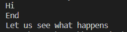

# JavaScript 中的同步和异步

> 原文:[https://www . geesforgeks . org/同步和异步 javascript/](https://www.geeksforgeeks.org/synchronous-and-asynchronous-in-javascript/)

**同步 JavaScript:** 顾名思义，同步是指在一个序列中，即代码的每一条语句都被逐个执行。因此，基本上一条语句必须等待前面的语句被执行。
让我们借助一个例子来理解这一点。

**示例:**

```
<script>
    document.write("Hi"); // First
    document.write("<br>");

    document.write("Mayukh") ;// Second
    document.write("<br>");

    document.write("How are you"); // Third
</script>
```

**输出:**


在上面的代码片段中，首先记录代码的第一行`**Hi**`，然后记录第二行`**Mayukh**`，完成后，记录第三行`**How are you**`。
所以我们可以看到代码是按顺序工作的。每一行代码都等待前一行先被执行，然后再被执行。

**异步 JavaScript:** 异步代码允许程序立即执行，其中同步代码将阻止剩余代码的进一步执行，直到它完成当前代码。这可能看起来不是一个大问题，但是当你从更大的角度来看时，你会意识到这可能会导致用户界面的延迟。

让我们看看异步 JavaScript 如何运行的例子。

```
<script>
    document.write("Hi");
    document.write("<br>");

    setTimeout(() => {
        document.write("Let us see what happens");
    }, 2000);

    document.write("<br>");
    document.write("End");
    document.write("<br>");
</script>
```

**输出:**


所以，代码首先登录`**Hi**`，然后不执行`**setTimeout**`函数，而是登录`**End**`，然后运行`**setTimeout**`函数。

起初，像往常一样，登录了`**Hi**`语句。当我们使用浏览器运行 JavaScript 时，有一些 web APIs 为用户处理这些事情。因此，JavaScript 所做的是，它在这样的网络应用编程接口中传递`**setTimeout**`函数，然后我们像往常一样继续运行我们的代码。因此，它不会阻止其余代码执行，在所有代码执行完毕后，它会被推送到调用堆栈，然后最终被执行。这就是异步 JavaScript 中发生的情况。