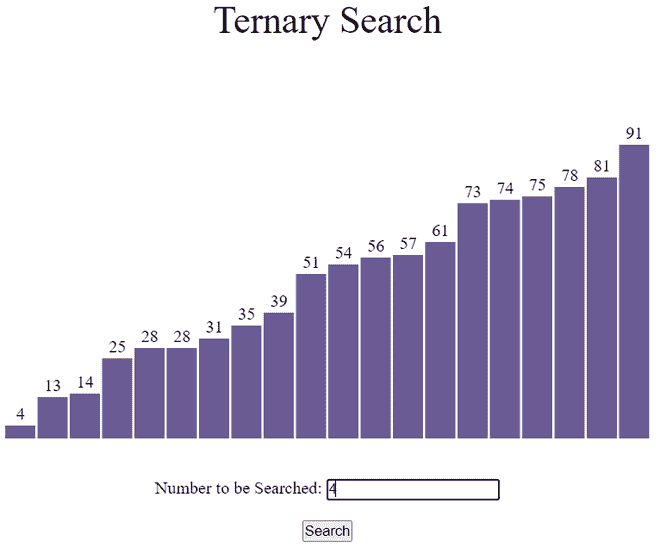
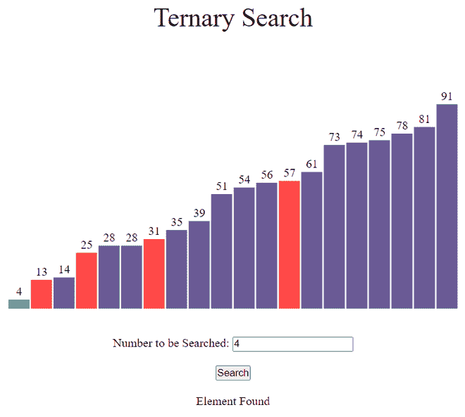
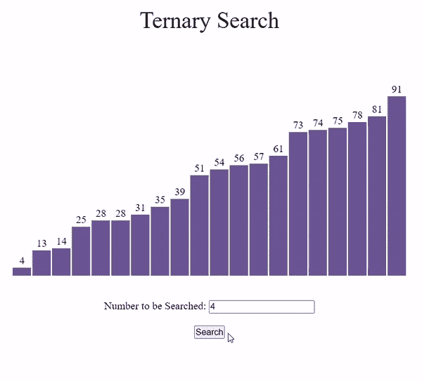

# 使用 JavaScript 的三元搜索可视化

> 原文:[https://www . geesforgeks . org/三元-搜索-可视化-使用-javascript/](https://www.geeksforgeeks.org/ternary-search-visualization-using-javascript/)

**GUI(图形用户界面)**比程序更有助于理解。在本文中，我们将使用 JavaScript 可视化三元搜索。我们将看到元素如何在三元搜索中遍历，直到找到给定的元素。我们还将可视化三元搜索的时间复杂性。

**参考:**

*   [三元搜索](https://www.geeksforgeeks.org/ternary-search/)
*   [JavaScript 中的异步函数](https://www.geeksforgeeks.org/how-to-create-an-asynchronous-function-in-javascript/)

**进场:**

*   首先，我们将使用 [Math.random()](https://www.geeksforgeeks.org/javascript-math-random-method/) 函数生成一个随机数组，然后使用 [sort()](https://www.geeksforgeeks.org/javascript-array-sort-method/) 函数对其进行排序。
*   不同的颜色用于指示当前时间哪个元素正在被**遍历**。
*   由于算法的运算速度非常快， [setTimeout()](https://www.geeksforgeeks.org/java-script-settimeout-setinterval-method/) 功能被用来减缓进程。
*   按**“Ctrl+R”**键可生成新数组。
*   使用 **TernarySearch()** 功能进行搜索。



搜索前



搜索后

下面是可视化[三元搜索](https://www.geeksforgeeks.org/ternary-search/)算法的程序。

## index.html

```html
<!DOCTYPE html>
<html lang="en">

<head>
    <meta charset="UTF-8" />
    <meta name="viewport" content=
        "width=device-width, initial-scale=1.0" />
    <link rel="stylesheet" href="style.css" />
</head>

<body>
    <br />
    <p class="header">Ternary Search</p>

    <div id="array"></div>
    <br /><br />

    <div style="text-align: center">
        <label for="fname">
        Number to be Searched:
      </label>
        <input type="text" id="fname" name="fname" />
        <br /><br />
        <button id="btn" onclick="TernarySearch()">
        Search
      </button>
        <br />
        <br />
        <div id="text"></div>
    </div>

    <script src="script.js"></script>
</body>

</html>
```

**style.css:** 以下是上述文件中使用的“style.css”的内容。

## style.css

```html
* {
    margin: 0px;
    padding: 0px;
    box-sizing: border-box;
}

.header {
    font-size: 35px;
    text-align: center;
}

#array {
    background-color: white;
    height: 305px;
    width: 598px;
    margin: auto;
    position: relative;
    margin-top: 64px;
}

.block {
    width: 28px;
    background-color: #6b5b95;
    position: absolute;
    bottom: 0px;
    transition: 0.2s all ease;
}

.block_id {
    position: absolute;
    color: black;
    margin-top: -20px;
    width: 100%;
    text-align: center;
}
```

**script.js:** 以下是上述 HTML 代码中使用的“script.js”文件的内容。

## script.js

```html
var container = document.getElementById("array");

// Function to generate the array of blocks
function generatearray() {

    // Creating an array
    var arr = [];

    // Filling array with random values
    for (var i = 0; i < 20; i++) {

        // Return a value from 1 to 100 (both inclusive)
        var val = Number(Math.ceil(Math.random() * 100));
        arr.push(val);
    }

    // Sorting Array in ascending order
    arr.sort(function(a, b) {
        return a - b;
    });

    for (var i = 0; i < 20; i++) {
        var value = arr[i];

        // Creating element div
        var array_ele = document.createElement("div");

        // Adding class 'block' to div
        array_ele.classList.add("block");

        // Adding style to div
        array_ele.style.height = `${value * 3}px`;
        array_ele.style.transform = `translate(${i * 30}px)`;

        // Creating label element for displaying
        // size of particular block
        var array_ele_label = document.createElement("label");
        array_ele_label.classList.add("block_id");
        array_ele_label.innerText = value;

        // Appending created elements to index.html
        array_ele.appendChild(array_ele_label);
        container.appendChild(array_ele);
    }
}

// Asynchronous TernarySearch function
async function TernarySearch(delay = 700) {
    var blocks = document.querySelectorAll(".block");
    var output = document.getElementById("text");

    // Extracting the value entered by the user
    var num = document.getElementById("fname").value;

    // Colouring all the blocks voilet
    for (var i = 0; i < blocks.length; i += 1) {
        blocks[i].style.backgroundColor = "#6b5b95";
    }

    output.innerText = "";

    // TernarySearch Algorithm
    var start = 0;
    var end = 19;
    var flag = 0;
    while (start <= end) {
        var mid1 = Math.floor(start + (end - start) / 3);
        var mid2 = Math.floor(end - (end - start) / 3);

        // Extracting values of mid1 and mid2 blocks
        var value1 = Number(blocks[mid1].childNodes[0].innerHTML);
        var value2 = Number(blocks[mid2].childNodes[0].innerHTML);

        // Changing color to red
        blocks[mid1].style.backgroundColor = "#FF4949";
        blocks[mid2].style.backgroundColor = "#FF4949";

        // To wait for .1 sec
        await new Promise((resolve) =>
            setTimeout(() => {
                resolve();
            }, delay)
        );

        // Number entered by the user equals to
        // element at mid1
        if (value1 == num) {
            output.innerText = "Element Found";
            blocks[mid1].style.backgroundColor = "#13CE66";
            flag = 1;
            break;
        }

        // Number entered by the user equals to
        // element at mid2
        if (value2 == num) {
            output.innerText = "Element Found";
            blocks[mid2].style.backgroundColor = "#13CE66";
            flag = 1;
            break;
        }

        if (num < value1) {
            end = mid1 - 1;
        } else if (num > value2) {
            start = mid2 + 1;
        } else {
            start = mid1 + 1;
            end = mid2 - 1;
        }
    }

    if (flag === 0) {
        output.innerText = "Element Not Found";
    }
}

// Calling generatearray function
generatearray();
```

**输出:**

