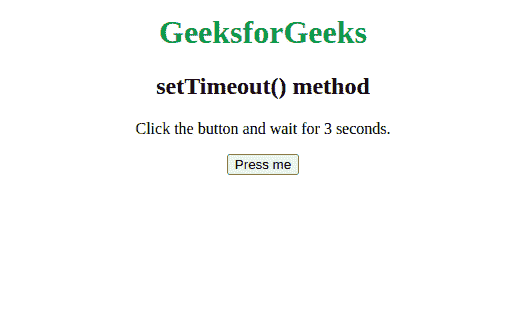
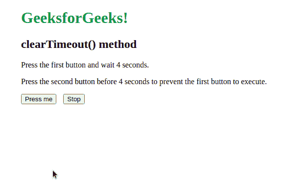
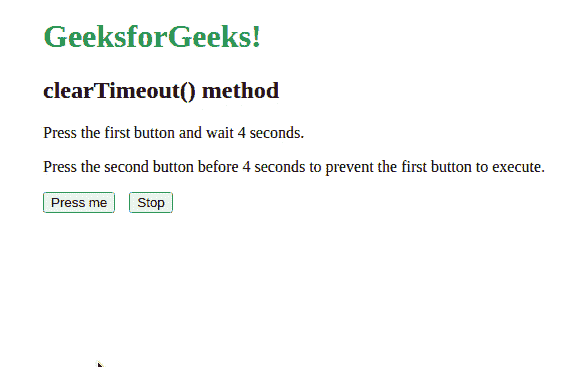
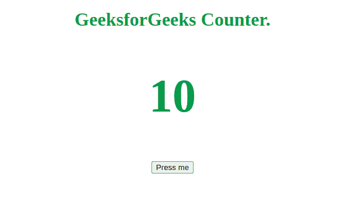

# Javascript 中的计时事件

> 原文:[https://www.geeksforgeeks.org/timing-events-in-javascript/](https://www.geeksforgeeks.org/timing-events-in-javascript/)

定时事件是帮助在特定时间间隔执行一段代码的事件。这些事件在 HTML DOM(文档对象模型)窗口对象中直接可用，即它们存在于浏览器中。因此，这些被称为全局方法，可以通过“窗口”对象调用，也可以不通过它调用。下面列出了各种计时事件:

**[setTimeout()方法](https://www.geeksforgeeks.org/java-script-settimeout-setinterval-method/) :** 此方法用于在一定时间后执行一段代码。大多数情况下，这段代码是在一个函数中编写的。该函数要么作为参数传递，要么作为匿名函数直接作为参数传递。它返回一个正整数，表示由于调用 setTimeout 方法而创建的计时器的标识。使用变量存储标识是可选的，但这取决于我们想使用 *clearTimeout()* 方法取消计时器的情况。

通过的*功能*在定时器停止后执行。传递的参数(在延迟时间后指定)是可选的，可通过此功能*访问。**延迟*是定时器必须等待功能执行的时间。它以毫秒为单位写入，因此“1000”代表“1”秒。

**语法:**

```html
let timeoutID = scope.setTimeout(function, delay, param1, param2, ...)
```

下面的示例演示了 setTimeout()方法:

**示例:**

## 超文本标记语言

```html
<!DOCTYPE html>
<html>

<body style="text-align:center;">
    <h1 style="color:#378E47;">
        GeeksforGeeks
    </h1>

    <h2>setTimeout() method</h2>
    <p>Click the button and wait for 3 seconds.</p>

    <!-- Setting the onclick method for the button -->
    <button onclick="setTimeout(geeksforgeeks, 3000);">
        Press me
    </button>

    <h2 style="font-size:3em;color:#378E47;"></h2>

    <script>
        function geeksforgeeks() {

            // Fetching the first index h2 element
            var h2Heading =
                document.getElementsByTagName("h2")[1];

            // Changing the innerHTML tag of the
            // fetched h2 heading
            h2Heading.innerHTML = "Welcome here!";
        }
    </script>
</body>

</html>
```

**输出:**



**[clearTimeout()方法](https://www.geeksforgeeks.org/javascript-cleartimeout-clearinterval-method/) :** 使用*“clear time out()”*方法来取消使用 *setTimeout()* 方法建立的超时。如果在 setTimeout()方法中指定的时间延迟内调用作为参数传递的函数，此方法将停止执行该函数。

它接受一个参数，即 *setTimeout() m* 方法返回的 *timoutID* 。传递给此方法的无效标识将不起任何作用。

**语法:**

```html
scope.clearTimeout(timeoutID) 
```

下面的示例演示了 clearTimeout()方法:

**示例:**

## 超文本标记语言

```html
<!DOCTYPE html>
<html>

<body style="margin-left:50px;">
    <h1 style="color:#378E47;">
        GeeksforGeeks!
    </h1>

    <h2>clearTimeout() method</h2>
    <p>Press the first button and wait 4 seconds.</p>

    <p>
        Press the second button before 4 seconds to
        prevent the first button to execute.
    </p>

    <button style="margin-right:10px" 
        onclick="startFunction()">Press me
    </button>

    <button onclick="stopFunction()">Stop</button>
    <h1 style="font-size:3em; color: #378E47;"></h1>

    <!-- Javascript Code -->
    <script>
        var setTimeoutID;

        function startFunction() {
            setTimeoutID = setTimeout(function () {

                // Fetching the first indexed h1 element
                var h2Heading =
                    document.getElementsByTagName("h1")[1];

                // Changing the innerHTML tag of the 
                // fetched h2 heading
                h2Heading.innerHTML = "Welcome here!";
            }, 4000);
        }

        function stopFunction() {
            clearTimeout(setTimeoutID);
        }
    </script>
</body>

</html>
```

**输出:**

 

**[setInterval()方法](https://www.geeksforgeeks.org/java-script-settimeout-setinterval-method/) :** 该方法用于在每次调用之间的固定时间间隔内重复执行一段代码。每个参数的含义和用法与 *setTimeout()* 方法相同。它返回一个正整数，表示由于调用 setTimeout 方法而创建的计时器的标识。使用变量存储标识是可选的，但这取决于我们想使用 *clearInterval()* 方法取消定时器的情况。

传递的参数(在延迟时间后指定)是可选的，可通过*功能访问。**延迟*是决定作为参数传递的函数执行频率的时间。它以毫秒为单位写入，因此“1000”代表“1”秒。

**语法:**

```html
var intervalID = scope.setInterval(function, delay, param1, param2, ...)
```

**[clearInterval()方法](https://www.geeksforgeeks.org/javascript-cleartimeout-clearinterval-method/) :** 此方法用于取消使用 *setInterval()* 方法建立的重复定时动作。如果在 setInterval()方法的所有时间间隔结束之前调用了作为参数传递的函数，则此方法会停止执行该函数。

它接受一个参数，即*设置间隔()m* 方法返回的*有效间隔*。传递给此方法的无效标识将不起任何作用。

**语法:**

```html
scope.clearInterval(intervalID)
```

下面的示例演示了 clearInterval()方法:

**示例:**

## 超文本标记语言

```html
<!DOCTYPE html>
<html>

<body style="text-align:center; color:#378E47;">
    <h1> GeeksforGeeks Counter.</h1>
    <h2 style="font-size:5em;">10</h2>

    <!-- Setting the onclick method for the button -->
    <button onclick="geeksforgeeksCounter()">
        Press me
    </button>

    <!-- JavaScript code -->
    <script>

        // Variable for maintaining count of the timer
        let count = 10;

        function geeksforgeeksCounter() {

            // Fetching the 0th indexed h2 element
            var h2Heading =
                document.getElementsByTagName("h2")[0];
            var countDownID = setInterval(function () {
                count--;
                h2Heading.innerHTML = count;

                if (count <= 0) {
                    // Changing the innerHTML tag of 
                    // the fetched h2 heading.
                    h2Heading.innerHTML = "Welcome here!";
                    // Stop the timer
                    clearInterval(countDownID);
                }
            }, 1000);
        }
    </script>
</body>

</html>
```

**输出:**



**其他要点:**

*   *setTimeout()* 和 *setInterval()* 方法共享同一个池来存储 id，这意味着我们可以互换使用 *clearTimeout()* 和 *clearInterval()* 方法。然而，我们应该避免这样做。
*   支持 *setTimeout()* 和 *setInterval()* 方法的浏览器主要有，谷歌 Chrome，互联网浏览器，Safari，Opera，火狐。
*   当不需要使用 *clearTimeout()* 或 *clearInterval()* 方法时，则不需要分别存储 s *etTimeout()* 或 *setInterval()* 方法返回的 ID。