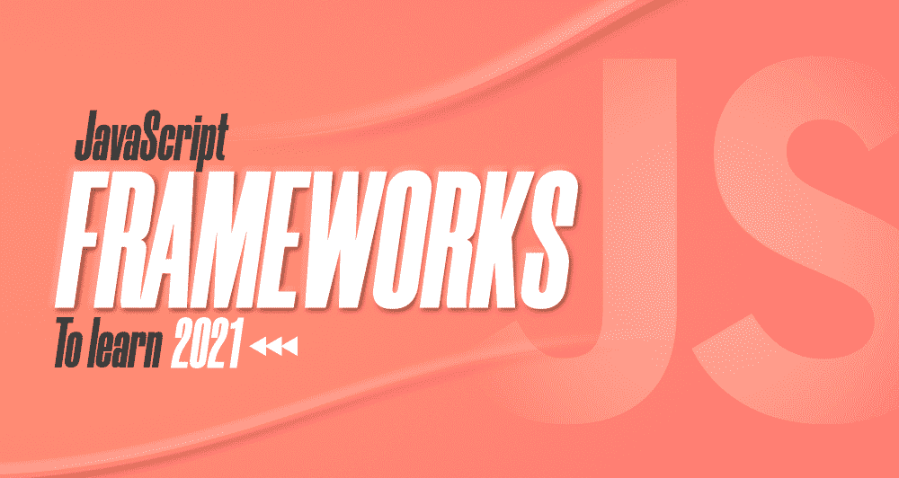

# 2021 年十大值得学习的 JavaScript 框架

> 原文:[https://www . geesforgeks . org/top-10-JavaScript-框架-2021 年要学/](https://www.geeksforgeeks.org/top-10-javascript-frameworks-to-learn-in-2021/)

考虑到几个著名平台的报告，如 [**【堆栈溢出】**](https://insights.stackoverflow.com/survey/2020) 和[**Statista**](https://www.statista.com/statistics/793628/worldwide-developer-survey-most-used-languages/)[JavaScript](https://www.geeksforgeeks.org/javascript-tutorial/)在 2020 年最后一年位居全球最受欢迎的编程语言之首，有非常积极的迹象表明，这种特定的语言也将在 2021 年占据主导地位。对 JavaScript 的巨大需求背后的主要原因可能是它对客户端和服务器端开发的支持。尽管随着 JavaScript 需求的增长和普及，也有许多丰富的 JS 框架可供使用——在所有这些选项中找到最佳框架是一项相当艰巨的任务，尤其是对于初学者开发人员来说。

在进一步讨论之前，让我们先看看这个问题–**为什么我们需要 JavaScript 框架？**一般来说，JavaScript Frameworks 实际上是 JS 代码库的集合，为您提供了可以用于标准编程功能和任务的预写 JavaScript 代码。它允许您高效地创建网站或网络应用程序。它节省了您的时间并提高了您的工作效率，因为您在框架中获得了各种预先编写的功能，并且您也不需要担心其他问题，如从头开始构建一切、安全问题等。

现在，让我们回到**的主要关注点，从**开始寻找一个有价值的、能够满足您所有需求的 JS 框架。为了让您更轻松，我们根据各种关键因素和统计数据，为 2021 年汇编了几个最受欢迎和推荐的 JavaScript 框架列表。

*让我们从 JS 框架列表开始:*

### 1.有角的

Angular 由谷歌支持，是一个开源的前端网络框架，允许 JavaScript 与其他网络技术(如 HTML 和 CSS)集成。Angular 的最新版本是在 2020 年的最后一年发布的，它基于 TypeScript(JavaScript 的超集)，你需要知道全世界有超过 40 万个网站是用 Angular 构建的。它使您能够为桌面和移动开发本机和 web 应用程序，并且非常适合企业 web 应用程序的开发。

此外，Angular 遵循 [MVC(模型-视图-控制器)](https://www.geeksforgeeks.org/model-view-controllermvc-architecture-for-node-applications/)架构模式，并为您提供控制 UI 组件&行为的权限。在 Angular 中，您可以根据自己的需求来操作 DOM 属性。该框架在开发人员中非常受欢迎，因为它具有一些显著的特性，如双向数据绑定、Angular CLI、指令、内置依赖注入、虚拟滚动等。

*   帮助构建渐进式网络应用程序
*   高速和高性能
*   陡峭的学习曲线
*   更少的代码框架
*   使用 Angular 的公司:谷歌、微软、YouTube 等。

### 2.vista . js

Vue.js，俗称 Vue，是一个开源的 JavaScript 框架，用来构建丰富的用户界面。说它是“反应”和“角度”框架的结合不会错。例如，该框架提供了类似于 Angular 的虚拟 DOM 特性，如 React 和双向绑定。由于 Vue 是一个进步的框架，您可以很容易地将其与现有项目和其他 JS 库集成。2020 年，Vue 是 GitHub 超过 Angular 和 React 的最具明星效应的框架。在过去的 3-4 年里，使用 Vue 的开发人员数量增加了 18-20%左右。

此外，它是一个基于 MVVM 的(模型-视图-视图-模型)框架，核心库主要只关注视图层。此外，该框架支持声明性呈现和组件合成。Vue 的一些其他突出特性是——事件处理、模板和指令、Vue.js CLI、组件、转换、反应焦点以及许多其他特性。

*   提供更高的可定制性
*   更容易学习
*   支持 CSS 过渡和动画
*   更好的灵活性和模块化
*   使用 Vue 的公司:栈溢出、GitLab、Adobe 等。

### 3. [React.js](https://www.geeksforgeeks.org/react-js-introduction-working/)

React，也称为 React.js，是一个用于构建 Web 用户界面的开源 JavaScript 库，最初由脸书开发。然而，您需要知道 React 实际上不是一个框架，而是一个前端库——尽管它被世界各地的许多开发人员广泛认为是一个框架。React 允许您构建可重用的用户界面组件，并且它可以与其他 JavaScript 库一起使用。它可以用于为任何类型的用户界面(如移动、桌面或其他)开发应用程序，并且非常适合开发 SPA(单页应用程序)和构建企业应用程序。在 GitHub，React 是第二大明星框架，与其他框架相比，它的分叉最多。

React 使用了 JavaScript 扩展 JSX，使得 JavaScript 和 HTML 的结合更加容易。此外，它遵循 MVC 模型，并为您提供了一些值得注意的特性，如单向数据绑定、虚拟 DOM、事件处理等。

*   更容易开发动态 web 应用程序
*   可重用组件
*   易于调试
*   更好的社区支持
*   使用 React 的公司:脸书、WhatsApp、Instagram 等。

### 4.[苗条](https://www.geeksforgeeks.org/svelte-introduction-and-installation/)

Svelte 由 Rich Harris 开发，是一个开源的前端 JavaScript 框架，用 TypeScript 编写。Svelte 将代码编译为纯 JS，并提供了自己的编译器，可以在构建时将应用程序转换为理想的 JavaScript，而不是像其他框架一样在运行时进行。一般来说，当应用程序更新 DOM 时，它不会注入任何开销代码来运行。因此，使用 Svelte 开发的网络应用程序通常比其他框架更快。

Svelte 为您提供了一些突出的特性，例如更好的速度和性能、更少的代码需求、没有虚拟 DOM 以及许多其他特性。根据各种调查报告，Svelte 完全有机会和潜力接管其他著名的框架，如 React、Angular 等。在未来的时代。毫无疑问，Svelte 似乎相当年轻，但如果你期待学习 2021 年的网络开发框架，这将是一个很好的选择！

*   真正的反应
*   更高的性能
*   没有复杂的管理库
*   可读且紧凑的语法
*   使用 Svelte 的公司:Codustry、Screeb、Kontist 等。

### 5.Ember.js

Ember.js 是另一个有价值的 JavaScript web 框架，它是开源的，用于开发可扩展的单页 web 应用程序。最初，它被称为 SproutCore 2.0 框架，由 Yehuda Katz 创建。Ember.js 遵循 MVC(模型-视图-控制器)架构模式，虽然它是一个 web 框架，但是您也可以使用它来开发移动和桌面应用程序。此外，它将 HTML 和 CSS 视为其开发模型的基础，Ember.js 的后端架构使您编写高级 HTML 标记变得可行。

Ember.js 为您提供了一个独立的数据层、模板或手柄、一个内置的测试环境以及许多其他特性和功能。它提供了微光渲染引擎，允许您从模板渲染 DOM 元素。Ember.js 的命令行界面允许您在浏览器内部执行测试、自动重新加载组件、快速重建等。与此同时，烬见证了其需求的相当大的增长&最近几年在开发者中的受欢迎程度。

*   高性能
*   适应性和灵活性
*   Ember 命令行界面的可用性
*   双向数据绑定
*   使用 Ember.js 的公司:苹果、微软、领英、网飞等。

### 6.Backbone.js

Backbone.js 是一个轻量级的 JavaScript 库，遵循 MVC(模型-视图-控制器)架构模式，通常用于开发单页应用程序。它允许您构建 SPa 和客户端应用程序，以结构化的方式在网络浏览器中运行，具有更好的灵活性。它为 RESTful APIs 提供了巨大的支持，并且它主要有一个核心依赖，那就是下划线库。此外，主干网通过事件的帮助进行通信，这意味着应用程序不会被损坏或出现问题，代码将简单、干净且易于维护。

使用 Backbone.js 可以为 web 应用程序开发利用各种突出的特性和功能，例如 100 多个扩展的可用性、通过编写更少的代码来执行复杂的功能、在模型改变时自动更新 HTML 等。使用主干网的另一个优点是，它允许开发人员根据他们的需求和要求为项目选择合适的工具。

*   免费开源图书馆
*   抽象代码和 MV 结构
*   事件驱动的沟通
*   更好的文档
*   使用 Backbone.js 的公司:Airbnb、Drupal、Trello 等。

### 7.Next.js

让我们转到另一个开源前端开发框架，Next.js. Next.js 基于 react，由于其服务器端的可呈现性，在开发人员中非常受欢迎。它允许您通过遵循开发的最佳实践来开发 Jamstack 和基于服务器的应用程序。同时，Next.js 主要支持 CSS 和 JSX 风格以及其他技术。此外，Next.js 是用 TypeScript 编写的，JavaScript 模块& React 组件可以在其中动态导入。

Next.js 为您提供了一些显著的功能，如自动代码拆分、自动路由、搜索引擎优化支持、预取和许多其他功能。此外，Next.js 附带了一个静态导出功能，允许您从应用程序中导出一个完全静态的站点。在 Next.js 的最新版本中，宣布了各种新的特性和功能，例如重定向支持、增量静态再生以及许多其他特性和功能。

*   服务器端渲染
*   支持热代码重载
*   提供生态系统兼容性
*   动态组件
*   使用 Next.js 的公司:网飞、Github、Avocode 等。

### 8.流星

Meteor，也称为流星 JS，是一个开源的 JavaScript 框架，用于构建 web 和移动应用程序。该框架为 web 应用程序的开发提供了全栈解决方案。此外，该框架提供了同构的开发生态系统，使您能够从头开始构建实时 web 应用程序。这种特定框架的使用范围很广，如后端开发、数据库管理、前端渲染等。此外，它可以与各种其他著名的前端框架一起使用，如 Vue、Svelte、Angular 等。是的，Meteor 允许使用相同的代码开发移动和网络应用程序。

Meteor 为您提供了几个突出的功能，例如反应模板、热代码重载、前端和后端服务器之间的有效通信等等。如果我们看一下数字，目前有超过 25000 个活跃在网络上的网站正在使用 Meteor，这个框架在开发者中变得非常流行。

*   同构发展生态系统
*   集成实时浏览器重装
*   更好的社区支持
*   自定义包管理器
*   使用 Meteor 的公司:德勤、诺德斯特龙、埃森哲等。

### 9.蛹

Aurelia 是另一个流行的开源前端 JavaScript 框架，主要用于开发 web、移动和桌面应用程序。该框架是许多开源 JavaScript 模块的集合，用 ECMAScript 编写，允许您使用普通的 JavaScript 或 TypeScript 开发组件。此外，这些模块中的一些可以特别用在任何类型的 JS 项目中，与其他几个著名的框架相比，它占用的内存更少。此外，它可以很容易地与其他第三方库或框架集成，如 jQuery、Polymer、Bootstrap 等。

Aurelia 提供了许多丰富的内置特性，例如强大的数据绑定、路由、渐进式增强、依赖注入等等。此外，它还为您提供了用于开发项目的命令行界面和用于调试的浏览器插件。此外，奥雷利亚拥有更好的社区支持，来自世界各地的大量开发人员和贡献者积极工作。

*   高性能
*   广阔的生态系统
*   强大的反应绑定
*   出色的内存效率
*   使用 Aurelia 的公司:德勤、Chegg、Dev 等。

### 10.Express.js

最后但并非最不重要的是，这里来了 Express.js. Express.js，由 TJ Holowaychuk 开发，是 Node.js 的后端 web 开发框架，用于构建 Web 应用程序和 API。Express 主要基于 Sinatra 框架，它允许您高效地开发基于节点的 web 应用程序。该框架支持 MVC(模型-视图-控制器)架构，与其他框架相比速度相当快。它允许动态呈现网页，并为您提供重要的网络应用程序功能，而不会隐藏节点. js 功能。

此外，它还为您提供了路由组件，支持中间件、模板和其他功能，使 web 应用程序开发对您来说更加方便。是的，该框架非常兼容，可以与 MongoDB、MySQL 等数据库连接。Express.js 在开发人员中非常受欢迎，主要是因为它的极简特性。

*   快速且不受限制的框架
*   轻松调试
*   与其他框架兼容
*   更好的社区支持
*   使用 Express.js 的公司:PayPal、优步、IBM 等。

最后，你需要知道每个框架都有它自己的优点和缺点——因此，在所有上述框架中，你可以根据你的要求和便利性选择一个作为开始！