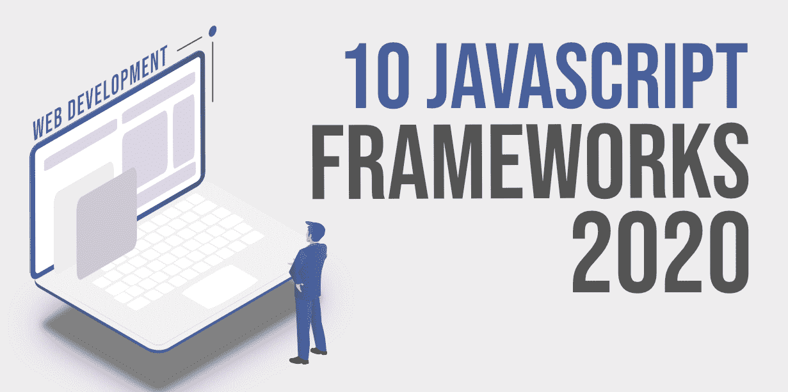

# 十大最受欢迎的网页开发 JavaScript 框架

> 原文:[https://www . geesforgeks . org/top-10-最受欢迎的 JavaScript-framework-for-web-development/](https://www.geeksforgeeks.org/top-10-most-popular-javascript-frameworks-for-web-development/)

JavaScript 是一种多范式语言，支持事件驱动、函数式和命令式(包括面向对象和基于原型)的编程类型。最初，JavaScript 只在客户端使用。尽管如此，如今 JavaScript 仍然被用作服务器端编程语言。综上所述，简单来说， [JavaScript](https://www.geeksforgeeks.org/javascript-tutorial/) 就是网络的语言。

**什么是 JavaScript 框架？为什么要使用它们？**

JS 框架是 JavaScript 编程库，它有预写的代码用于标准编程功能和任务。这是一个创建网站或网络应用程序的框架。

让我们从为什么我们需要 JavaScript 框架开始吧？不使用它们进行编码是完全可能的，但是一个精心选择的框架可以让工作变得容易得多。更重要的是，它们是免费和开源的，所以尝试没有风险，是吗？

首先，它会提高你的生产力。可以把它看作是一种变通方法:你必须手动编写更少的代码，因为已经有了预写的和现成的函数和模式。网站的某些组件不需要定制，因此您可以在预建组件的基础上进行构建和扩展。框架更适合网站设计，大多数网站开发人员更喜欢它。让我们来看看最好的 JS 框架。

### 1.[反作用](https://www.geeksforgeeks.org/react-js-introduction-working/)

JavaScript 用户界面框架领域的当前领导者是 React。起初，脸书的开发者开始致力于简化他们的工作。名为“脸书广告”的应用程序增长非常快，这意味着复杂的管理和支持。因此，团队开始建立一个图书馆来帮助他们提高效率。他们在 2011 年之前有了一个早期的原型，两年后，这个图书馆是开源的，公众可以使用。目前很多商业巨头都在使用它:AirBNB、PayPal、网飞等。

React 基于一个可重用的组件。简单地说，这些代码块可以分为类或函数。每个组件代表页面的特定部分，如徽标、按钮或输入框。他们使用的参数叫做道具，代表属性。说到语法，大多数开发人员都认为，当您已经知道 JavaScript 时，React 很容易学习。

React 使用 JSX，一种结合了 JavaScript 和 HTML 的 XML 语法。它不是一个 JavaScript 模板；它是全功能的 JavaScript。一些新开发人员可能会觉得 JSX 一开始有点混乱。然而，在使用它一段时间后，你会明白它是多么有益。React 与它有很大关系，如果你在前端 web 开发中，这是一个你应该注意的库。

### 2.[有角度](https://angularjs.org/)

Angular 是最强大的开源 JavaScript 框架之一。谷歌运营着这个框架，并被设计用来开发单页应用程序。这个开发框架之所以为人所知，主要是因为它为开发人员提供了将 JavaScript 与 HTML 和 CSS 相结合的最佳条件。超过 50 万个网站，如 google.com、youtube.com 等。，使用 Angular。

众所周知，它如此可靠的因素之一是谷歌的支持。它也是谷歌应用开发者首选的 JavaScript UI 框架。Angular 有一个基于组件的结构，就像 React 一样。您可以根据需要操纵、嵌套和重用它们。您将需要使用 TypeScript 编写一个应用程序到 Angular。这是一个 JavaScript 超集，使用相同的语法，但也支持静态类型和类。在 TypeScript 中，您可以获得访问修饰符、枚举、泛型、混合类型等等。一般来说，如果你是一个新开发人员，Angular 是一个很好的平台。

### 3.vista . js

Vue 是一个开源的 JavaScript 框架，用于创建一个创造性的 UI。在使用其他 JavaScript 库的项目中与 Vue 的集成得到了简化，因为它被设计为具有适应性。超过 36，000 个网站目前正在使用 Vue。像 Stackoverflow、PlayStation 等公司。他们的 UI 网站依赖 Vue。

Vue.js 学习起来也相当简单:你只需要你需要的所有背景知识就是 JavaScript 和 HTML。Vue.js 的另一个优势是它的官方命令行界面(CLI)。它是通过提供大量插件、预置、即时原型和交互式项目支架工具来加速开发的基本工具。它的一些特性包括组件、模板、转换和双向数据绑定，以及反应焦点。当您更改或更新 Vue 中的任何 JavaScript 对象时，就会发生反应。Vue.js 使用了一种叫做 Shadow DOM 的东西，使得页面渲染速度很快。

### 4. [jQuery](https://www.geeksforgeeks.org/jquery-tutorials/)

JQuery 可能是目前最受欢迎的 JavaScript 库，它为现代开发提供了如此多的功能。JQuery 是一个快速简洁的 JavaScript 库，由 John Resig 在 2006 年创建。它是一个跨平台的 JavaScript 库，旨在简化 HTML 客户端脚本。目前有超过 1900 万个网站在使用 jQuery！像 WordPress、脸书、谷歌、IBM 和许多其他公司都依赖 jQuery 来提供某种网络浏览体验。

您可以使用 jQuery API 来处理、动画化和操纵 HTML 文档(也称为 DOM)中的事件。此外，jQuery 与 Angular 和 React 应用程序构建工具一起使用。简而言之，web 开发最重要的 JavaScript 库之一。

### 5.[主干网](https://backbonejs.org/)

这是最流行的 JavaScript 框架之一。它可以用来创建单页应用程序。这个框架的开发涉及到所有服务器端功能必须通过一个应用编程接口的思想，这将有助于通过编写更少的代码来实现复杂的功能。

BackboneJS 是一个轻量级的 JavaScript 库，它使运行在 web 浏览器中的客户端应用程序能够被开发和结构化。与其他框架不同，主干让开发人员负责选择最适合给定项目的工具。超过 50 万个网站目前正在使用主干网，包括 tumblr.com、espn.com、soundcloud.com 和更多。

### 6. [Node.js](https://www.geeksforgeeks.org/introduction-to-nodejs/)

Node.js 是一个开源的服务器端平台，建立在谷歌 Chrome JavaScript 引擎之上。使用 NodeJS 的网站数量增加了 84000 个。它是下载最多的跨平台运行时环境之一，用于运行 JavaScript 代码。Node.js 是一个异步、单线程、无阻塞的 I/O 模型，使其轻量级且高效。Node.js 包生态系统 npm 也是世界上最大的开源库生态系统。

### 7. [Ember.js](https://emberjs.com/)

Ember.js 是一个开源的 JavaScript 框架，最初由 Yehuda Katz 在 2011 年发布。在被称为 Ember.js 之前，它最初被称为 SproutCore 2.0。关于 Ember 框架的工作始于 2011 年，1.0 版本在两年后发布。Ember 没有一家公司支持这个项目，而是有很多通常是框架用户的支持者，比如 LinkedIn 和 Yahoo。

它还具有很高的可扩展性，可以用于大型项目。苹果音乐在全球拥有超过 6000 万用户，是建立在烬。如果你想看看你能做什么——有一个工具叫做余烬检查器，它可以让你在网上更仔细地查看余烬的项目。

烬有一个优秀的构建工具，借鉴了许多其他 SPA 框架，称为烬命令行界面。这个构建工具拥有您开始使用所需的一切。你需要路由器吗？它内置在那里。需要测试吗？它也是内置的。您需要处理后端数据吗？有恩伯的数据。Ember.js 遵循许多与 Ruby 在 Rails 上相同的原则。它经过深思熟虑，非常灵活，并且更喜欢约定而不是配置。Ember.js 只是越来越好，我会极力推荐给你。

### 8.[流星](https://www.geeksforgeeks.org/meteor-introduction-to-meteor/)

一个名为 Skybreak 的网络框架于 2011 年底发布。几个月后，该团队将其名称改为流星。到目前为止，它是 1.8.1 版本。使用普通的 JavaScript，您可以构建可以跨多个平台使用的应用程序，包括但不限于安卓和 iOS。Meteor JS 框架提供了全栈解决方案。该框架的使用包括重要领域，如后端开发、数据库管理、业务逻辑和前端呈现。

Meteor 正在宣传自己是构建 JavaScript 应用程序的最快方式。它在市场上越来越受欢迎，有超过 13，000 个网站使用流星。像 mtv.com、meteofrance.com 等网站都使用 Meteor 来构建用户界面。

### 9.[聚合物](https://www.polymer-project.org/)

这种聚合物是谷歌维护的开源 JavaScript 库，用于使用网络组件构建网络应用程序。它还支持单向和双向数据绑定，因此创建了更广泛的应用领域。当您将 Angular 与 Polymer 进行比较时，因为两者都是由谷歌构建的，Angular 是网络应用程序开发的综合框架，而 Polymer 只是网络组件设计的库。它是第一个允许通过使用 web 组件来构建交互式应用程序的库。目前，超过 3000 个网站正在使用聚合物，举几个例子有 virustotal.com，rogers.com，zeplin.io，等等。

### 10.[奥雷利亚](https://aurelia.io/)

Aurelia 是一个由 Rob Eisenberg 开发的前端开源框架。Aurelia 1.0 于 2016 年首次发布。Aurelia 由面向功能的模块组成，例如插件、路由、测试、依赖注入等等。您可以使用 Aurelia JS 框架来开发网络、移动和桌面应用程序。模块化还允许您创建不同大小的应用程序。Aurelia 同时支持 Babel 和 TypeScript。它也完全兼容未来的 JavaScript 版本。

在本指南提供的选择中，Aurelia 可能是最年轻的一个:我们在 2016 年年中才获得 1.0 版本。然而，这给了它一点优势:根据它的创建者，Aurelia 提供了一个最符合最好的网络标准的组件模型。它使用了许多更新的 ECMAScript 特性(ECMAScript 有助于规定 JavaScript 标准)，并鼓励您使用这些新特性来编写代码。这是一件好事，因为您没有学习到仅适用于 Aurelia 的自定义语法。如果你觉得这个有趣，就去看看吧！

对于那些不熟悉网络开发的人来说，你会听到很多愤世嫉俗的人谈论 JavaScript 世界变得多么快。他们会抱怨新的 JavaScript 库和框架出现得太快，每个人都在尝试做同样的事情。他们说这是快节奏并没有错，但这不应该阻止你走出去学习这些 JavaScript 框架和库。我只给你尝了每一种。接下来就看你了，开始学习吧。

不过，不要试图一次完成所有的事情:选择一个框架，让它变得完美。你不需要把它们都学完。你只需要学会至少一件事，这样你就可以涉足某个领域。