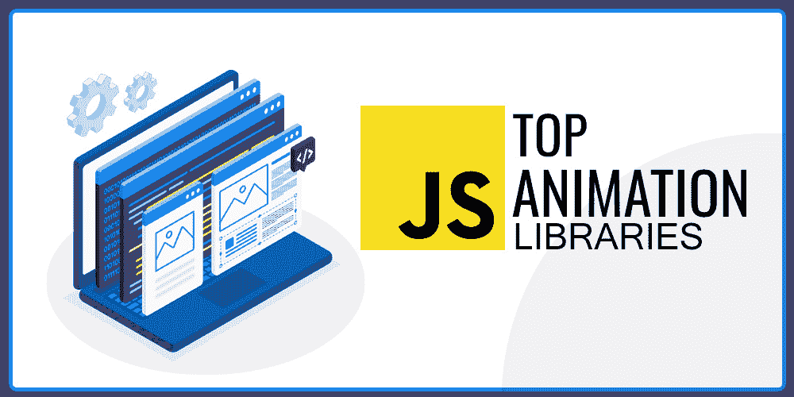

# 顶级 JavaScript 动画库

> 原文:[https://www . geesforgeks . org/top-JavaScript-动画-库/](https://www.geeksforgeeks.org/top-javascript-animation-libraries/)

有时你会在不同的网站或登陆页面上看到一些很酷的动画。当你添加吸引人眼球的动画时，它会给你的网站带来吸引人的外观。动画是吸引用户关注你的网站的最有效的方法之一。

但是，你们有没有想过这些很酷的动画是如何创作或开发的？在本文中，我们将介绍一些非常棒的 JavaScript 动画库，它们将让你创作出令人惊叹的、吸引眼球的动画

### 1\. 三 JS

Three.js 是最著名的 JavaScript 动画库之一，它可以让你在网络浏览器中创建三维计算机图形对象(像相机、灯光、三维化身、材质、效果、场景等等)。它允许你使用 JavaScript 创建图形处理器加速的三维动画。它于 2010 年由一位名叫里卡多·卡韦略的开发者首次发布。Three.js 是一个开源的动画库，它的源代码可以在 GitHub 上获得，并且可以在 MIT License 下获得。

使用三个 js 制作的一些很酷的网站是 **Cornrevolution，Earth 2050。**

### 2.格林斯托克克斯

GreensockJS 也是另一个超级惊人的 JavaScript 动画库，它可以帮助你轻松地制作 HTML 元素的动画，它还可以帮助前端开发人员和设计人员创建健壮的基于时间线的动画。它还允许对更复杂的动画进行更精确的控制，它包括一套广泛的工具、实用程序、插件和扩展，您可以利用它们来处理任何类型的复杂网络动画。它在他们的 GSAP 论坛上提供了超级棒的资源，如文档、教程等。GreensockJS 最棒的地方是，它很容易玩，而且超级轻便

一些用绿方块制作的很酷的网站是 **GSAP 3 标志，曲线文字动画。**

### 3.动漫

AnimeJS 是一个轻量级的 JavaScript 库，具有简单且位大小的 API，允许用户对不同的 CSS 属性和 DOM 属性进行动画处理。它允许您控制动画的所有成分，并为您提供对目标元素或您想要动画的属性/元素的完全控制。

使用动画制作的一些很酷的网站是基于滚动的动画。

### 4\. MoJS

MoJS 是一个 JavaScript 库，它允许用户玩运动图形，这是视网膜就绪，非常快，也是开源的。MoJS 的源代码可以在 GitHub 上找到。它提供了内置组件，通过这些组件，我们可以从头开始创建运动图形效果(例如，漩涡、放大、缩小、扩展等)。即使 MoJS 在测试版，但已经有成吨的功能可以玩了。

### 5.Popmotion

Popmotion 是一个功能性的 JavaScript 库，允许用户使用函数编写自己的特性，而不是等待库的管理员来创建它们。它包含了大量的功能，比如指针处理和许多其他功能，Popmotion 真的有点像一个库(只有 11.5KB)。

使用 Popmotion 库，制作 DOM 或 SVG 元素的动画可以很容易很好地完成，制作三维对象和图表的动画也很容易。

### 6.VelocityJS

VelocityJS 是一个动画引擎，它提供了极快的速度、元素的排列、SVG 的动画、彩色动画、特征滚动等等。VelocityJS 在 Github 上有 15k 颗星的源代码，这是一个相当令人印象深刻的数字。我们可以通过简单地引用一个内容交付网络来轻松地将 VelocityJS 添加到我们的网站上。

你也可以从他们的网站下载 VelocityJS，你可以直接在你的项目中使用它。我们可以使用 VelocityJS 做很多事情，比如玩 CSS 可动画化的属性，给你的网站添加渐变和滑动事件，等等。

### 7.VivusJS

VivusJS 是一个工具，旨在创建一个超级酷的绘图效果的简单动画，用户可以进行大量的定制。它将动画你的 SVG 的动画笔画，就像一个艺术家或画家正在画它。VivusJS 为用户提供了一种更详细的方法，因此用户可以将动画应用于内联 SVG 的文件。

### 8.ScrollRevealJS

scrollReveal.js 是一个 JavaScript 库，帮助用户在进入特定网页的视口时轻松显示元素。它非常小，因为如果缩小和压缩，它的重量大约是 3Kb。并且它没有基本的依赖关系来使用这个库，所以用户不需要使用另一个库来使用 scrollReveal.js。

### 9.KuteJS

KUTE.js 是一个基于 JavaScript 的动画引擎，它专注于性能，同时为网页上呈现的不同元素制作动画。整个代码库基于最新的编码标准和惯例。每个组件都有详细的指南和大量关于如何优化特定动画性能的提示和技巧。KuteJS 属于麻省理工学院许可证。