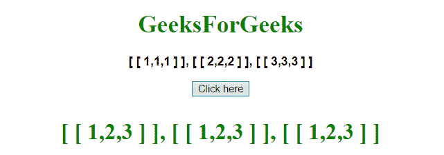

# 在 JavaScript 中转置二维(2D)数组

> 原文:[https://www . geesforgeks . org/transpose-a-二维-2d-数组 in-javascript/](https://www.geeksforgeeks.org/transpose-a-two-dimensional-2d-array-in-javascript/)

给定一个 2D 数组(矩阵)，任务是使用 JavaScript 获得矩阵的转置。

**方法 1:**

*   将 2D 数组存储到变量中。
*   显示 2D 阵列(矩阵)内容。
*   调用 map()方法，该方法为数组中的每个元素提供一次回调函数，保持顺序，并从结果中返回一个新数组(原始数组的转置)。

**示例:**本示例使用 **array.map()** 方法获取数组的转置。

## 超文本标记语言

```
<!DOCTYPE HTML>
<html>
    <head>
        <title>
            Transpose of a 2D array
        </title>
    </head>

    <body style = "text-align:center;">

        <h1 style = "color:green;" >
            GeeksForGeeks
        </h1>

        <p id = "GFG_UP" style =
            "font-size: 16px; font-family: sans-serif; font-weight: bold;">    
        </p>

        <button onclick = "gfg_Run()">
            Click here
        </button>

        <p id = "GFG_DOWN" style =
            "color:green; font-size: 30px; font-weight: bold;">
        </p>

        <script>
            var el_up = document.getElementById("GFG_UP");
            var el_down = document.getElementById("GFG_DOWN");

            var array = [
                            [1, 1, 1],
                            [2, 2, 2],
                            [3, 3, 3],
                        ];

            el_up.innerHTML = "[ [ " + array[0] + " ] ], [ [ "
                             + array[1] + " ] ], [ [ " + array[2] + " ] ]";

            function transpose(mat) {
                for (var i = 0; i < mat.length; i++) {
                    for (var j = 0; j < i; j++) {
                        const tmp = mat[i][j];
                        mat[i][j] = mat[j][i];
                        mat[j][i] = tmp;
                    }
                }
            }

            function gfg_Run() {
                array = array[0].map((col, i) => array.map(row => row[i]));

                el_down.innerHTML = "[ [ " + array[0] + " ] ], [ [ "
                        + array[1] + " ] ], [ [ " + array[2] + " ] ]";
            }        
        </script>
    </body>
</html>                   
```

**输出:**

*   **点击按钮前:**


*   **点击按钮后:**



**方法 2:**

*   将 2D 数组存储到变量中。
*   将数组中的每个元素替换为其相对于数组对角线的镜像。

**例子:**这个例子创建了一个函数，用它的镜像替换每个元素，得到数组的转置。

## 超文本标记语言

```
<!DOCTYPE HTML>
<html>
    <head>
        <title>
            Transposing a 2D array
        </title>
    </head>

    <body style = "text-align:center;">

        <h1 style = "color:green;" >
            GeeksForGeeks
        </h1>

        <p id = "GFG_UP" style =
            "font-size: 16px; font-family: sans-serif; font-weight: bold;">    
        </p>

        <button onclick = "gfg_Run()">
            Click here
        </button>

        <p id = "GFG_DOWN" style =
            "color:green; font-size: 30px; font-weight: bold;">
        </p>

        <script>
            var el_up = document.getElementById("GFG_UP");
            var el_down = document.getElementById("GFG_DOWN");

            var array = [
                            [1, 1, 1],
                            [2, 2, 2],
                            [3, 3, 3],
                        ];

            el_up.innerHTML = "[ [ " + array[0] + " ] ], [ [ "
                    + array[1] + " ] ], [ [ " + array[2] + " ] ]";

            function transpose(mat) {
                for (var i = 0; i < mat.length; i++) {
                    for (var j = 0; j < i; j++) {
                        const tmp = mat[i][j];
                        mat[i][j] = mat[j][i];
                        mat[j][i] = tmp;
                    }
                }
            }

            function gfg_Run() {
                transpose(array);
                el_down.innerHTML = "[ [ " + array[0] + " ] ], [ [ "
                        + array[1] + " ] ], [ [ " + array[2] + " ] ]";
            }        
        </script>
    </body>
</html>                   
```

**输出:**

*   **点击按钮前:**


*   **点击按钮后:**

