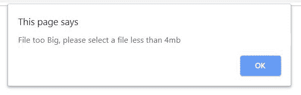
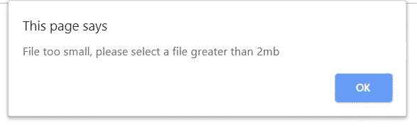
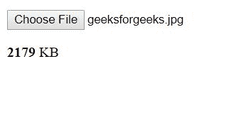
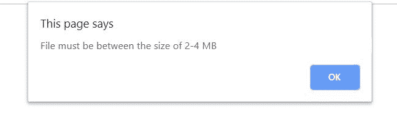
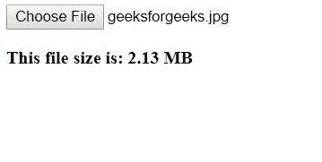

# 使用 JavaScript / jQuery 上传时验证文件大小

> 原文:[https://www . geeksforgeeks . org/验证文件大小-上传时使用-javascript-jquery/](https://www.geeksforgeeks.org/validation-of-file-size-while-uploading-using-javascript-jquery/)

在本文中，我们将学习如何使用 Javascript 和 jQuery 在上传之前通过检查文件大小来实现文件大小验证。这是客户端验证的演示，实现它是为了提供良好的用户体验。在某些情况下，与服务器端方法相比，客户端验证是一种更好的方法，因为它消耗的时间更少。
例如，如果我们不允许上传大于 4MB 或小于 2MB 的文件，我们可以使用客户端验证来检查用户选择的文件是否符合给定的要求，如果不符合，就给他们一条消息，这样他们就不会花所有的时间上传文件，结果只是得到一个被服务器丢弃的错误。

**进近-1:**

*   倾听输入端的变化事件。
*   检查是否选择了任何文件**文件.长度> 0** 。
*   通过 **files.item(i)得到文件的大小。尺寸**。
*   该值将以字节为单位。通过 **Math.round((文件大小/1024))** 将其转换为您想要的任何单位，在本例中为兆字节。
*   检查尺寸是否符合您想要的标准。

**示例-1:**

## java 描述语言

```html
<!DOCTYPE html>
<html>

<head>
    <title>File Validation-1</title>
</head>

<body>

<p>
        <input type="file"
               id="file" 
               onchange="Filevalidation()" />
    </p>

    <p id="size"></p>

</body>

<script>
    Filevalidation = () => {
        const fi = document.getElementById('file');
        // Check if any file is selected.
        if (fi.files.length > 0) {
            for (const i = 0; i <= fi.files.length - 1; i++) {

                const fsize = fi.files.item(i).size;
                const file = Math.round((fsize / 1024));
                // The size of the file.
                if (file >= 4096) {
                    alert(
                      "File too Big, please select a file less than 4mb");
                } else if (file < 2048) {
                    alert(
                      "File too small, please select a file greater than 2mb");
                } else {
                    document.getElementById('size').innerHTML = '<b>'
                    + file + '</b> KB';
                }
            }
        }
    }
</script>

</html>
```

**输出:**
**上传文件前:**


**如果文件大于 4MB:**



**如果文件小于 2MB:**



**上传成功:**



**Approach-2:**
在下面的例子中，我们将学习如何使用 jQuery 做同样的事情。

*   倾听输入端的变化事件。
*   通过**获取文件的大小。尺寸**。
*   您也可以通过**到**方法对获得的值进行舍入。
*   检查尺寸是否符合您想要的标准。

**示例-2:**

## java 描述语言

```html
<!DOCTYPE HTML>
<html>

<head>
    <meta http-equiv="Content-Type" 
          content="text/html; charset=iso-8859-1" />
    <title>JQuery File Validation</title>
    <script src=
"https://ajax.googleapis.com/ajax/libs/jquery/3.4.0/jquery.min.js">
  </script>
</head>

<body>
    <input id="file"
           type="file" 
           name="file" />
    <p id="output"></p>

    <script type="text/javascript">
        $('#file').on('change', function() {

            const size = 
               (this.files[0].size / 1024 / 1024).toFixed(2);

            if (size > 4 || size < 2) {
                alert("File must be between the size of 2-4 MB");
            } else {
                $("#output").html('<b>' +
                   'This file size is: ' + size + " MB" + '</b>');
            }
        });
    </script>
</body>

</html>
```

**输出:**
**上传文件前:**


**如果文件小于 2MB 或大于 4MB:**



**上传成功:**



JavaScript 最出名的是网页开发，但它也用于各种非浏览器环境。您可以通过以下 [JavaScript 教程](https://www.geeksforgeeks.org/javascript-tutorial/)和 [JavaScript 示例](https://www.geeksforgeeks.org/javascript-examples/)从头开始学习 JavaScript。

HTML 是网页的基础，通过构建网站和网络应用程序用于网页开发。您可以通过以下 [HTML 教程](https://www.geeksforgeeks.org/html-tutorials/)和 [HTML 示例](https://www.geeksforgeeks.org/html-examples/)从头开始学习 HTML。