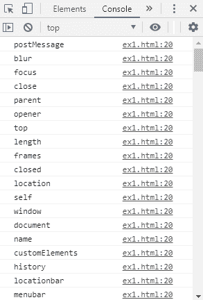
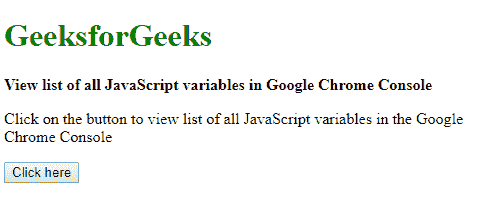
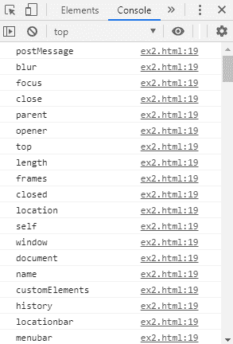

# 使用 JavaScript 查看谷歌 Chrome 控制台中所有变量的列表

> 原文:[https://www . geeksforgeeks . org/view-the-list-all-variables-in-Google-chrome-console-use-JavaScript/](https://www.geeksforgeeks.org/view-the-list-of-all-variables-in-google-chrome-console-using-javascript/)

谷歌 Chrome 中的所有变量都可以列出来供调试使用。列出所有变量有两种方法:

**方法 1:迭代窗口对象的属性:**JavaScript 中的窗口对象代表当前浏览器的窗口。这个对象的属性可以用来查找 Chrome 浏览器的变量。首先使用 **hasOwnProperty()** 方法检查窗口对象的每个属性。这可确保对象将属性作为自己的属性。

**语法:**

```
for (let variable in window) {
    if (window.hasOwnProperty(variable)) {
        console.log(variable);
    }
}
```

**示例:**

```
<!DOCTYPE html>
<html>

<head>
    <title>
        View the list of all variables in Google
        Chrome Console in JavaScript
    </title>
</head>

<body>
    <h1 style="color:green;">
        GeeksforGeeks
    </h1>

    <b>
        View list of all JavaScript variables
        in Google Chrome Console
    </b>

    <p>
        Click on the button to view list of
        all JavaScript variables in the
        Google Chrome Console
    </p>

    <button onclick="findAllVariables()">
        Click here
    </button>

    <script type="text/javascript">
        function findAllVariables() {
            for (let variable in window) {
                if (window.hasOwnProperty(variable)) {
                    console.log(variable);
                }
            }
        }
    </script>
</body>

</html>
```

**输出:**

**控制台输出:**


**方法 2:使用 Object.keys()方法:**使用 **Object.keys()** 方法以数组的形式返回给定对象的属性。由于**窗口**对象代表当前浏览器的窗口，这个对象的属性可以像前面的方法一样用来查找变量。
object . keys()方法作为参数传递给窗口对象，获取其密钥。这个对象中的每个键都代表谷歌浏览器的一个变量。这些可以在控制台中列出。

**语法:**

```
let variables = Object.keys(window);
console.log(variables);
```

**示例:**

```
<!DOCTYPE html>
<html>

<head>
    <title>
        View the list of all variables in Google
        Chrome Console in JavaScript
    </title>
</head>

<body>
    <h1 style="color: green">
        GeeksforGeeks
    </h1>

    <b>
        View list of all JavaScript variables
        in Google Chrome Console
    </b>

    <p>
        Click on the button to view list
        of all JavaScript variables in 
        the Google Chrome Console
    </p>

    <button onclick="findAllVariables()">
        Click here
    </button>

    <script type="text/javascript">
        function findAllVariables() {
            let variables = Object.keys(window);
            console.log(variables);
        }
    </script>
</body>

</html>
```

**输出:**

**控制台输出:**
