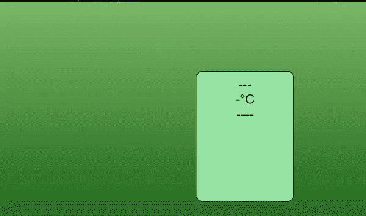

# 使用原始 JavaScript 的天气应用

> 原文:[https://www . geesforgeks . org/weather-app-using-vanilla-JavaScript/](https://www.geeksforgeeks.org/weather-app-using-vanilla-javascript/)

以下方法介绍了如何使用**开放天气地图应用编程接口在普通 JavaScript 中创建天气应用程序。**利用这个 API，我们可以得到每个坐标的天气数据。

**项目设置:**

*   **步骤 1:** 现在去 https://openweathermap.org/创建一个账户，获取你的 API 密钥。
*   **第二步:**之后可以创建一个文件夹，添加一个文件，比如 index.html 和 script.js 文件。
*   **第三步:**我们可以使用以下方法获取地理坐标:
    *   通过地理坐标调用 API-经纬度

        > API。openweatherap。org/data/2.5/天气？lat = { lat }&lon = { lon }&appid = { key API }
        > 
        > T3】

    *   通过城市标识

        > api.openweathermap.org/data/2.5/weather?id={city 标识} & appid = { API 密钥}

**示例:**

## index.html

```html
<!DOCTYPE html>
<html lang="en">
  <head>
    <meta charset="UTF-8" />
    <meta http-equiv="X-UA-Compatible" content="IE=edge" />
    <meta name="viewport" content="width=device-width, initial-scale=1.0" />
    <!--The CSS styling-->
    <style>
      * {
        margin: 0;
        padding: 0;
        box-sizing: border-box;
      }
      body {
        height: 100vh;
        display: flex;
        flex-direction: column;
        align-items: center;
        justify-content: center;
        background: linear-gradient(rgb(123, 184, 104), rgb(13, 87, 10));
        font-size: 2rem;
        font-family: sans-serif;
        color: rgb(7, 9, 10);
      }
      .container {
        height: 20rem;
        width: 15rem;
        background-color: rgb(152, 228, 165);
        text-align: center;
        padding-top: 12px;
        border-radius: 16px;
        border: 2px solid rgb(14, 43, 1);
      }
    </style>
  </head>
  <body>
    <div class="container">
      <div class="icon">---</div>
      <div class="temp">-°C</div>
      <div class="summary">----</div>
      <div class="location"></div>
    </div>
    <!--Linking the javascript code-->
    <script src="script.js"></script>
  </body>
</html>
```

## script.js

```html
// Declaring the variables
let lon;
let lat;
let temperature = document.querySelector(".temp");
let summary = document.querySelector(".summary");
let loc = document.querySelector(".location");
let icon = document.querySelector(".icon");
const kelvin = 273;

window.addEventListener("load", () => {
  if (navigator.geolocation) {
    navigator.geolocation.getCurrentPosition((position) => {
      console.log(position);
      lon = position.coords.longitude;
      lat = position.coords.latitude;

      // API ID
      const api = "6d055e39ee237af35ca066f35474e9df";

      // API URL
      const base =
`http://api.openweathermap.org/data/2.5/weather?lat=${lat}&` +
`lon=${lon}&appid=6d055e39ee237af35ca066f35474e9df`;

      // Calling the API
      fetch(base)
        .then((response) => {
          return response.json();
        })
        .then((data) => {
          console.log(data);
          temperature.textContent = 
              Math.floor(data.main.temp - kelvin) + "°C";
          summary.textContent = data.weather[0].description;
          loc.textContent = data.name + "," + data.sys.country;
          let icon1 = data.weather[0].icon;
          icon.innerHTML = 
              ``;
        });
    });
  }
});
```

**输出:**



**参考:**T2】https://openweathermap.org/current