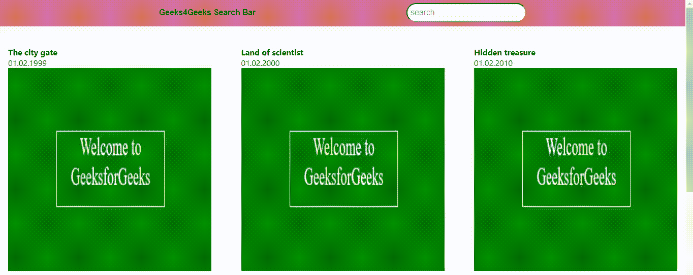

# 使用 Javascript 条件流实现网页搜索栏

> 原文:[https://www . geesforgeks . org/web-search-bar-implementation-use-JavaScript-conditional-flow/](https://www.geeksforgeeks.org/web-search-bar-implementation-using-javascript-conditional-flow/)

给定一个项目列表，任务是筛选项目，并使用搜索栏返回最佳匹配。

有几种方法可以实现这一点，但是我们将使用一个简单的 **if-else** 语句来实现我们的搜索栏。

**进场:**

*   创建一个名为 **gfgSearchBar** 的文件夹。
*   在所需的集成开发环境或空闲模式下打开文件夹。
*   创建一个名为**approachOne.html**的 html 文件
*   将下面的代码粘贴到 html 文件中。

**示例:**

```html
<!DOCTYPE html>
<html lang="en">

<head>
    <meta charset="UTF-8" />
    <meta name="viewport" content=
        "width=device-width, initial-scale=1.0" />

    <meta http-equiv="X-UA-Compatible" 
            content="ie=edge" />
    <meta author="Emmanuel Onah" />

    <title>
        GeeksforGeeks Search Bar 
    </title>
</head>

<style>
    * {
        margin: 0;
        padding: 0;
    }

    .container {
        box-sizing: border-box;
    }

    header {
        display: flex;
        align-content: center;
        align-items: center;
        justify-content: space-evenly;
        background: #d87093;
        padding: 0.5rem 1rem;
    }

    h3 {
        color: #000;
        font-family: Arial, Helvetica, sans-serif;
        font-size: 0.98rem;
    }

    input[type='search'] {
        padding: 0.5rem 2rem 0.5rem 0.4rem;
        border-radius: 4rem;
        font-size: 0.98rem;
    }

    .movieCollection {
        width: 100%;
        margin: 0 auto;
        padding: 1rem;
        box-sizing: border-box;
        display: flex;
        flex-wrap: wrap;
        justify-content: space-between;
        font-family: -apple-system, 
            BlinkMacSystemFont,
            'Segoe UI', Roboto, Oxygen,
            Ubuntu, Cantarell, 'Open Sans',
            'Helvetica Neue', sans-serif;
    }

    .movieWrapper {
        margin-top: 1.5rem;
    }

    img {
        width: 400px;
        height: 400px;
        display: block;
    }
</style>

<body>
    <div class="container">
        <header>
            <h3>Geeks4Geeks Search Bar</h3>

            <input type="search" 
                placeholder="search" id="searchBar" />
        </header>

        <div class="movieCollection">
            <div class="movieWrapper movieOne">
                <h4>The city gate</h4>
                <time>01.02.1999</time>
                
            </div>

            <div class="movieWrapper movieTwo">
                <h4>Land of scientist</h4>
                <time>01.02.2000</time>
                
            </div>

            <div class="movieWrapper movieThree">
                <h4>Hidden treasure</h4>
                <time>01.02.2010</time>
                
            </div>

            <div class="movieWrapper movieFour">
                <h4>Beautiful city of heroes</h4>
                <time>01.02.2020</time>
                
            </div>

            <div class="movieWrapper movieFive">
                <h4>The city gate</h4>
                <time>01.02.1999</time>
                
            </div>

            <div class="movieWrapper movieSix">
                <h4>Land of scientist</h4>
                <time>01.02.2000</time>
                
            </div>
        </div>
    </div>

    <script>
        document.addEventListener('DOMContentLoaded', () => {

            const getSearchBar = 
                document.querySelector('#searchBar');
            const getAllMovies = 
                document.querySelectorAll('.movieWrapper');

            getSearchBar.addEventListener('keyup', e => {
                getAllMovies.forEach(movie => {
                    if (movie.innerText.toLowerCase().includes(
                        e.target.value.toLowerCase())) {
                        movie.style.display = 'block';
                        return movie;
                    }
                    else {
                        movie.style.display = 'none';
                    }
                });
            });
        });
    </script>
</body>

</html>
```

**输出:**


**脚本标签内代码说明:**

*   **document . addeventlistener(' DOMContentLoaded ')；**这是一个文档事件，当 html 文件加载到您的浏览器上时，它会立即被执行或触发。在 html 文件完全加载到 DOM 之前，这个事件块中的操作不会被执行。*   **const getSearchBar = document . queryselector(' # searchBar ')；**我们只需获取搜索栏元素并将其传递给**获取搜索栏**变量。*   **const getAllMovies = document.querySelectorAll(‘.movieWrapper’);** We simply got all the movie divs and pass then to **getAllMovies** variable. Note that getAllMovies is a **Nodelist** of elements which is an **Array** look alike not an **Array**.

    **getsearchbar . addeventlistener():**我们只是在搜索栏中添加了一个按键事件监听器。

    ```html
    getAllMovies.forEach(movie => {
        if (movie.innerText.toLowerCase()
        .includes(e.target.value.toLowerCase())) {
            movie.style.display = 'block';
            return movie;
        }
        else {
            movie.style.display = 'none';
        }
    });

    ```

    这段代码只是意味着用户在搜索栏中键入的内容会出现在电影文本内容中，然后设置电影框的样式，以块的形式显示并返回所有内容。否则不要返回任何电影区块。