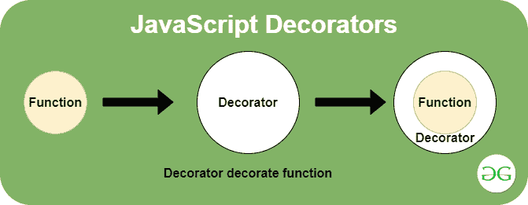
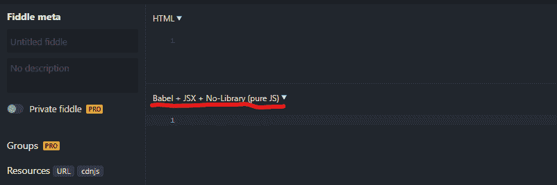

# 什么是装饰器，它们在 JavaScript 中是如何使用的？

> 原文:[https://www . geesforgeks . org/什么是装饰者以及它们在 javascript 中的使用方式/](https://www.geeksforgeeks.org/what-are-decorators-and-how-are-they-used-in-javascript/)

**装饰器**是用一段代码包装另一段代码或在 JavaScript 中的函数周围应用包装器的方式。**装饰器**是一种设计模式，允许行为被静态或动态地添加到单个对象中，而不影响同一类中其他对象的行为。它们用于增强函数的功能，而不修改底层函数。它们只是通过返回一个新函数来修改传递给它的函数或方法的行为。装饰器已经在 Python 和 C#等语言中使用，现在它也在 JavaScript 中使用。



*   **语法:**

```
let variable=function(object) {
  object.property='characteristic';
}

// Use as decorator
@variable   
class GFG
{ }
console.log(GFG.property);
```

*   **示例:**这个示例使用较低版本的 JavaScript 实现了装饰者的工作。本例中**添加**功能以**打印**功能为参数。这里**打印**功能作为装饰器工作。它有助于将**“最佳”**字符串连接到传递的字符串**“GFG”**。这里我们使用**“添加”**功能，通过连接字符串来扩展和执行**“打印”**功能。

## java 描述语言

```
<script>
// Working of decorators in javascript

// "add" function takes the function as
// a parameter for wrapping function
// "print" is wrapped
function add(fn) {

  return function(s) {

    var gg = s + ' is Best';

    // By concatenating we extend
    // the function "add"
    fn(gg);
  }
}

// Decorated function
function print(s) {
  document.write(s);
}

// Calling "add"
var g = add(print);
g('GFG');
</script>
```

*   **输出:**

```
GFG is Best
```

**运行程序:**要运行装饰器，需要浏览器支持 **transpiler** ，但目前没有浏览器支持这个。

*   **步骤 1:** 我们使用 **BabelJS** 然后我们可以在浏览器上运行装饰器。这里我们将使用[**js 小提琴**](https://jsfiddle.net/) 来运行代码。
*   **第二步:**在**js 小提琴**下选择**巴别塔+JSX** 选项，否则程序不会运行，只有 JavaScript 会显示错误 **@** 。



下面的例子说明了 JavaScript 中的**装饰器**:

*   **例 1:**

## java 描述语言

```
let variable = function(target) {
  target.property = 'GFG is best';
}

// Decorator
@variable 
class GFG
{ }

// Print in the console
console.log(GFG.property);
```

*   **输出:**

```
GFG is best
```

*   **例 2:**

## java 描述语言

```
let variable = function(color) {
    return function (target) {
      target.property = color;
  }
};

// The value is passed in the decorator
@variable('GFG is Green')
class GFG
{ }

console.log(GFG.property);
```

*   **输出:**

```
GFG is Green
```

**为什么要用装修师？**
我们可以使用装饰器来装饰代码，但是这种装饰很难应用，并且将相同的技术应用于其他代码，或者将一段代码与另一段代码包装在一起，或者将包装器应用于一个函数也很困难。在 ES6 中，装饰者可以解决这些困难。装饰器允许用另一个函数或另一个代码包装一段代码的有效且可理解的方式。此外，装饰器为应用这些包装器提供了清晰的语法。不直接支持 javascript 装饰器，但将来可能会将装饰器支持添加到 JavaScript 中。

**装饰者的类型:**装饰者被将要装饰的物品的适当细节所召唤。装饰器实际上是返回另一个函数的函数。现在支持两种类型的装饰器:

*   **类成员装饰师**
*   **班级成员**

**类成员装饰器:**这些装饰器应用于类的单个成员。这个装饰器有属性、方法、获取器、设置器。这个装饰器接受 3 个参数:

*   **目标:**成员所属的类。
*   **名称:**类成员的名称。
*   **描述符:**传递给**对象的对象成员的描述。**

**示例 1:** 在这个示例中，我们传递了两个参数，这里装饰器函数检查描述符是否是函数，然后打印参数和它们的加法。功能**添加**在这里使用另一个功能 **gfg** 进行修饰。

## java 描述语言

```
// Decorator function
function gfg(target, name, descriptor) {
  var fn = descriptor.value;

  // Checks if "descriptor.value"
  // is a function or not
  if (typeof fn == 'function') {
    descriptor.value = function(...args) {

      // Document.write(`parameters: ${args}`+"<br>");
      console.log(`parameters: ${args}`);
      var result = fn.apply(this, args);

      // Document.write(`addition: ${result}`);

      // Print the addition of passed arguments
      console.log(`addition: ${result}`);

      return result;
    }
  }
  return descriptor;
 }

class geek {
  @gfg
  add(a, b) {
    return a + b;
  }
}

var e = new geek();
e.add(100, 200);
```

*   **输出:**

```
parameters: 100, 200
addition: 300
```

*   **例 2:**

## java 描述语言

```
let readonly = function(target, key, descriptor) {
  descriptor.writable = false;

  return descriptor;
}

class car {
  constructor(color) {
      this.color = color;
  }

  // Decorator
  @readonly
  getColor() {
      return this.color;
  }
}

const rCar = new car('car is Black');

// When  descriptor.writable = false;
rCar.getColor = function() {

    // When  descriptor.writable = true;
    return 'car is not Black'
}

console.log(rCar.getColor());
```

*   **输出:**

```
car is Black
```

**类的成员:**这些装饰器应用于整个类。这些函数用要修饰的单个参数调用。这个函数是一个构造函数。这些装饰器并不适用于类的每个实例，它只适用于构造函数。这些装饰器不如类成员装饰器有用。因为我们可以用一个简单的函数来做这些装饰者能做的一切。

*   **示例:**

## java 描述语言

```
function log()

// Decorator function
{
  return function decorator()
    {
    // "arrow" function
    return (...args) =>
        {
      console.log(`Parameters : args`);
      return new Class(...args);
    };
  }
}

// Decorators
@log 
class gfg
{
  constructor(name, category) {}
}

const e = new gfg('geek', 'code');

// Arguments for Demo: args
console.log(e);
```

*   **输出:**

```
(...args) =>  
    {
      console.log(`Parameters : args`);
      return new Class(...args);
    }
```