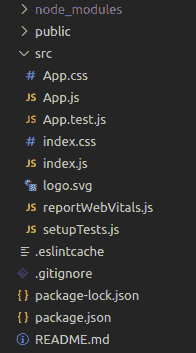
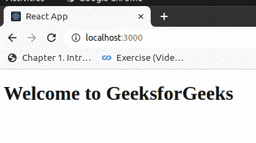

# JSX 和 HTML 有什么区别？

> 原文:[https://www . geeksforgeeks . org/jsx 和 html 之间的区别是什么/](https://www.geeksforgeeks.org/what-are-the-differences-between-jsx-and-html/)

**[HTML 简介:](https://www.geeksforgeeks.org/html-introduction/)** HTML 是一种超文本标记语言，是用于文档的标准标记语言，旨在网页浏览器中显示和查看网页。

下面是一个用 HTML 创建基本表单的代码:

## 超文本标记语言

```
<!DOCTYPE html>
<html>
<body>

<h2>HTML Form</h2>

<form>
  <label for="firstname">First name:</label>
  <br>
  <input type="text" id="firstname" name="firstname" value="Shubh">
  <br>
  <label for="lastname">Last name:</label><br>
  <input type="text" id="lastname" name="lastname" value="Barotha">
  <br><br>
  <input type="submit" value="Submit">
</form> 

</body>
</html>
```

**输出:**


**[JSX 简介](https://www.geeksforgeeks.org/reactjs-introduction-jsx/) :** JSX (JavaScript + XML)是 JavaScript 的一个扩展，允许你直接在 JavaScript 中写下 HTML，它有几个好处，让你的代码更易读，并在 HTML 中发挥 JavaScript 的全部功能。JSX 在某些方面几乎像 HTML，然而，它确实伴随着某些明显的差异，我们将在下一节中讨论这些差异。因为 JSX 不是一个合法的 JS 代码，所以它必须用巴贝尔之类的工具编译成 JS。

JSX 的一个简单例子:

> const App =
> 
> # 欢迎来到极客 forgeeks
> 
> ；

下面是在 JSX 创建一个简单示例的代码:

使用以下命令在 reactjs 中创建新应用程序:

```
npx create-react-app myapp
```

您的项目结构如下所示:



我们将在 react 代码中编写一个基本的 jsx。

首先，打开 **App.js** 并进行以下更改:

```
import React from 'react';
import ReactDOM from 'react-dom'; 

const App=()=> {
 return(
   <div><h1>Welcome to GeeksforGeeks</h1></div>
 )
}
export default App;
```

使用项目目录中的命令保存并关闭文件，然后运行项目:

```
npm start
```

**输出:**



如果您单击提交按钮，页面将重新加载。由于您正在构建一个单页应用程序，因此您将阻止具有 type="submit "的按钮的这种标准行为。相反，您将在组件内部处理提交事件。

### JSX 与 HTML:

JSX 和 HTML 的基本区别如下:

<figure class="table">

| 超文本标记语言 | JSX |
| In HTML, multiple elements can be returned.
For example:
*< UL >*
*< Li > Disordered list*
*< OL >*
[T11 】/Li >
< Li > Ordered list </Li < Li > Disordered list </Li >
*</UL >* | Nested JSX of must return an element, which we call the parent element that wraps all other levels of nested elements:
*< div >*
*t172] p > pink </p 【T175】 In REAT, we can use REAT rendering API, that is The formula for rendering the React element is as follows:
*Reactdom.render (componenttorender, targetnode)*
*Reactdom.render ()* must be called after the JSX element is declared.* |
| HTML 元素都有属性。例如 *maxlength* 在 *<中输入 maxlength = " 16 "/>* | JSX 元素有道具。例如 *maxLength* 在 *<中输入 maxLength =“16”/>* |
| CamelCase is not required for attributes, id and event references. It's all your call. Name them with Camille Case, lowercase or hyphen. | All HTML attributes and event references of JSX have become camelCase, so *onclick* events become *onclick* and *onchange* - *onchange.* |
| The attribute can be used on any HTML element. And CSS and JavaScript can use class names to perform certain tasks for elements with specified class names. | The word *class* cannot be used to define HTLM class, because *class* is a reserved word in JavaScript, so it is better to use- *class name* . |
| In HTML, almost all tags have a start tag and an end tag, except for a few possibilities like *<. br/ >* | However, in JSX, any element can be written as a self-closing tag, for example: *< div/>*
Example:
*Conststring = <* |

</figure>

由于 JSX 组件代表 HTML，所以您可以将几个组件放在一起，以创建更复杂的 HTML 页面。

JSX 看起来像 HTML 的事实并没有使它成为 HTML 的一部分，事实上，你仍然可以绕过类似 HTML 的语法编写正常的函数。

底线是，JSX 不是 HTML 或模板引擎。