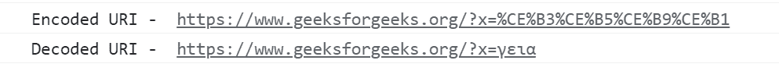

# JavaScript 中的 encodeURI()和 decodeURI()是什么？

> 原文:[https://www . geesforgeks . org/什么是 javascript 中的 encodeuri-and-decodeuri/](https://www.geeksforgeeks.org/what-are-the-encodeuri-and-decodeuri-in-javascript/)

URL 和 URIs 旨在定位/识别互联网上可用的资源，任何唯一识别资源的东西都是它的 URI，如 id、名称。网址指定资源及其访问协议。所有的网址都是 URIs，但不是所有的 URIs 都是网址。URI 只能有标准 128 ASCII 字符集的某些字符。不属于此集合的保留字符必须编码。这意味着我们在传递到一个网址时需要对这些字符进行编码。在 JavaScript 中，我们有两个特殊的函数来完成编码和解码 URIs 的任务。 **encodeURI** ()和 **decodeURI** ()这些功能是为了对非英文字符进行编码/解码而引入的，例如 URI(统一资源标识符)中使用的拉丁文、希腊文字母。此外，它有助于编码特殊字符，取代 URI 的空白；有时这些特殊的字符或空白可以划定 URI。

**1。encodeURI():** 用于将给定的 URI 编码为 UTF-8 格式。 **encodeURI** ()函数将 **URI** (类型字符串)作为一个函数参数值，并通过用一个、两个、三个或四个转义序列替换某些字符的每个实例来编码 URI，转义序列代表字符的 UTF-8 编码。

**语法:**

```
encodeURI(URI)
```

**参数:**这里，URI 是一个参数，它由一个完整的 URI 统一资源标识符(类型字符串)组成，您想要对它进行编码。

**返回值:**上述函数将返回一个新的字符串，表示作为函数参数提供的给定 URI 的“编码 URI”。

**注意:**在很多浏览器中 encodeURI()不编码很多字符下面是一组特殊字符[ ~！@ # { content } amp*()=:/,;？+' ]来编码这些字符集 escape()是单独实现的。以及英文字母和数字[A-Z A-Z 0-9–_。！~ *()]没有被 encodeURI()转义。要对完整的 URI 字符串进行编码，您可以使用 encodeURI()，如果您对 URI 字符串的一部分进行了转义，则可以使用 encodeURIComponent()对 URI 字符串的特定部分进行编码。

**2。decodeURI():** 用于解码之前已经编码的 URI。这与此相反，取一个编码字符串，用普通字符替换标记。 **decodeURI** ()函数将**encodeURI**(类型字符串)作为一个函数参数值，并对给定的编码 URI 进行解码，该编码之前由 encodeURI()或类似的例程创建。

**语法:**

```
decodeURI(encodedURI)
```

**参数:**这里，encodedURI 是表示完整的编码 URI(统一资源标识符)的参数。如果要解码，URI 参数必须只包含编码形式的 URI。此外，如果给定的参数“encodedURI”包含无效的字符序列，它将引发“URIError”异常。

**返回值:**上述函数将返回一个新的字符串，该字符串以编码形式表示给定 URI 的解码版本。

**注意:**将编码 URI 中的每个转义序列替换为它所代表的字符，但不解码 encodeURI 无法引入的转义序列。它也用于解码西里尔文网址；西里尔网址包含西里尔字母，看起来类似于拉丁字母中的字母(用于英语)，有时它被用来跟踪用户并将其重定向到假网站。

**示例:**

## java 描述语言

```
<script>
    const uri = 'https://www.geeksforgeeks.org/?x=γεια';
    const encoded = encodeURI(uri);
    console.log("Encoded URI - ", encoded);

    // Expected output: 
    //"https://www.geeksforgeeks.org/?x=%CE%B3%CE%B5%CE%B9%CE%B1"

    try {
        console.log("Decoded URI - ", decodeURI(encoded));

        // Expected output: 
        // "https://www.geeksforgeeks.org/?x=γεια"
    } catch (e) {
        console.error(e);
    }
</script>
```

**输出:**



**encodeURI** 和 **decodeURI** 的输出