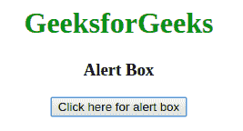
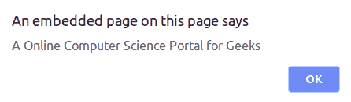
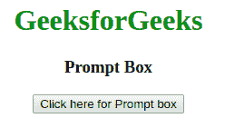
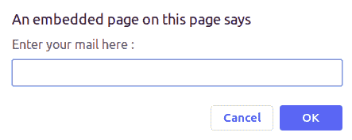
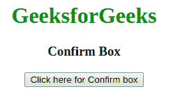
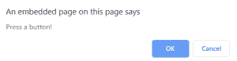

# JavaScript 中有哪些类型的弹出框？

> 原文:[https://www . geesforgeks . org/JavaScript 中有哪些类型的弹出框/](https://www.geeksforgeeks.org/what-are-the-types-of-popup-box-available-in-javascript/)

在 Javascript 中，弹出框用于向用户显示消息或通知。JavaScript 中有三种弹出框，分别是**提醒框**、**确认框**、**提示框**。

**警告框:**需要产生警告信息时使用。当警告框显示给用户时，用户需要按 ok 并继续。

**语法:**

```
alert("your Alert here")
```

**示例:**

## 超文本标记语言

```
<!DOCTYPE html>
<html>

<head>
    <title>Pop-up Box type | Alert Box</title>
    <style>
        h1{
            color:green;
        }
    </style>
</head>

<body>
    <center>

        <h1>GeeksforGeeks</h1>

        <h3>Alert Box</h3>
        <button onclick="geekAlert()">
            Click here for alert box
        </button>

        <!-- Alert box function -->
        <script>
            function geekAlert() {
                alert("An Online Computer Science"
                               + "Portal for Geeks");
            }
        </script>
    </center>
</body>

</html>
```

**输出:**
**按下按钮前:**



**按下按钮后:**



**提示框:**是一种弹出框的类型，用于获取用户输入以便进一步使用。输入所需的详细信息后，用户必须单击“确定”继续下一阶段，否则按“取消”按钮用户将返回空值。

**语法:**

```
prompt("your Prompt here")
```

**示例:**

## 超文本标记语言

```
<!DOCTYPE html>
<html>

<head>
    <title>
      Pop-up Box type | Prompt Box
    </title>
    <style>
        h1 {
            color: green;
        }
    </style>
</head>

<body>
    <center>

        <h1>GeeksforGeeks</h1>

        <h3>Prompt Box</h3>

        <input type="button" onclick="geekPrompt();"
        value="Click here for Prompt box"/>

        <!-- Prompt box function -->
        <script>
            function geekPrompt() {
                var x = prompt("Enter your mail here : ");
                document.write("Your ID : " + x);
            }
        </script>
    </center>
</body>

</html>
```

**输出:**
**按下按钮前:**



**按下按钮后:**



**确认框**是一种用于获得用户授权或许可的弹出框。用户必须按下 ok 或 cancel 按钮才能继续。

**语法:**

```
confirm("your query here")
```

**示例:**

## 超文本标记语言

```
<!DOCTYPE html>
<html>

<head>
    <title>
        Pop-up Box type | Confirm Box
    </title>
    <style>
        h1 {
            color: green;
        }
    </style>
</head>

<body>
    <center>

        <h1>GeeksforGeeks</h1>

        <h3>Confirm Box</h3>

        <button onclick="geekConfirm()">
          Click here for Confirm box
        </button>

        <p id="geek"></p>

        <!-- Confirm box function -->
        <script>
            function geekConfirm() {
                var x;
                if (confirm("Press a button!") == true) {
                    x = "OK pressed!";
                } else {
                    x = "Cancel!";
                }
                document.getElementById("geek").innerHTML = x;
            }
        </script>
    </center>
</body>

</html>
```

**输出:**
**按下按钮前:**



**按下按钮后:**

