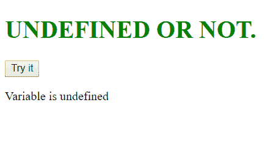

# JavaScript 中有哪些未声明和未定义的变量？

> 原文:[https://www . geesforgeks . org/什么是未声明和未定义的 javascript 变量/](https://www.geeksforgeeks.org/what-are-undeclared-and-undefined-variables-in-javascript/)

**未定义:**当一个变量已经被声明，但没有被赋值时，就会出现这种情况。Undefined 不是关键字。

**未声明:**当我们试图使用 *var* 或 *const 关键字*访问任何未初始化或未提前声明的变量时，就会出现这种情况。如果我们使用 *'typeof'* 运算符获取未声明变量的值，我们将面临*运行时错误*，返回值为**“未定义”**。未声明变量的范围总是全局的。

**例如:**

*   **未定义:**

    ```
    var geek;
    undefined
    console.log(geek) 

    ```

*   **未申报:**

    ```
    //ReferenceError: myVariable is not defined
    console.log(myVariable) 

    ```

*   **Example 1:** This example illustrate a situation where an undeclared variable is used.

    ```
    <script>
    function GFG(){
    //'use strict' verifies that no undeclared 
    // variable is present in our code
       'use strict'; 
       x = "GeeksForGeeks";
    }

     GFG(); //accessing the above function
    </script>
    ```

    **输出:**

    ```
    ReferenceError: x is not defined
    ```

*   **Example 2:** This example checks whether a given variable is undefined or not.

    ```
    <!DOCTYPE html>
    <html>

    <body>
        <style>
            h1 {
                color: green;
            }
        </style>

        <h1>UNDEFINED OR NOT.</h1>

        <button onclick="checkVar()">
          Try it
      </button>

        <p id="gfg"></p>

        <script>
            function checkVar() {
                if (typeof variable === "undefined") {   
                    string = "Variable is undefined";
                } else {   
                    string = "Variable is defined";
                }
                document.getElementById("gfg").innerHTML = 
                  string;
            }
        </script>

    </body>

    </html>
    ```

    **输出:**

    