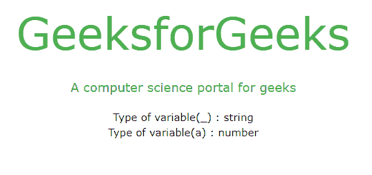
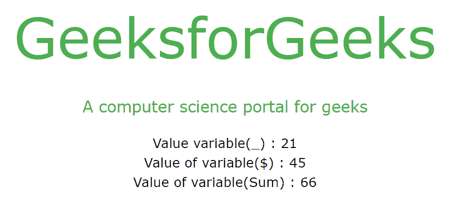

# JavaScript 中的+_ 运算符是什么意思？

> 原文:[https://www . geesforgeks . org/what-do-_-operator-in-mean-JavaScript/](https://www.geeksforgeeks.org/what-does-_-operator-mean-in-javascript/)

**一元运算符:**一元运算只包含一个操作数。这里，'+'一元加号运算符将其操作数转换为数字类型。同时，它还充当具有两个操作数的算术运算符，在计算时返回加法结果。

**JavaScript 标识符:** Javascript 标识符用于命名变量(和关键字，和函数，和标签)。在 Javascript 中，第一个字符必须是字母、下划线(_)或美元符号($)，但不能是数字，后续字符可以是字母、数字、下划线或美元符号。

**JavaScript +_ 运算符:**是带符号下划线(_)的变量和一元加号(+)运算符的组合，+运算符将 _ 变量的类型转换为 Number 类型，以便进一步操作。

**示例:**字符串类型的变量“_”存储在“数字”类型的变量“r”中。

*   **输入:**

    ```
    var _ = "1";
    var r = +_;
    ```

*   **输出:**

    ```
    typeof(r) will be number
    ```

**例 1:** 字符串到数字的转换

## 超文本标记语言

```
<!DOCTYPE html>
<html>
    <head>
        <title>Javascript Operator</title>
        <script type="text/javascript"></script>
        <link rel="stylesheet" 
              href="https://www.w3schools.com/w3css/4/w3.css" />
    </head>
    <body>
        <div class="conintainer">
            <p class="w3-jumbo w3-text-green pad" 
               align="center" 
               style="margin: 0 0 0 0;">
              GeeksforGeeks
            </p>

            <p class="w3-large w3-text-green pad" 
               align="center">
              A computer science portal for geeks
            </p>

            <p align="center">
                Type of variable(_) : 
              <span id="gfg"></span> <br />
                Type of variable(a) : 
              <span id="gfg1"></span>
            </p>

            <script type="text/javascript">
                GFG = function (_) {
                    let b = typeof _;
                    let a = +_;
                    let c = typeof a;

                    document.getElementById("gfg").innerHTML = b;
                    document.getElementById("gfg1").innerHTML = c;
                };

                GFG("21");
            </script>
        </div>
    </body>
</html>
```

**输出:**



**示例 2:** 通过将算术加法运算转换为数字类型来执行算术加法运算。

## 超文本标记语言

```
<!DOCTYPE html>
<html>
    <head>
        <title>Addition Operation</title>
        <script type="text/javascript"></script>
        <link rel="stylesheet" 
              href="https://www.w3schools.com/w3css/4/w3.css" />
    </head>
    <body>
        <div class="conintainer">
            <p class="w3-jumbo w3-text-green pad" 
               align="center"
               style="margin: 0 0 0 0;">
              GeeksforGeeks
            </p>

            <p class="w3-large w3-text-green pad" 
               align="center">
              A computer science portal for geeks
            </p>

            <p align="center">
                Value variable(_) :
              <span id="gfg"></span> <br />
                Value of variable($) :
              <span id="gfg1"></span> <br />
                Value of variable(Sum) :  
              <span id="gfg2"></span>
            </p>

            <script type="text/javascript">
                GFG = function (_, $) {
                    let c = +_ + +$;
                    let a = +_;
                    let b = +$;

                    document.getElementById("gfg").innerHTML = a;
                    document.getElementById("gfg1").innerHTML = b;
                    document.getElementById("gfg2").innerHTML = c;
                };

                GFG("21", "45");
            </script>
        </div>
    </body>
</html>
```

**输出:**

