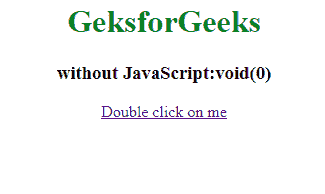
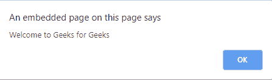
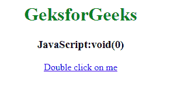

# JavaScript:void(0)是什么意思？

> 原文:[https://www . geeksforgeeks . org/什么意思-JavaScript void 0-什么意思/](https://www.geeksforgeeks.org/what-does-javascriptvoid0-mean/)

您可能偶尔会在 HTML 文档中遇到“javascript:void(0)”。当在网页中插入表达式可能会产生一些不想要的效果时，通常会用到它。要移除此效果，使用*“JavaScript:void(0)”*。此表达式返回未定义的基元值。
这个经常和超链接一起使用。
有时候，你会决定从一个链接里面调用一些 JavaScript。通常，当您单击链接时，浏览器会加载一个全新的页面或刷新同一页面(取决于指定的网址)。
但是如果你连接了一些 JavaScript 链接，你很可能不希望这种情况发生。

若要防止页面刷新，可以使用 void(0)。

**在锚点标签中使用“#”:**在编辑器中编写以下代码时，网页会在显示警告消息后刷新。
T3】例:

```
<!DOCTYPE html>
<html>

<head>
    <title>without JavaScript:void(0)</title>
</head>

<body>
    <center>
        <h1 style="color:green">GeksforGeeks</h1>
        <h3>without JavaScript:void(0)</h3>
        <a href="#" 
           ondblclick="alert('Welcome to Geeks for Geeks')"> 
Double click on me </a>
    </center>
</body>

</html>
```

**输出:**



**使用“JavaScript:void(0)；”在锚点标签:**中写“JavaScript:void(0)；”在锚点标签中可以防止页面重新加载，并且 JavaScript 函数可以在单击或双击时轻松调用。
T3】例:

```
<!DOCTYPE html>
<html>

<head>
    <title>JavaScript:void(0)</title>
</head>

<body>
    <center>
        <h1 style="color:green">GeksforGeeks</h1>
        <h3>JavaScript:void(0)</h3>
        <a href="javascript:void(0);" 
           ondblclick="alert('Welcome to Geeks for Geeks')">
Double click on me </a>
    </center>
</body>

</html>
```

**输出:**

