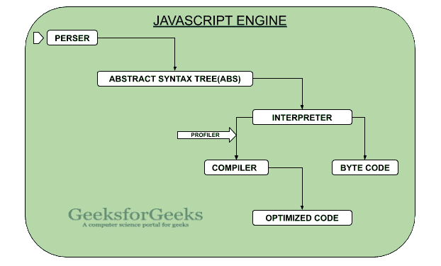

# 【JavaScript 引擎内部发生了什么？

> 原文:[https://www . geeksforgeeks . org/发生什么事-内部-javascript-engine/](https://www.geeksforgeeks.org/what-happens-inside-javascript-engine/)

**JavaScript** 是一种基于多范式原型的语言，使用了 **JavaScript 引擎，比如 Chrome 的 V8 引擎 Firefox SpiderMonkey 引擎等。**它们将高级代码转换成机器可读代码，让计算机执行一些特定的任务。我们将使用图像来理解这一点。



**谷歌 chrome 的 JavaScript V8 引擎:**首先，原始 JavaScript 文件进入**解析器**。

*   **解析器:**检查**语法**和**语义**。**解析器**只不过是一种词法分析，它将代码分解成标记，以便理解它们的含义，这些标记被转换成抽象语法树(AST)。
*   **抽象语法树:**它是一种程序表示的层次树状结构，允许解释器理解程序。这个 AST 最初是给**翻译**的。
*   **解释器:**它让 **AST** 转换成字节码。在 **V8 发动机**中，这个过程被称为**点火**，但是当一些代码反复出现时。
    **例如:**

## java 描述语言

```
// Arrow function
const multiply = (a, b)=> a*b;

for(let i=0;i<1000;i++){
    console.log(multiply(4, 3));
}
```