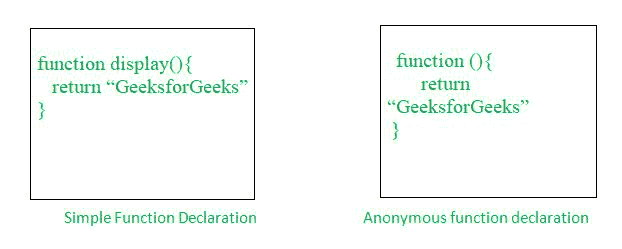

# JavaScript 中匿名函数的典型用例是什么？

> 原文:[https://www . geesforgeks . org/什么是 javascript 中匿名函数的典型用例/](https://www.geeksforgeeks.org/what-is-a-typical-use-case-for-anonymous-functions-in-javascript/)

在本文中，我们将尝试了解匿名函数到底是什么，我们如何使用 JavaScript 中提供的语法来声明它，此外，我们还将看到一些示例(用例)，在这些示例中，我们可以使用匿名函数在控制台中获得结果。在继续匿名函数的例子或用例之前，让我们简单了解一下简单的[函数](https://www.geeksforgeeks.org/functions-in-javascript/)和[匿名函数。](https://www.geeksforgeeks.org/javascript-anonymous-functions/)



函数是一组接受输入、进行某种特定计算并产生输出的语句。基本上，函数是一组语句，它们执行一些任务或进行一些计算，然后将结果返回给用户。匿名函数的工作原理与普通函数相同，但语法不同。

匿名函数是一个没有任何关联名称的函数。通常我们在函数名前使用 *函数* 关键字来定义 JavaScript 中的函数，但是，在 JavaScript 中的匿名函数中，我们只使用 *函数* 关键字而不使用函数名。匿名函数在初始创建后是不可访问的，它只能被一个变量访问，该变量作为一个值 存储在 *函数中。匿名函数也可以有多个参数，但只能有一个表达式。*

让我们考虑下面这段代码来理解我们如何声明一个普通函数和一个匿名函数:

**示例:**

## java 描述语言

```
<script>
   // Normal function
   function Display() {
        return "GeeksforGeeks!";
    }

  console.log(Display());
  // Anonymous function
  let display = function() {
    return "GeeksforGeeks!!!";
   }
  console.log(display()); 
</script>
```

**输出:**

```
GeeksforGeeks!
GeeksforGeeks!!!
```

现在让我们看看下面的例子(用例)，这些例子将更详细地说明匿名函数及其用法。

**示例 1:** 在本例中，我们将匿名函数存储在一个变量中，然后我们将使用函数调用语法调用该变量，以便打印我们的结果。如果您不了解箭头函数，请参考 JavaScript 文章中的[箭头函数。](https://www.geeksforgeeks.org/arrow-functions-in-javascript/)

## java 描述语言

```
<script>
    let display = function() {
        return "GeeksforGeeks...!";
    }
    console.log(display());

   // Using arrow function 
   let displayName = () => {
     return "GeeksforGeeks....!";
   }
  console.log(displayName()); 
</script>
```

**输出:**

```
GeeksforGeeks...!
GeeksforGeeks....!
```

**示例 2:** 在本例中，我们将在匿名函数内部传递一个参数，该参数负责获取我们的结果名称，此外，在调用该函数时，我们将提供该名称作为参数值。

## java 描述语言

```
<script>
    let display = function(name) {
        return name;
    }
   console.log(display("GeeksforGeeks"));

   // Using arrow function
   let displayName = (name) => {
    return name;
   }
  console.log(displayName("GeeksforGeeks")); 
</script >
```

**输出:**

```
GeeksforGeeks
GeeksforGeeks
```

**示例 3:** 在本例中，我们使用匿名函数作为自调用函数(一种特殊函数，它在声明后立即被调用，并且没有任何类型的名称与之相关联)，这可以通过在函数定义之间写入括号来实现。

## java 描述语言

```
<script>
      (function () {
        console.log("GeeksforGeeks....!");
       })();

      // Using arrow functions
      (() => {
    console.log("GeeksforGeeks....!");
      })(); 
</script >
```

**输出:**

```
GeeksforGeeks....!
GeeksforGeeks....!
```

**匿名功能的区别&正常功能**

<figure class="table">

| 

#### S 号

 | 

#### **Normal function**

 | 

#### **Anonymous function**

 |
| --- | --- | --- |
| 1。 | 一个简单的函数(也叫方法)负责执行某些操作或任务。当函数被调用时，它执行该函数所调用的特定任务。 | 匿名函数是一个没有任何关联名称的函数。这是在没有任何标识符或名称的情况下创建的 |
| 2。 | 我们可以通过调用函数直接访问这个函数。 | 匿名函数在其初始创建后是不可访问的，它只能由它作为函数作为值存储在其中的变量来访问。 |
| 3。 | 该功能对所有场景都有用。 | 匿名函数对于创建 IIFE(立即调用的函数表达式)非常有用。 |
| 4。 | 正常函数被挂起，这意味着我们可以在函数在 javascript 中使用后声明它。 | 一个匿名功能不能被挂起。 |

</figure>