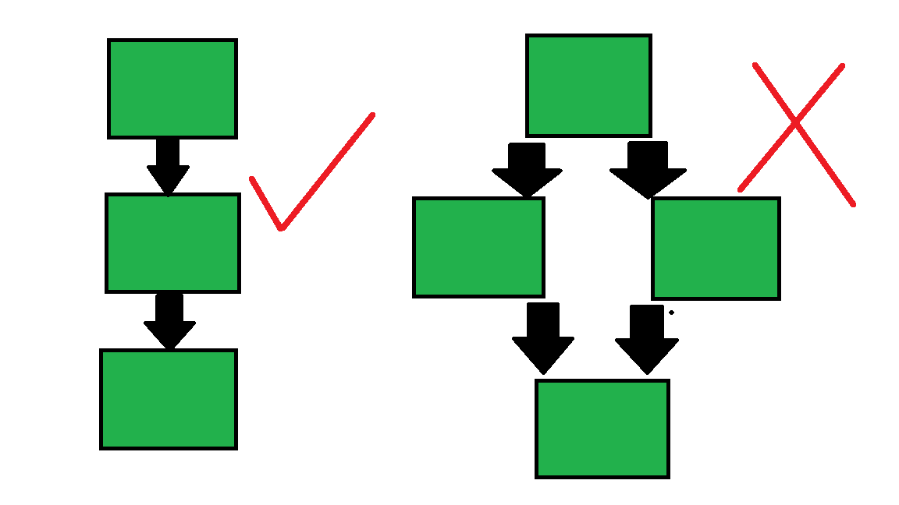
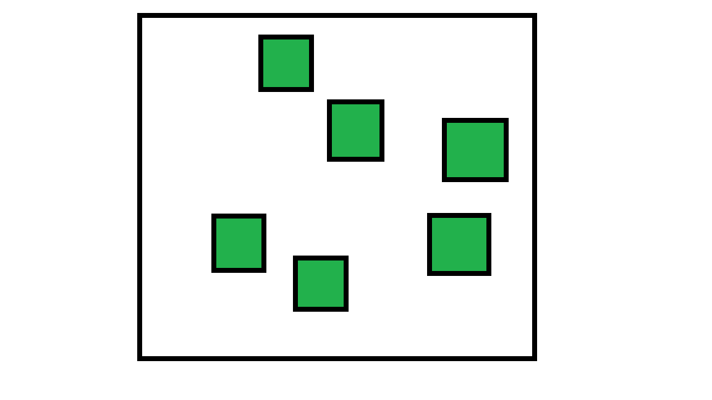
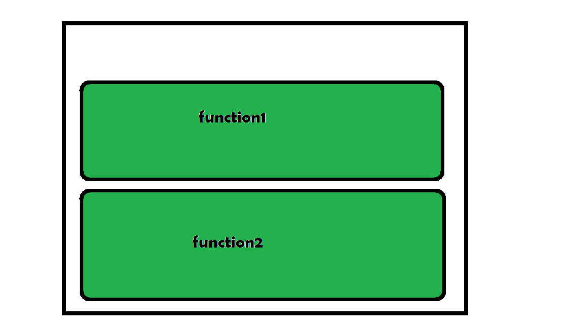
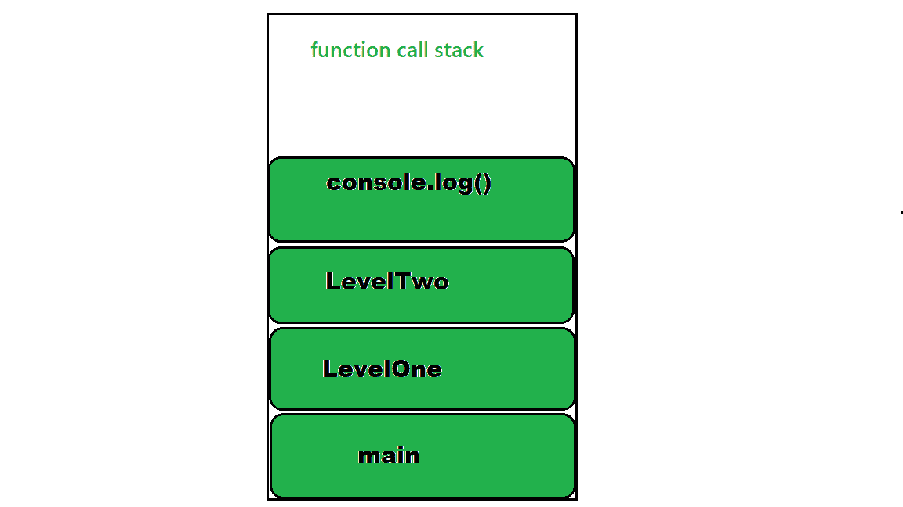
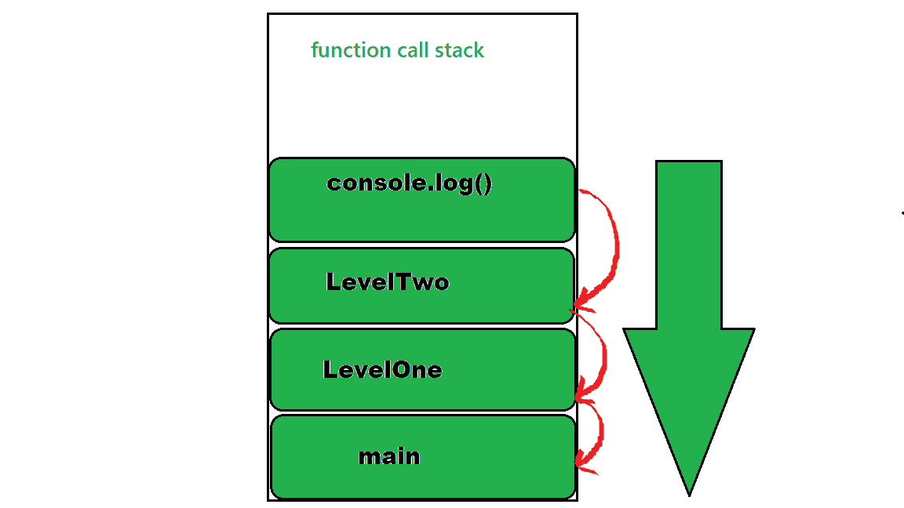
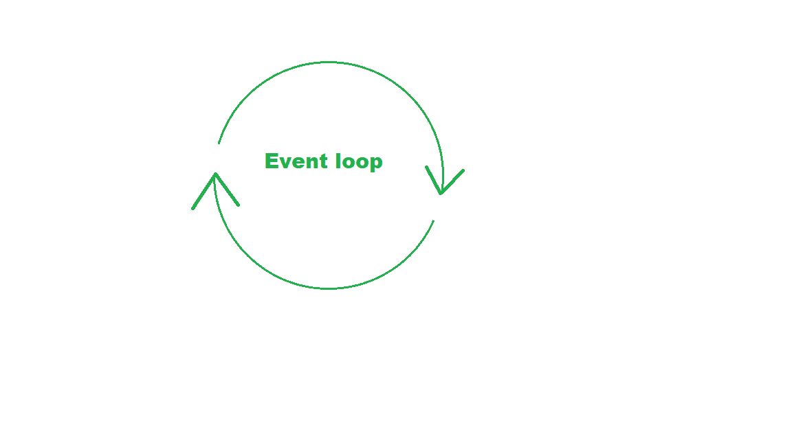
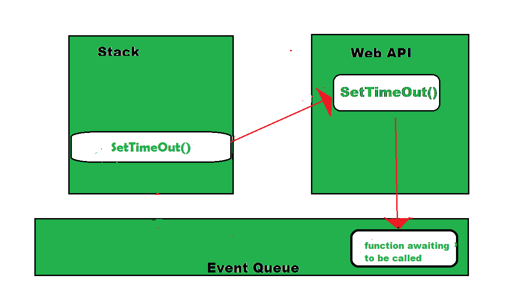
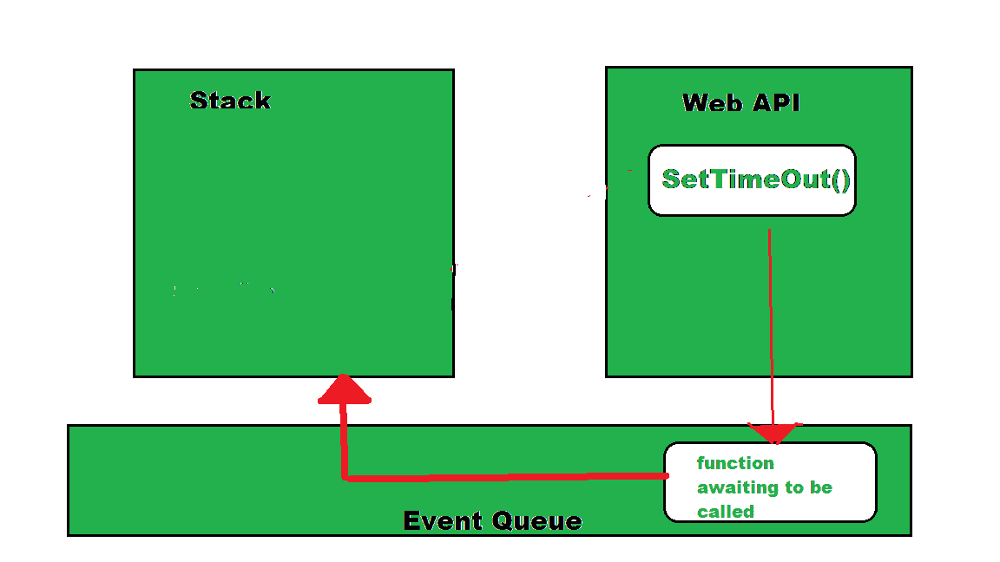
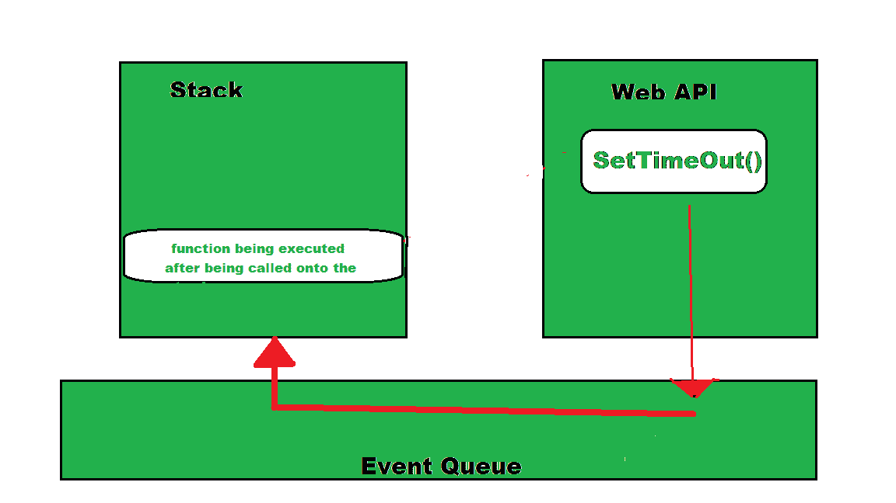

# 什么是 JavaScript 中的事件循环？

> 原文:[https://www . geesforgeks . org/什么是 javascript 中的事件循环/](https://www.geeksforgeeks.org/what-is-an-event-loop-in-javascript/)

JavaScript 是一种单线程同步编程语言。但它实际上意味着什么呢？我们一直在谈论的 JavaScript 中的这个事件循环是什么？

**当我们说 JavaScript 是单线程时，它实际上意味着什么？**

这意味着运行 JavaScript 代码的主线程以一次一行的方式运行，不可能并行运行代码。



**示例:**

## java 描述语言

```
console.log("Before delay");

function delayBySeconds(sec) {
   let start = now = Date.now()
   while(now-start < (sec*1000)) {
     now = Date.now();
   }
}

delayBySeconds(5);

// Executes after delay of 5 seconds
console.log("After delay");
```

**输出:**

```
Before delay
(... waits for 5 seconds)
After delay
```

**JavaScript 中的内存分配:**

**1)堆内存:**数据随机存储，内存分配。



**2)堆栈内存:**以堆栈形式分配的内存。主要用于功能。



**函数调用栈:**函数栈是一个跟踪运行时执行的所有其他函数的函数。当你在 JavaScript 中遇到一个错误时，你是否见过一个堆栈跟踪被打印出来。这只不过是错误发生时函数堆栈的快照。

示例:

## java 描述语言

```
function LevelTwo() {
   console.log("Inside Level Two!")
}

function LevelOne() {
   LevelTwo()
}

function main() {
   LevelOne()
}

main()
```



函数执行的顺序，即在函数的目的结束后从堆栈中弹出，如下所示:



**事件循环:**事件循环是指每当函数堆栈变空时，将东西从队列中取出并放入函数执行堆栈的循环。



事件循环是 JavaScript 给我们一种多线程错觉的秘密，即使它是单线程的。下图很好地展示了事件循环的功能:



在这里，事件队列中的回调函数还没有运行，正在等待它进入堆栈的时间，此时 SetTimeOut()正在执行，Web API 正在进行上述等待。当函数栈变空时，函数被加载到栈中，如下所示:



这就是事件循环出现的地方，它从事件队列中取出第一个事件，并将其放入堆栈中，即在这种情况下的回调函数。从这里，这个函数执行调用它里面的其他函数，如果有的话。



这个循环被称为**事件循环**，这就是 JavaScript 管理其事件的方式。