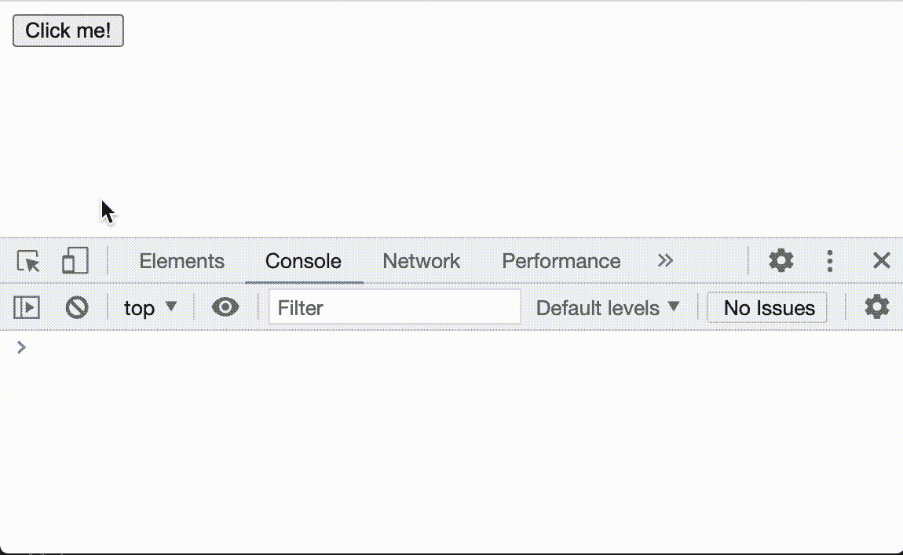
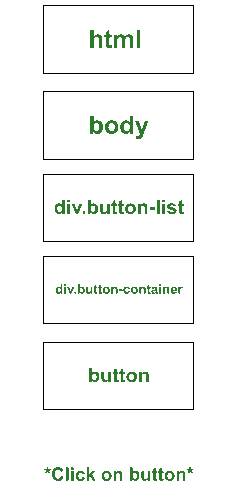
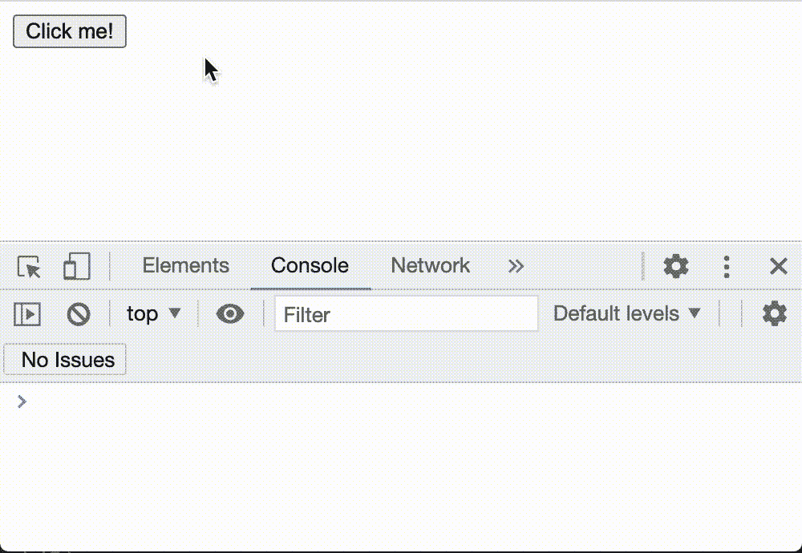
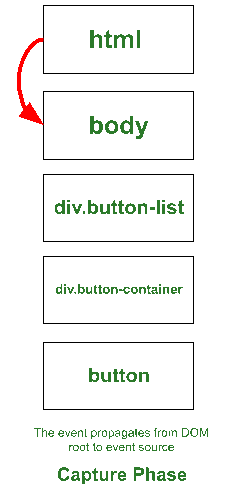

# 什么是 JavaScript 中的事件冒泡和捕捉？

> 原文:[https://www . geesforgeks . org/什么是事件冒泡并捕获 javascript/](https://www.geeksforgeeks.org/what-is-event-bubbling-and-capturing-in-javascript/)

**事件**是现代网络的基本构造。它们是一组特殊的对象，允许发出网站内发生了某些事情的信号。通过定义事件侦听器，开发人员可以在事件发生时运行特定的代码。这允许在 web 应用程序上实现复杂的控制逻辑。

每次您按键、点按按钮或轻按手机，浏览器都会发送一个事件。更重要的是，您可以定义自己的事件，并根据自己的意愿发送它们！这从模拟用户的击键发展到自定义的特定于域的事件。

可以想象，理解事件如何工作和表现是构建健壮的现代网络应用程序的关键；作为一名熟练的网络开发人员，这是一个需要掌握的关键概念。

**示例 1:** 假设我们有以下 HTML 文档。该文档呈现嵌套在两个不同的*div*中的单个按钮，每个元素附带一个事件处理程序，当检测到“点击”事件时将调用该程序。尝试运行它，点击按钮，并检查您的开发人员工具控制台。

## 超文本标记语言

```
<!DOCTYPE html>
<html lang="en">

<head>
    <meta charset="UTF-8">
    <meta name="viewport" content=
        "width=device-width, initial-scale=1.0">
    <title>
        GeeksForGeeks: What is Event 
        Bubbling and Capturing?
    </title>
</head>

<body>
    <div class="button-list" 
        onclick="console.log('button-list')">
        <div class="button-container" 
            onclick="console.log('container')">
            <button class="button" 
                onclick="console.log('button')">
                Click me!
            </button>
        </div>
    </div>
</body>

</html>
```

**输出:**输出将显示在控制台上，顺序如下。



示例 1 的输出

那么，发生了什么？你点击了按钮，然而*三个*日志被打印在控制台上。有几件事正在进行，让我们来解决它们。

**创建事件**

每当您与一个 DOM 元素交互时，浏览器都会创建一个新的 [DOM 事件](https://dom.spec.whatwg.org/#introduction-to-dom-events)。在这种情况下，当点击按钮时，浏览器会合成一个特定的 DOM 事件: [*指针*](https://developer.mozilla.org/en-US/docs/Web/API/PointerEvent) 。以下是它的几个属性。

```
{
  target: button.button,
  type: "click",
  x: 33,
  y: 9,
  ...
}
```

注意*类型*属性是如何设置为“点击”的，表示该事件代表鼠标点击(相比之下，例如，只需按下键盘上的一个键)。

**调度事件**

创建事件对象后，浏览器*调度*它。事件随后在所谓的**事件传播**中遍历 DOM。事件传播过程分为三个阶段。



“点击”事件通过示例 DOM 的事件传播

1.  **捕获阶段:**事件从 DOM 的根开始，开始向下遍历树，直到找到触发事件的元素。对于它遍历的每个元素，它检查是否有一个附加了*捕获*标志设置为真的事件监听器。如果不是，它只是忽略它。请注意，在我们的示例中，我们在控制台中看到的第一条日志消息是*按钮*消息。这是因为，默认情况下，事件监听器**不会监听**捕获阶段的事件。

2.  **目标阶段:**事件到达目标元素，并运行附加到它的事件侦听器(如果有)。在我们的示例中，这个阶段在控制台中为我们提供了第一条消息:“*按钮*”

3.  **冒泡阶段:**与捕获阶段类似，事件将遍历 DOM 检查事件侦听器，但这次它将从*调度*事件的元素开始，并在 DOM 的根元素(即 *html* 元素)上结束。就是在这个阶段，我们得到了我们示例中的日志“*容器*”和*”按钮列表*，因为它们是那个顺序中最接近按钮的祖先！请注意，默认情况下，事件监听器**在此阶段将被称为**。

**收听事件**

有几种方法可以监听通过 DOM 传递的事件。在文章的例子中，我们使用了“*onclick*”*事件属性。这种倾听事件的方法很简单，但不太通用。最通用、规范有效的方法是使用元素的 Javascript 方法“*添加事件侦听器*”。它是这样工作的。*

*要附加事件侦听器，请在元素上调用“ *addEventListener* ”，签名如下。*

```
*element.addEventListener(type, handler, useCapture);*
```

*   ***类型**:这是你想听的事件类型，由其*类型*属性定义。如前所述，在示例文档中，触发事件的*类型的*值为“点击”。*
*   ***处理程序**:这是对一个 javascript 函数的引用，当事件通过 DOM(在正确的阶段)时，该函数将运行*
*   ***使用捕获**:这是一个布尔值，指示在哪个事件传播阶段，事件侦听器应该触发事件处理程序。如果设置为真，侦听器将在*捕获*阶段调用处理程序。否则将在默认*冒泡*阶段调用。*

***例 2:** 我们用另一个例子来测试一下。用此代码更新示例文档。在这里，我们删除了列表和容器的事件属性，并将两个不同的事件侦听器附加到文档中:一个在捕获阶段，一个在冒泡阶段。现在，打开文档并点击按钮。*

## *超文本标记语言*

```
*<!DOCTYPE html>
<html lang="en">

<head>
    <meta charset="UTF-8">
    <meta name="viewport" content=
        "width=device-width, initial-scale=1.0">
    <title>
        GeeksForGeeks: What is Event 
        Bubbling and Capturing
    </title>
</head>

<body>
    <div class="button-list">
        <div class="button-container">
            <button class="button"
                onClick="console.log('button')">
                Click me!
            </button>
        </div>
    </div>
    <script>
        document.addEventListener("click", () =>
            console.log('Capture!'), true);
        document.addEventListener("click", () =>
            console.log('Bubbling!'), false);
    </script>
</body>

</html>*
```

***输出:**输出将显示在控制台上，顺序如下。*

*

示例 2 的输出* 

*如您所见，事件按照预期的顺序进行处理，正如事件传播过程所定义的那样。*

***通过 DOM 处理事件的传播***

*有几个事件方法可以控制事件在 DOM 树中的传播。*

*

通过调用 event.stopPropagation()停止了事件传播* 

*   ***event . preventdefault()***:*停止该事件的默认浏览器行为。*
*   ***事件.停止传播()** *:* 停止事件在下一个元素上的传播(无论是捕获阶段的后代，还是冒泡阶段的祖先)*
*   ***event . stoppermipropagement()**:类似于“*event . stoppermipropagement()”*，但也会停止在同一元素中其他侦听器上的传播。*

***结论***

*在本文中，我们已经了解了什么是事件，它们何时被浏览器触发，以及它们如何通过 DOM 传播以被不同的事件侦听器处理。现在是时候了解更多[事件](https://www.geeksforgeeks.org/javascript-events/)和[如何处理](https://www.geeksforgeeks.org/how-to-handle-javascript-events-in-html/)了。*