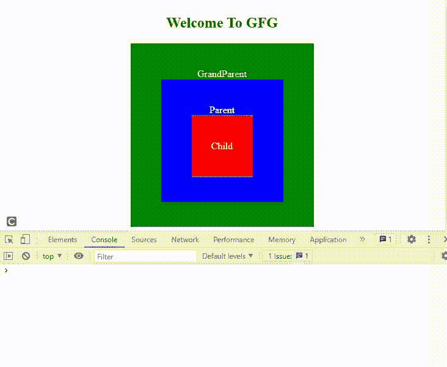
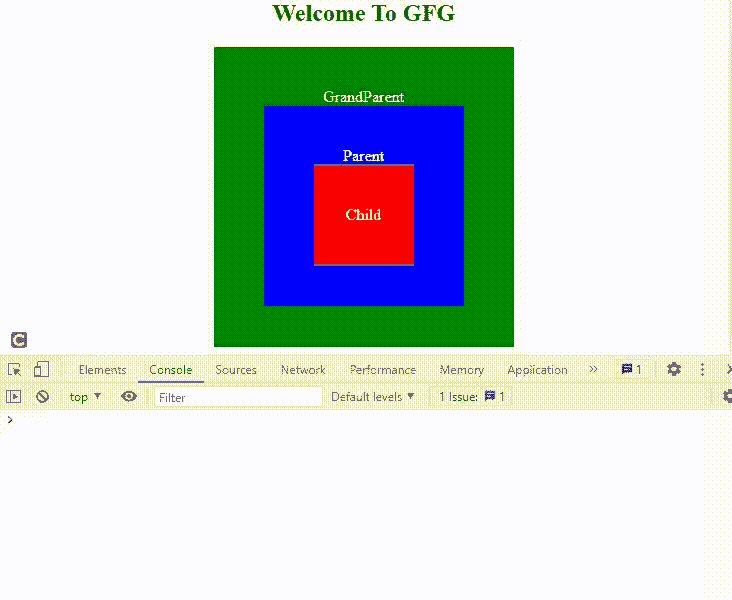
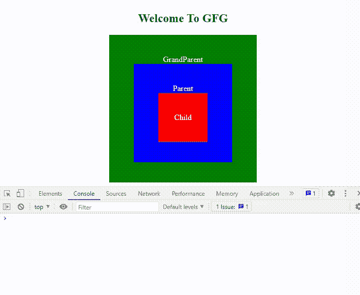

# 什么是 JavaScript 中的事件冒泡和事件捕获？

> 原文:[https://www . geesforgeks . org/什么是 javascript 中的事件冒泡和事件捕获/](https://www.geeksforgeeks.org/what-is-event-bubbling-and-event-capturing-in-javascript/)

[事件冒泡](https://www.geeksforgeeks.org/event-bubbling-in-javascript/)和事件捕获是 JavaScript 两个有趣的概念。在深入这些迷人的概念之前，让我们先了解一下什么是[事件监听器](https://www.geeksforgeeks.org/javascript-addeventlistener-with-examples/)？事件侦听器基本上是一个等待事件发生的函数。该事件可以是任何事情，如鼠标点击事件、提交表单、按键盘按键等。

事件侦听器包含三个参数，可以使用以下语法定义。

```html
<element>.addEventListener(<eventName>, 
    <callbackFunction>, {capture : boolean});
```

*   <element>:事件侦听器附加到的元素。</element>
*   <eventname>: 可以是‘点击’、‘向上键’、‘向下键’等。事件。</eventname>
*   <callbackfunction>:该功能在事件发生后触发。</callbackfunction>
*   {捕获:布尔值}:它告诉事件是处于捕获阶段还是冒泡阶段(可选)

**示例 1:** 我们举个例子来理解事件冒泡和事件捕获。

## 超文本标记语言

```html
<!DOCTYPE html>
<html>

<head>
    <script src=
"https://code.jquery.com/jquery-3.6.0.min.js">
    </script>
    <style>
        div {
            color: white;
            display: flex;
            justify-content: center;
            align-items: center;
            flex-direction: column;
        }
        h2 {
            color: black;
        }
        #grandparent {
            background-color: green;
            width: 300px;
            height: 300px;
        }
        #parent {
            background-color: blue;
            width: 200px;
            height: 200px;
        }
        #child {
            background-color: red;
            width: 100px;
            height: 100px;
        }
    </style>
</head>

<body>
    <div>
        <h2>Welcome To GFG</h2>
        <div id="grandparent">GrandParent
            <div id="parent">Parent
                <div id="child">Child</div>
            </div>
        </div>
    </div>

    <script>
        const grandParent = document.getElementById("grandparent");
        const parent = document.getElementById("parent");
        const child = document.getElementById("child");

        grandParent.addEventListener("click", (e) => {
            console.log("GrandParent");
        }, { capture: false });
        parent.addEventListener("click", (e) => {
            console.log("Parent");
        }, { capture: false });
        child.addEventListener("click", (e) => {
            console.log("Child");
        }, { capture: false });
    </script>
</body>
</html>
```

**输出:**



当我们以孩子作为 id 点击 div 时，我们应该在控制台上以“孩子”的形式获得输出。但是出乎意料的是，我们收到了一个不同的输出，即使我们没有点击父母和祖父母作为他们的 id 的 div。事件冒泡的概念出现了。子分区位于父分区和祖父母分区内。因此，当子 div 单击时，我们间接单击了父 div 和祖父母 div。因此，在 DOM 中，传播是从内到外的，或者我们可以说事件正在冒泡。

因此，从 DOM(文档对象模式)中最近的元素传播到最远的元素的过程称为事件冒泡。

**示例 2:** 在上面的示例中，让我们更改[**addEventListener()**](https://www.geeksforgeeks.org/javascript-addeventlistener-with-examples/)第三个参数的值，看看输出会有什么变化。

## 超文本标记语言

```html
<!DOCTYPE html>
<html>
<head>

    <style>
        div {
            color: white;
            display: flex;
            justify-content: center;
            align-items: center;
            flex-direction: column;
        }
        h2 {
            color: black;
        }
        #grandparent {
            background-color: green;
            width: 300px;
            height: 300px;
        }
        #parent {
            background-color: blue;
            width: 200px;
            height: 200px;
        }
        #child {
            background-color: red;
            width: 100px;
            height: 100px;
        }
    </style>
</head>

<body>
    <div>
        <h2>Welcome To GFG</h2>
        <div id="grandparent">GrandParent
            <div id="parent">Parent
                <div id="child"> Child</div>
            </div>
        </div>
    </div>
    <script>
        const grandParent = document.getElementById("grandparent");
        const parent = document.getElementById("parent");
        const child = document.getElementById("child");

        // Changing value of capture parameter as 'true'
        grandParent.addEventListener("click", (e) => {
            console.log("GrandParent");
        }, { capture: true });
        parent.addEventListener("click", (e) => {
            console.log("Parent");
        }, { capture: true });
        child.addEventListener("click", (e) => {
            console.log("Child");
        }, { capture: true });
    </script>
</body>

</html>
```


很明显*子 div* 的*祖先 div*先打印，然后是*子 div* 本身。所以，从 DOM 中最远的元素传播到最近的元素的过程叫做事件捕获**。**两个术语正好相反。

**示例 3:** 为了更好地理解，让我们更多地玩代码。

## 超文本标记语言

```html
<!DOCTYPE html>
<html>

<head>  
    <style>
        div {
            color: white;
            display: flex;
            justify-content: center;
            align-items: center;
            flex-direction: column;
        }
        h2 {
            color: black;
        }
        #grandparent {
            background-color: green;
            width: 300px;
            height: 300px;
        }
        #parent {
            background-color: blue;
            width: 200px;
            height: 200px;
        }
        #child {
            background-color: red;
            width: 100px;
            height: 100px;
        }
    </style>
</head>

<body>
    <div>
        <h2>Welcome To GFG</h2>
        <div id="grandparent">GrandParent
            <div id="parent">Parent
                <div id="child"> Child</div>
            </div>
        </div>
    </div>

    <script>
        const grandParent = document.getElementById("grandparent");
        const parent = document.getElementById("parent");
        const child = document.getElementById("child");

        document.addEventListener("click", (e) => {
            console.log("Document capturing");
        }, { capture: true });

        grandParent.addEventListener("click", (e) => {
            console.log("GrandParent capturing");
        }, { capture: true });

        parent.addEventListener("click", (e) => {
            console.log("Parent capturing");
        }, { capture: true });

        child.addEventListener("click", (e) => {
            console.log("Child capturing");
        }, { capture: true });
          document.addEventListener("click", (e) => {
            console.log("Document bubbling");
        }, { capture: false });

        grandParent.addEventListener("click", (e) => {
            console.log("GrandParent bubbling");
        }, { capture: false });

        parent.addEventListener("click", (e) => {
            console.log("Parent bubbling");
        }, { capture: false });

        child.addEventListener("click", (e) => {
            console.log("Child bubbling");
        }, { capture: false });
    </script>
</body>

</html>
```

**输出:**如果我们点击了 id 为 child 的 div，那么这将是输出。



我们可以看到事件侦听器的事件捕获首先发生，然后事件冒泡发生。这意味着事件侦听器的传播首先从外部到内部，然后在 DOM 中从内部到外部。

**如何停止事件冒泡和事件捕捉？**

在上面的例子中，我们可以在 [addEventListener()](https://www.geeksforgeeks.org/javascript-addeventlistener-with-examples/) 的回调函数中看到一个参数“e”(或者有时称为“event”)。它是一个事件对象，当我们向元素添加事件侦听器时，它会自动定义。这个对象“e”有一个名为[stopperpagation()](https://www.geeksforgeeks.org/html-dom-stoppropagation-event-method/)的函数，有助于防止这种烦人的行为。

**示例 4:** 让我们看看当我们点击下面代码中的*子 div* 时会发生什么。

## 超文本标记语言

```html
<!DOCTYPE html>
<html>

<head>
    <style>
        div {
            color: white;
            display: flex;
            justify-content: center;
            align-items: center;
            flex-direction: column;
        }
        h2 {
            color: black;
        }
        #grandparent {
            background-color: green;
            width: 300px;
            height: 300px;
        }
        #parent {
            background-color: blue;
            width: 200px;
            height: 200px;
        }
        #child {
            background-color: red;
            width: 100px;
            height: 100px;
        }
    </style>
</head>

<body>
    <div>
        <h2>Welcome To GFG</h2>
        <div id="grandparent">GrandParent
            <div id="parent">Parent
                <div id="child"> Child</div>
            </div>
        </div>
    </div>

    <script>
        const grandParent = document.getElementById("grandparent");
        const parent = document.getElementById("parent");
        const child = document.getElementById("child");
        grandParent.addEventListener("click", (e) => {
            console.log("GrandParent bubbling");
        });
        parent.addEventListener("click", (e) => {
            e.stopPropagation();  //syntax to stop event bubbling
            console.log("Parent bubbling");
        });
        child.addEventListener("click", (e) => {
            console.log("Child bubbling");
        });
    </script>
</body>

</html>
```

**输出:**



如果我们点击*子 div* ，传播在*父 div* 上停止，不会移动到祖父母 *div* 。因此，防止了事件冒泡。

**注意:**也可以用同样的方法阻止事件捕获。

**需要记住的要点:**

*   如果我们在 **addEventListener()** 中没有提到任何第三个参数，那么默认情况下会发生事件冒泡。
*   事件冒泡和事件捕获只有当元素及其所有祖先都有相同的事件侦听器(在我们的例子中是“click”事件)附加到它们时才会发生。

**结论:**我们已经了解了事件冒泡和事件捕获，这些是一些关键点。

*   事件捕获意味着事件从 DOM 中的祖先元素传播到子元素，而事件冒泡意味着事件从 DOM 中的子元素传播到祖先元素。
*   事件捕获发生后会出现事件冒泡。
*   如果{capture: true}，将发生事件捕获，否则将发生事件冒泡。
*   这两种情况都可以通过使用**stopperpagation()**方法来防止。