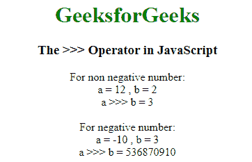

# 什么是 JavaScript > > >运算符以及如何使用？

> 原文:[https://www . geesforgeks . org/什么是 JavaScript-操作符和使用方法/](https://www.geeksforgeeks.org/what-is-javascript-operator-and-how-to-use-it/)

JavaScript > > >代表零填充右移运算符。它也被称为无符号右移位运算符。它属于按位运算符的范畴。按位运算符将操作数视为 32 位整数，并对其二进制表示进行运算。

**零填充右移(> > >)运算符:**
它是一个二进制运算符，其中第一个操作数指定要移位的位数，第二个操作数指定要移位的位数。运算符将第一个操作数的位移动第二个操作数指定的位数。这些位向右移动，多余的位被丢弃，而 0 位从左边添加。当符号位变为 0 时，运算符(> > >)返回一个 32 位非负整数。

**示例:**

```
Input:
A = 6 ( 00000000000000000000000000000110 )
B = 1 ( 00000000000000000000000000000001 )

Output:
A >>> B = 3 ( 00000000000000000000000000000011 )
```

**语法:**

```
result = expression1 >>> expression2

```

**区别> > >和> > :**
这两者的区别在于无符号零填充右移位运算符(> > >)从左边填充零，有符号右移位运算符(> >)从左边填充符号位，因此移位时保持整数值的符号。

**示例:**本示例实现了> > >运算符的使用:

*   **程序:**

    ```
    <!DOCTYPE html>
    <html>

    <head>
        <title>>>> Operator in JavaScript</title>

        <style>
            body {
                text-align: center;
            }

            h1 {
                color: green;
            }
        </style>
    </head>

    <body>
        <h1>GeeksforGeeks</h1>
        <h3>The >>> Operator in JavaScript</h3>

        <script>
            document.write("For non negative number:<br>");
            var a = 12;

            // Shift right two bits
            var b = 2;
            document.write("a = " + a + " , b = " + b);
            document.write("<br>a >>> b = " + (a >>> b) + '<br>');

            document.write("<br>For negative number:<br>");
            var a = -10;

            // Shift right two bits
            var b = 3; 
            document.write("a = " + a + " , b = " + b);
            document.write("<br>a >>> b = " + (a >>> b) + '<br>');
        </script>
    </body>

    </html>
    ```

*   **Output:**
    

    **说明:**对于非负数，零填充右移(> > >)和符号传播右移(> >)给出相同的输出。例如，9 > > > 2 和 9 > > 2 给出相同的结果，即 2。但对于负数，-9 > > > 2 给出 1073741821，-9 > > 2 给出-3 作为输出。

    ```
    Case 1: non-negative number
        12 (base 10): 00000000000000000000000000001100 (base 2)
                       --------------------------------
        12 >>> 2 (base 10): 00000000000000000000000000000011 (base 2)
        = 3 (base 10)

    Case 2: negative number
        -10 (base 10): 11111111111111111111111111110110 (base 2)
                        --------------------------------
        -10 >>> 3 (base 10): 00011111111111111111111111111110 (base 2)
        = 536870910 (base 10) 

    ```