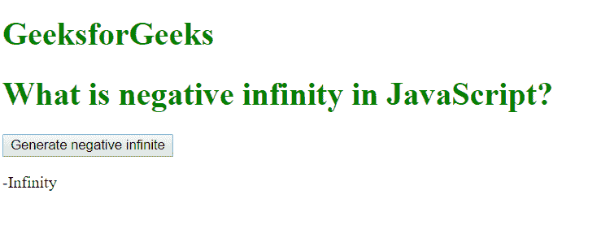
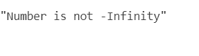

# 什么是 JavaScript 中的负无穷大？

> 原文:[https://www . geesforgeks . org/什么是负无限 javascript/](https://www.geeksforgeeks.org/what-is-negative-infinity-in-javascript/)

JavaScript 中的负无穷大是一个常数值，用于表示最低的可用值。这意味着没有其他数字小于该值。它可以使用自制函数或通过算术运算生成。

**注意:** JavaScript 将 NEGATIVE_INFINITY 值显示为-Infinity。

**负无穷大**与数学无穷大有以下不同:

1.  负无穷大除以任何其他数字都会得到 0。
2.  当被自身或正无穷大除时，负无穷大返回 NaN
3.  负无穷大，除以任何正数(正无穷大除外)就是负无穷大。
4.  负无穷大除以任何负数(负无穷大除外)就是正无穷大。
5.  如果我们将负无穷大乘以 NaN，我们将得到 NaN。
6.  NaN 和负无穷大的乘积是 0。
7.  两个负无穷的乘积总是正无穷。
8.  正无穷大和负无穷大的乘积总是负无穷大。

**语法:**

```
Number.NEGATIVE_INFINITY
```

**例 1:**

```
<!DOCTYPE html>
<html>

<body>
    <style>
        h1 {
            color: green;
        }
    </style>

    <h1>GeeksforGeeks</h1>
    <h1>
      What is negative infinity in JavaScript?
  </h1>

    <button onclick="geekNegativeInfinity()">
      Generate negative infinite
  </button>

    <p id="geek"></p>

    <script>
        function geekNegativeInfinity() {
            //negative value greater than the 
            //largest representable number in JavaScript
            var n = (-Number.MAX_VALUE) * 2; 
            document.getElementById("geek").innerHTML = n;
        }
    </script>

</body>

</html>
```

**输出:**


**例 2:**

```
<script>
    function checkNegativeInfinity(x) {
        if (x === Number.NEGATIVE_INFINITY) {
            return 'Number is -Infinity';
        } else {
            return 'Number is not -Infinity';
        }
    }

console.log(checkNegativeInfinity(2)); 
</script>
```

**输出**


**支持的浏览器:**

*   谷歌 Chrome
*   Mozilla Firefox
*   苹果 Safari
*   歌剧
*   互联网浏览器/边缘