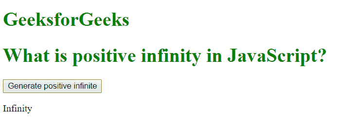
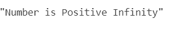

# 什么是 JavaScript 中的正无穷大？

> 原文:[https://www . geeksforgeeks . org/什么是正无限 javascript/](https://www.geeksforgeeks.org/what-is-positive-infinity-in-javascript/)

Javascript 中的**正无穷大**是一个常数，代表最高可用值。它可以使用一个自制的函数或通过算术运算生成。

**注意:** JavaScript 将 POSITIVE_INFINITY 值显示为 INFINITY。

**正无穷大**与数学无穷大有以下不同:

1.  两个正无穷大的乘积是正无穷大
2.  正无穷大和负无穷大的乘积是负无穷大
3.  如果我们将任何正数除以正无穷大，我们将得到正 0
4.  如果我们将任何负数除以正无穷大，我们将得到负 0
5.  0 乘以正无穷大就是 NaN
6.  NaN 乘以正无穷大就是 NaN
7.  当我们用正无穷大除以任何负数(负无穷大除外)时，我们得到负无穷大
8.  当我们用正无穷大除以任何正数(正无穷大除外)时，我们得到正无穷大
9.  正无穷大除以正无穷大或负无穷大就是 NaN

**语法:**

```
Number.POSITIVE_INFINITY
```

**例 1:**

```
<!DOCTYPE html>
<html>

<body>
    <style>
        h1 {
            color: green;
        }
    </style>

    <h1>GeeksforGeeks</h1>
    <h1>What is positive infinity in JavaScript?</h1>

    <button onclick="geekPositiveInfinity()">
      Generate positive infinite
  </button>

    <p id="geek"></p>

    <script>
        function geekPositiveInfinity() {

           //positive value greater than the largest
           // representable number in JavaScript
            var n = (Number.MAX_VALUE) * 2;
            document.getElementById("geek").innerHTML = n;
        }
    </script>

</body>

</html>
```

**输出:**


**例 2:**

```
<script>
function checkPositiveInfinity(x) {
  if (x === Number.POSITIVE_INFINITY) {
    return 'Number is Positive Infinity';
  }
  return x;
}

console.log(checkPositiveInfinity(Number.MAX_VALUE * 2));
</script>
```

**输出:**


**支持的浏览器:**

*   谷歌 Chrome
*   Mozilla Firefox
*   苹果 Safari
*   歌剧
*   互联网浏览器/边缘