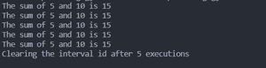

# setInterval()方法在 Node.js 中有什么用？

> 原文:[https://www . geesforgeks . org/what-is-set interval-in-JavaScript/](https://www.geeksforgeeks.org/what-is-setinterval-in-javascript/)

setInterval()方法帮助我们在固定延迟后重复执行一个函数。它返回一个唯一的区间标识，稍后可以由 clearInterval()方法使用，该方法停止函数的进一步重复执行。

**语法:**

```
const intervalId = setInterval(func, 
    [delay, arg1, agr2, ..., argN]);
```

哪里，

*   **func** 是我们要在延迟毫秒后重复执行的函数。
*   **延迟(可选参数)**是函数两次重复执行之间的延迟毫秒数。
*   **arg1、…、argN(可选参数)**是执行时将传递给**函数**的参数。

**示例 1:** 在本例中，我们将看到无限数量的函数执行。

当我们使用 setInterval()方法，但没有使用 clearInterval()方法清除它时，它会无限次地继续执行传递给它的函数。当我们需要在每个固定的时间间隔后获取一些信息时，比如当我们构建时钟时，我们需要计算和更新每秒后的秒数，我们可以像这样使用 setInterval()方法。下面是一个简单的代码示例，演示了 setInterval()方法的这种用法。

## Index.js

```
setInterval(() => {
  console.log('HELLO GEEK');
}, 1000);
```

**输出:**


**示例 2:** 在本例中，我们将看到使用 clearInterval()的有限执行次数。如果我们希望函数执行有限的次数，那么我们可以使用 clearInterval()方法。我们可以通过将从 setInterval()方法返回的间隔 id 传递给 clearInterval()方法来清除一个间隔。

**语法:**

```
clearInterval(intervalId)
```

下面提到的代码示例演示了如何使用 clearInterval()方法来实现函数的有限重复执行。

## Index.js

```
let count = 0;

const intervalId = setInterval(() => {
  console.log('HELLO GEEK');
  count++;

  if (count === 5) {
    console.log('Clearing the interval id after 5 executions');
    clearInterval(intervalId);
  }
}, 1000);
```

**输出:**


**示例 3:** 在本例中，我们将看到使用传递给 setInterval()的参数。在延迟参数之后传递给 setInterval()方法的参数由我们的函数接收，并且可以以期望的方式使用。下面提到的代码通过一个简单的代码示例来演示它。

## Index.js

```
let count = 0;

// The arguments passed after the 
// delay (in milliseconds) will
// be received in our function 
// inside the setInterval() method
const intervalId = setInterval(
  (a, b) => {
    console.log(`The sum of ${a} and ${b} is ${a + b}`);
    count++;

    if (count === 5) {
      console.log("Clearing the interval id after 5 executions");
      clearInterval(intervalId);
    }
  },
  1000,
  5,
  10
);
```

**输出:**

