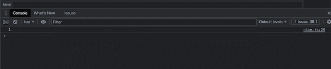
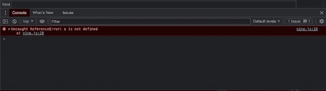
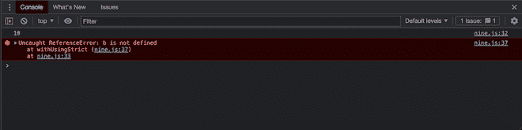

# 什么是严格模式，如何在 JavaScript 中启用？

> 原文:[https://www . geesforgeks . org/什么是严格模式以及如何在 javascript 中启用它/](https://www.geeksforgeeks.org/what-is-strict-mode-and-how-to-enable-it-in-javascript/)

在 ECMAScript 5 中引入的 [JavaScript](https://www.geeksforgeeks.org/javascript-tutorial/https://www.geeksforgeeks.org/javascript-tutorial/) 的严格模式是一种选择受限版本 JavaScript 的机制。“严格模式通过以下方式修改常规 JavaScript 语义:通过将一些 JavaScript 静默错误转换为抛出错误来消除它们。

**如何在 JavaScript 中启用严格模式:**

在需要严格模式才能启用严格模式的代码前面使用“使用严格”。严格模式可以通过简单地在脚本顶部或所需函数中声明来启用。当 JavaScript 引擎遇到这个指令时，它开始以一种特定的模式解析代码，在这种模式下，错误捕捉变得更加容易。

**使用严格模式的优势:**

*   严格模式通过将静默错误更改为抛出错误来消除它们。因此，这使得调试更加容易
*   当在无效的地方使用 delete 运算符时，严格模式会引发错误。
*   当变量在没有声明的情况下被使用，或者我们称之为“意外全局变量”时，严格模式会抛出一个错误。
*   它不允许重复的属性名或参数值。
*   。当我们不使用严格模式并且我们的“this”操作符指向空值或未定义的值时，它不会给出错误，但是启用严格模式会引发错误。
*   以严格模式编写的代码有时会比以非严格方式编写的代码执行得更快。

**严格模式不允许以下指令:**

*   如果不声明变量，我们就不能直接使用变量。
*   参数/自变量不允许重复。
*   不允许删除功能。
*   单词“eval”和“arguments”不能用作变量。
*   不允许使用“with”语句。
*   删除不可删除的属性。
*   写入只读属性。

**示例:**

**不使用严格模式的演示:**在下面的例子中，我们分配了一个变量，但没有声明它，然后打印它。

## java 描述语言

```
a = 1;
console.log(a);
```

**输出:**



**使用严格模式的演示:**在下面的例子中，我们分配了一个变量，但没有声明它，然后打印它。我们在代码的顶部启用了严格模式。当我们使用严格模式时，会显示错误消息。

## java 描述语言

```
"use strict";
a = 1;
console.log(a);
```

**输出:**



**演示** **使用或不使用严格模式的示例:**在下面的示例中，javascript 代码的一部分在严格模式下运行，另一部分在非严格模式下运行。

## java 描述语言

```
// This will not cause an error
a = 10; .
console.log(a);
withUsingStrict();

function withUsingStrict() {
  "use strict";
  b = 20; // This will cause an error
  console.log(b);
}
```

**输出:**

