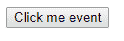
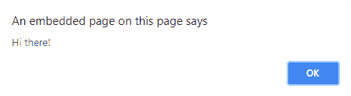
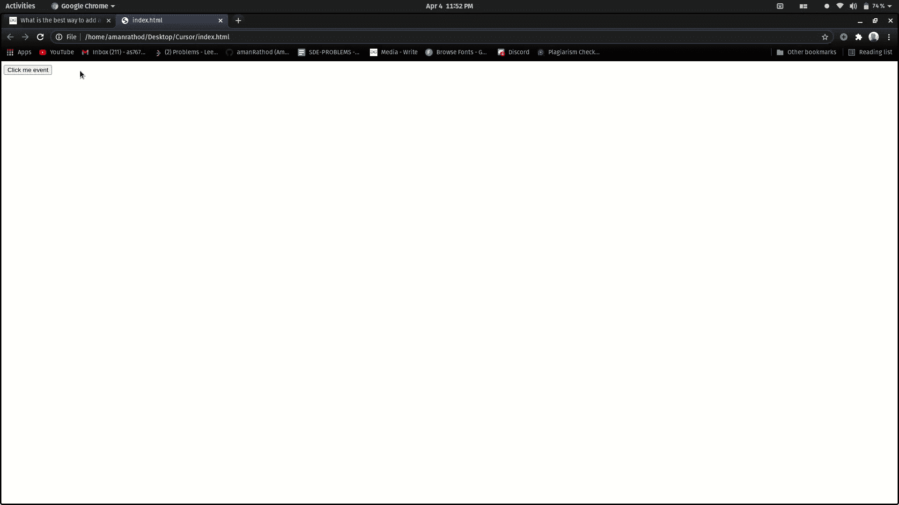

# 在 JavaScript 中添加事件的最佳方式是什么？

> 原文:[https://www . geesforgeks . org/什么是添加 javascript 事件的最佳方式/](https://www.geeksforgeeks.org/what-is-the-best-way-to-add-an-event-in-javascript/)

Javascript 具有为网页提供动态界面的事件。这些事件与文档对象模型中的元素挂钩。

有三种方法可以分配事件处理程序:

1.  HTML 事件处理程序属性
2.  HTML DOM 属性
3.  HTML DOM addEventListener()方法

在 JavaScript 脚本中添加事件的最佳方式是 **addEventListener()** 。让我们深入几个例子来理解。

**示例 1:** 在本例中，我们将使用事件处理程序属性添加一个事件。

**语法:**

```html
<element onlick = "script">
```

onclick 事件属性在用户单击按钮时起作用。当鼠标点击元素时，脚本运行。

## 超文本标记语言

```html
<!doctype html>
<html>

<head>
    <script>
        function Geeks() {
            alert('Hi there!');
        }
    </script>
</head>

<body>
    <button type="button"
        onclick="Geeks()">
        Click me event
    </button>
</body>

</html>
```

**输出:**

**点击按钮前:**



**点击按钮后:**



**劣势:**

1.  使用 HTML 事件处理程序属性分配事件处理程序被认为是一种不好的做法。
2.  事件处理程序代码与 HTML 代码混合在一起，这将使代码更难维护和扩展。
3.  计时有问题，就好像元素在 JavaScript 代码之前已经完全加载，用户可以开始与网页上的元素进行交互，这会导致错误。

**示例 2:** 在本例中，我们将使用 HTML DOM 属性添加一个事件。

**语法:**

```html
element.onclick = function() {}
```

## 超文本标记语言

```html
<!doctype html>
<html>

<body>
    <button id="button">Click me event</button>
    <script>
        let btn = document.getElementById("button");

        btn.onclick = function() {
            alert('Hi there');
        };
    </script>
</body>

</html>
```

**输出:**

**点击按钮前:**


**点击按钮后:**


**缺点:**我们不能为特定事件分配多个事件处理程序。

**示例 3:** 在本例中，我们将使用 addEventListener()方法添加一个事件。 **addEventListener()** 方法接受要监听的事件，并且每当所描述的事件被激发时，都会调用第二个参数。可以将任意数量的事件处理程序添加到单个元素中，而不会覆盖现有的事件处理程序。

**语法:**

```html
element.addEventListener(event, listener);
```

## 超文本标记语言

```html
<!doctype html>
<html>

<body>
    <button id="button">Click me event</button>

    <script>
        let btn = document.getElementById("button");

        btn.addEventListener('click', function() {
            alert('Hi there');
        });

        btn.addEventListener('click', function() {
            alert('Welcome To GeeksforGeeks');
        });
    </script>
</body>

</html>
```

**输出:**



**优势:**我们可以为特定事件分配多个事件处理程序。

**结论:**现在可以得出结论，addEventListener()是在 JavaScript 脚本中添加事件的最佳方式，因为它是针对特定事件的 Multiple 事件处理程序。