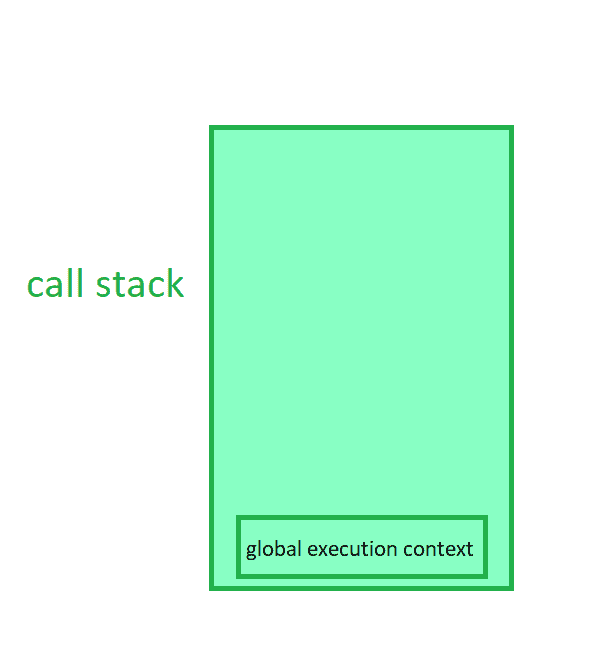
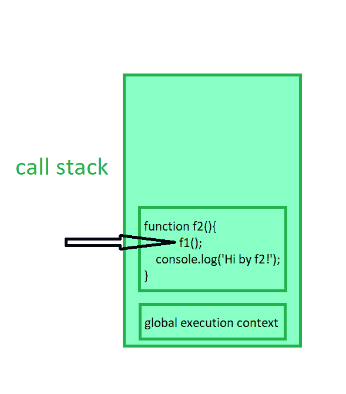
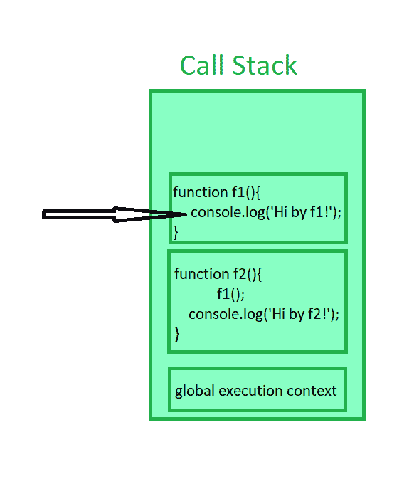
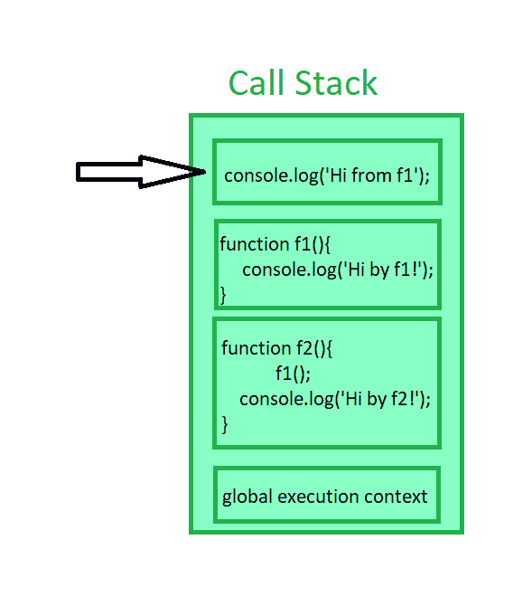

# JavaScript 中的调用栈是什么？

> 原文:[https://www . geesforgeks . org/什么是 javascript 中的调用堆栈/](https://www.geeksforgeeks.org/what-is-the-call-stack-in-javascript/)

JavaScript 使用调用堆栈来跟踪多个函数调用。它就像数据结构中的一个真正的堆栈，在那里数据可以被推送和弹出，并遵循后进先出原则。我们使用调用堆栈来记忆哪个函数正在运行。下面的例子演示了调用堆栈。

**示例:**

## java 描述语言

```
function f1() {
  console.log('Hi by f1!');
}

function f2() {
  f1();
  console.log('Hi by f2!');
}

f2();
```

**输出:**

```
"Hi by f1!"
"Hi by f2!"
```

**说明:**

下面的步骤和插图解释了上述函数的调用堆栈。

**步骤 1:** 当代码加载到内存中时，全局执行上下文被推入堆栈。



**第二步:**调用 *f2()* 函数，将 *f2()* 的执行上下文推入堆栈。



**第三步:**开始执行 *f2()* ，在执行过程中， *f1()* 函数在 *f2()* 函数中被调用。这导致 *f1()* 的执行上下文被推入调用堆栈。



**第 4 步:**现在 *f1()* 功能开始执行。*控制台. log()* 方法的新堆栈框架将被推送到堆栈。



**第五步:**当 *console.log()* 方法运行时，会打印“Hi by f1”，然后从栈中弹出。执行上下文将返回函数，现在在 *f1()* 函数中没有任何代码行，因此，它也将从调用堆栈中弹出。

**第 6 步:**这同样会发生在 *console.log()* 方法中，该方法打印行“Hi by f2”，然后最后函数 *f2()* 将完成并被推出堆栈。