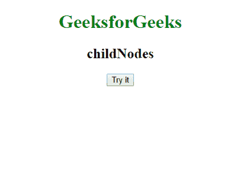
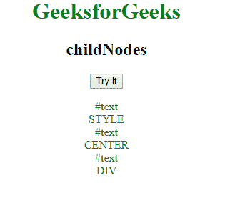
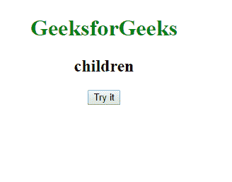
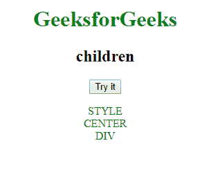

# JavaScript 中的 childNodes 和 child nodes 有什么区别？

> 原文:[https://www . geesforgeks . org/child-and-child-nodes-in-JavaScript/](https://www.geeksforgeeks.org/what-is-the-difference-between-children-and-childnodes-in-javascript/)有什么区别

*   **childNodes:**
    The childNodes property is a property of Node in Javascript and is used to return a Nodelist of child nodes. Nodelist items are objects, not strings and they can be accessed using index numbers. The first childNode starts at index **0**.

    **语法**

    ```
    element.childNodes
    ```

*   **children**
    The children is a property of element which returns the child elements of an element as objects.

    **语法**

    ```
    element.children
    ```

**子节点**和**子节点**属性的主要区别在于，子节点处理元素，子节点处理节点，包括非元素节点，如文本和注释节点。

**示例 1:** 此示例说明了 childNodes 的属性。

```
<!DOCTYPE html>
<html>

<body>
    <style>
        p {
            color: green;
        }
    </style>
<center>
    <h1 style="color:green">GeeksforGeeks</h1>
    <h2>childNodes</h2>
    <button onclick="childNode()">
        Try it
    </button>

    <p id="geek"></p>

    <script>
        function childNode() {
            //accessing all the child nodes present in our code
            var childNode = 
                document.body.childNodes;
            var string = "";
            var i;

            for (i = 0; i < childNode.length; i++) {
                string = string + childNode[i].nodeName + "<br>";
            }

            //appending the child nodes to paragraph with id "geek"
            document.getElementById(
            "geek").innerHTML = string;
        }
    </script>
</center>
</body>

</html>
```

**输出:**
**前:**

**后:**


**例 2:** 这个例子说明了孩子的属性。

```
<!DOCTYPE html>
<html>

<body>
    <style>
        p {
            color: green;
        }
    </style>
<center>
    <h1 style="color:green">GeeksforGeeks</h1>
    <h2>children</h2>

    <button onclick="myChildren()">
      Try it
  </button>

    <p id="geek"></p>

    <script>
        function myChildren() {
            var c = document.body.children;
            var string = "";
            var i;
            for (i = 0; i < c.length; i++) {
                string = string + c[i].tagName + "<br>";
            }

            document.getElementById(
              "geek").innerHTML = string;
        }
    </script>
</center>
</body>

</html>
```

**输出:**
**前:**

**后:**


**支持的浏览器:**

1.  谷歌 Chrome
2.  Mozilla Firefox
3.  苹果 Safari
4.  歌剧
5.  互联网浏览器/边缘