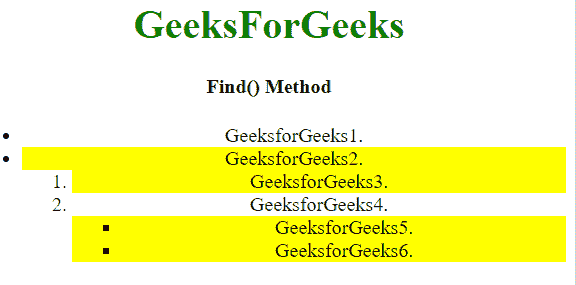
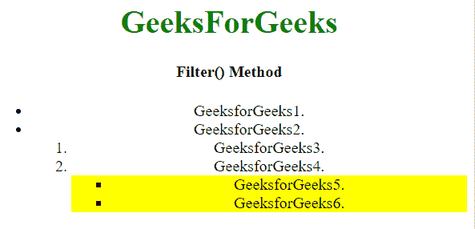

# JavaScript 中的 find()和 filter()方法有什么区别？

> 原文:[https://www . geesforgeks . org/JavaScript 中的查找和筛选方法的区别是什么/](https://www.geeksforgeeks.org/what-is-the-difference-between-find-and-filter-methods-in-javascript/)

**[find()方法](https://www.geeksforgeeks.org/javascript-array-find-method/)** 用于查找所选元素的所有后代元素。它通过从根到叶的遍历找到 DOM 树中的元素。

**[filter()方法](https://www.geeksforgeeks.org/javascript-array-filter/)** 用于过滤所有元素，返回匹配的元素，不匹配的元素去掉。

唯一不同的是 **filter()** 方法搜索所有元素，而 **find()** 方法只搜索所有子元素。

*   **示例 1:** 本示例使用 **find()方法**搜索元素。

    ```
    <!DOCTYPE html>
    <html>

    <head>
        <script src=
    "https://ajax.googleapis.com/ajax/libs/jquery/3.4.1/jquery.min.js">
        </script>

        <script>
            $(document).ready(function() {
                $("ul").find(":odd")
                .css("background-color", "yellow");
            });
        </script>
    </head>

    <body style="text-align:center;">

        <h1 style="color:green;"> 
            GeeksForGeeks 
        </h1>

        <h4>Find() Method</h4>

        <ul>
            <li>GeeksforGeeks1.</li>
            <li>GeeksforGeeks2.</li>
            <ol>
                <li>GeeksforGeeks3.</li>
                <li>GeeksforGeeks4.</li>
                <ul>
                    <li>GeeksforGeeks5.</li>
                    <li>GeeksforGeeks6.</li>
                </ul>
            </ol>
        </ul>
    </body>

    </html>
    ```

*   **输出:**
    
*   **示例 2:** 使用 filter()方法进行搜索时所做的更改。

    ```
    <!DOCTYPE html>
    <html>

    <head>
        <script src=
    "https://ajax.googleapis.com/ajax/libs/jquery/3.4.1/jquery.min.js">
        </script>

        <script>
            $(document).ready(function() {
                $("ul").filter(":odd").
                    css("background-color", "yellow");
            });
        </script>
    </head>

    <body style="text-align:center;">

        <h1 style="color:green;"> 
            GeeksForGeeks 
        </h1>

        <h4>Find() Method</h4>

        <ul>
            <li>GeeksforGeeks1.</li>
            <li>GeeksforGeeks2.</li>
            <ol>
                <li>GeeksforGeeks3.</li>
                <li>GeeksforGeeks4.</li>
                <ul>
                    <li>GeeksforGeeks5.</li>
                    <li>GeeksforGeeks6.</li>
                </ul>
            </ol>
        </ul>
    </body>

    </html>
    ```

*   **输出:**
    