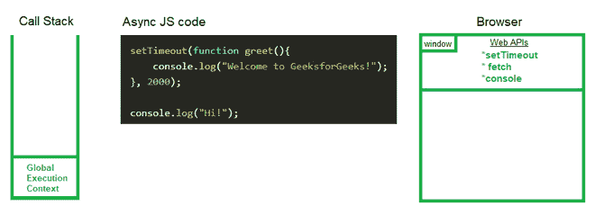
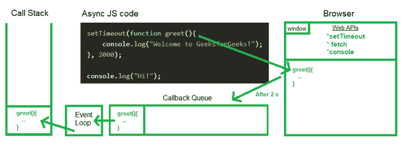

# 异步 JavaScript 中的微任务队列和回调队列有什么区别？

> 原文:[https://www . geesforgeks . org/micro task-queue-and-callback-queue-in-asynchronous-JavaScript/](https://www.geeksforgeeks.org/what-is-the-difference-between-microtask-queue-and-callback-queue-in-asynchronous-javascript/)的区别是什么

要知道 *【微任务队列】* 和*回调队列的区别，*我们需要清楚异步 JavaScript 是如何执行的，微任务队列和回调队列扮演什么角色。

与其他功能或操作并行运行的功能或操作在 JavaScript 中称为[异步](https://www.geeksforgeeks.org/synchronous-and-asynchronous-in-javascript/)功能或操作。异步 JavaScript 代码需要[回调](https://www.geeksforgeeks.org/javascript-callbacks/)函数，这些函数在期望的时间后执行。

**示例:**下面的代码说明了在 JavaScript 中使用 *setTimeout()* 函数。

## java 描述语言

```
<script>
  setTimeout(function greet() {
    console.log("Welcome to GeeksforGeeks!");
  }, 2000);
</script>
```

现在，在这个期望的时间之后，代码需要被传递到[调用栈](https://www.geeksforgeeks.org/what-is-the-call-stack-in-javascript/)，但是这个调用栈没有提供一个计时器，通过这个计时器我们可以延迟代码的执行。因此，它使用了网络应用编程接口 *setTimeout()* 的帮助，该接口在浏览器的窗口全局对象中可用。一段时间后，调用栈通过[事件循环](https://www.geeksforgeeks.org/node-js-event-loop/)获取代码，事件循环获取回调函数到调用栈。但是，回调函数不能直接进入事件循环。



因此，微任务队列和回调队列的作用就来了。这些队列作为一个中介，一旦计时器超时，回调函数就被连续地放入这些队列中。每当调用堆栈为空时，事件循环就按照先进先出的顺序将它们读入调用堆栈。

但是，我们需要[微任务队列和回调队列](https://www.geeksforgeeks.org/what-are-the-microtask-and-macrotask-within-an-event-loop-in-javascript/)用于不同的目的。让我们看看他们之间的比较。

**回调队列:**定时器到期后，回调函数被放入回调队列中，事件循环检查调用堆栈是否为空，如果为空，则将回调函数从回调队列推到调用堆栈，回调函数从回调队列中移除。然后调用栈创建一个执行上下文并执行它。



**微距任务队列:**微距任务队列类似于回拨队列，但微距任务队列的**优先级更高**。所有通过 [*【承诺】*](https://www.geeksforgeeks.org/javascript-promises/) 和 [*突变观察器*](https://developer.mozilla.org/en-US/docs/Web/API/MutationObserver) 进入微任务队列的回调函数。例如[的情况。fetch()](https://www.geeksforgeeks.org/javascript-fetch-method/) ，回调函数到达微任务队列。承诺处理总是有更高的优先级，所以 JavaScript 引擎执行微任务队列中的所有任务，然后移动到回调队列。

<figure class="table">

| **Callback queue** | **Micro-task queue** |
| --- | --- |
| The callback queue gets the ordinary callback function from *settimeout ()* API after the timer expires. | The callback queue gets the callback function through the promise and mutation observer. |
| The priority of callback queue in extracting callback function into event loop is lower than that of micro-task queue. | Micro-task queue has higher priority than callback queue, and callback function can be extracted into the event loop. |

</figure>