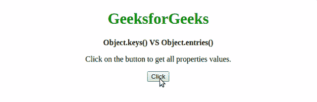
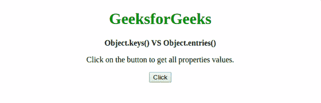

# JavaScript 中 Object.keys()和 Object.entries()方法有什么区别？

> 原文:[https://www . geesforgeks . org/object-key-and-object-entries-methods-in-JavaScript/](https://www.geeksforgeeks.org/what-is-the-difference-between-object-keys-and-object-entries-methods-in-javascript/)的区别是什么

JavaScript 中的 **Object.keys()** 方法返回一个数组，该数组的元素是对应于可枚举属性的字符串

JavaScript 中的 **Object.entries()方法**返回一个由对象的可枚举属性[键，值]对组成的数组。

唯一的区别是 **Object.keys()** 方法只返回自己的属性名，它只适用于 ES5，而 **Object.entries()** 方法返回一个带有 key 和值的数组数组，它适用于 ES6。

**示例 1:** 本示例实现了 Object.keys()方法。

*   **程序:**

    ```
    <!DOCTYPE html>
    <html>

    <head>
        <title>
            Object.keys() VS Object.entries()
        </title>
    </head>

    <body style="text-align:center">

        <h1 style="color: green"> 
            GeeksforGeeks 
        </h1>

        <b> 
            Object.keys() VS Object.entries()
        </b>

        <p>
            Click on the button to get all 
            properties values.
        </p>

        <button onclick="getValues()">
            Click
        </button>

        <script type="text/javascript">
            function getValues() {
                var object = {
                    2: 'Geeks1',
                    23: 'Geeks2',
                    52: 'Geeks3'
                };

                let valuesArray = Object.keys(object);

                for (let value of valuesArray) {
                    document.write(value + "<br>");
                }
            }
        </script>
    </body>

    </html>
    ```

*   **输出:** 

**示例 2:** 本示例实现了 Object.entries()方法。

*   **程序:**

    ```
    <!DOCTYPE html>
    <html>

    <head>
        <title>
            Object.keys() VS Object.entries()
        </title>
    </head>

    <body style="text-align:center">

        <h1 style="color: green"> 
            GeeksforGeeks 
        </h1>

        <b> 
            Object.keys() VS Object.entries()
        </b>

        <p>
            Click on the button to get 
            all properties values.
        </p>

        <button onclick="getValues()">
            Click
        </button>

        <script type="text/javascript">
            function getValues() {
                var object = {
                    2: 'Geeks1',
                    23: 'Geeks2',
                    52: 'Geeks3'
                };

                let valuesArray = Object.entries(object);

                for (let value of valuesArray) {
                    document.write(value + "<br>");
                }
            }
        </script>
    </body>

    </html>
    ```

*   **输出:** 