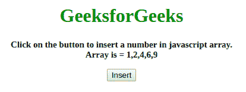
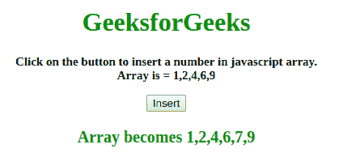
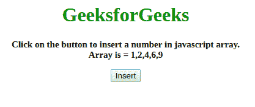
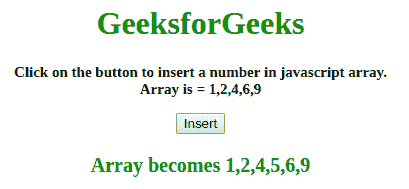

# 在 JavaScript 中，有什么有效的方法可以将一个数字插入到排序后的数字数组中？

> 原文:[https://www . geeksforgeeks . org/什么是将数字插入到用 javascript 排序的数字数组中的最有效方法/](https://www.geeksforgeeks.org/what-is-the-efficient-way-to-insert-a-number-into-a-sorted-array-of-numbers-in-javascript/)

给定一个数字数组，任务是使用 JavaScript 将一个数字插入到排序后的数组中。有许多方法可以解决这个问题，其中两种方法如下:

**方法 1:**

*   首先取一个变量中的值。
*   确保它已排序。
*   在这个例子中，复杂度是 O(n)，其中 n 是数组中可用元素的数量。
*   方法 **findLoc** 是搜索刚好大于我们要插入的元素的元素。
*   方法返回位置的索引。
*   使用**执行插入操作。拼接()方法**。

**示例:**这个示例说明了上面讨论的方法。

```
<!DOCTYPE HTML>
<html>

<head>
</head>

<body style="text-align:center;" id="body">
    <h1 style="color:green;"> 
      GeeksforGeeks 
    </h1>
    <p id="GFG_UP" 
       style="font-size: 15px; font-weight: bold;">
    </p>
    <button onclick="gfg_Run()">
        Insert
    </button>
    <p id="GFG_DOWN" 
       style="color:green; font-size: 20px; font-weight: bold;">
    </p>
    <script>
        var el_up = document.getElementById("GFG_UP");
        var el_down = document.getElementById("GFG_DOWN");
        var today = new Date();
        var arr = [1, 2, 4, 6, 9];
        el_up.innerHTML = "Click on the button to insert a number "+
                       "in javascript array.<br> Array is = " + arr;

        function add(el, arr) {
            arr.splice(findLoc(el, arr) + 1, 0, el);
            return arr;
        }

        function findLoc(el, arr, st, en) {
            st = st || 0;
            en = en || arr.length;
            for (i = 0; i < arr.length; i++) {
                if (arr[i] > el)
                    return i - 1;
            }
            return en;
        }

        function gfg_Run() {
            add(7, arr);
            el_down.innerHTML = "Array becomes " + arr;
        }
    </script>
</body>

</html>
```

**输出:**

*   **点击按钮前:**
    
*   **点击按钮后:**
    

**方法 2:**

*   在这个例子中，复杂度是 O(Logn)，其中 n 是数组中元素的个数。
*   一种方法 **findLoc** 正在搜索元素应该出现的位置。
*   方法使用**二分搜索法**算法返回位置索引。
*   使用**执行插入操作。拼接()方法**。

**示例:**这个示例说明了上面讨论的方法。

```
<!DOCTYPE HTML>
<html>

<head>
</head>

<body style="text-align:center;" id="body">
    <h1 style="color:green;">  
      GeeksforGeeks  
    </h1>
    <p id="GFG_UP" 
       style="font-size: 15px; font-weight: bold;">
    </p>
    <button onclick="gfg_Run()">
        Insert
    </button>
    <p id="GFG_DOWN" 
       style="color:green; font-size: 20px; font-weight: bold;">
    </p>
    <script>
        var el_up = document.getElementById("GFG_UP");
        var el_down = document.getElementById("GFG_DOWN");
        var today = new Date();
        var arr = [1, 2, 4, 6, 9];
        el_up.innerHTML = "Click on the button to insert a "+
          "number in javascript array.<br> Array is = " + arr;

        function add(el, arr) {
            arr.splice(findLoc(el, arr) + 1, 0, el);
            return arr;
        }

        function findLoc(el, arr, st, en) {
            st = st || 0;
            en = en || arr.length;
            var pivot = parseInt(st + (en - st) / 2, 10);
            if (en - st <= 1 || arr[pivot] === el) return pivot;
            if (arr[pivot] < el) {
                return findLoc(el, arr, pivot, en);
            } else {
                return findLoc(el, arr, st, pivot);
            }
        }

        function gfg_Run() {
            add(5, arr);
            el_down.innerHTML = "Array becomes " + arr;
        }
    </script>
</body>

</html>
```

**输出:**

*   **点击按钮前:**
    
*   **点击按钮后:**
    