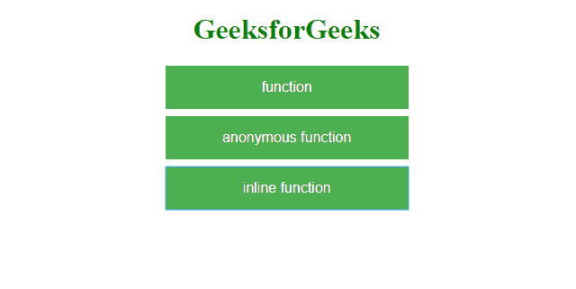
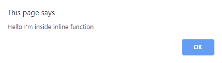

# JavaScript 中的内联函数是什么？

> 原文:[https://www . geesforgeks . org/什么是 javascript 内联函数/](https://www.geeksforgeeks.org/what-is-the-inline-function-in-javascript/)

在 JavaScript 中，内联函数是一种特殊类型的匿名函数，它被分配给一个变量，或者换句话说，一个带有名称的匿名函数。JavaScript 不支持像在 [C](https://www.geeksforgeeks.org/inline-function-in-c/) 或 [C++](https://www.geeksforgeeks.org/inline-functions-cpp/) 中那样的内联函数的传统概念。因此匿名函数和内联函数实际上是相同的。与普通函数不同，它们是在运行时创建的。

**语法:**

*   功能:

    ```
    function func() {
        //Your Code Here
    }

    ```

*   匿名功能:

    ```
    function() {
        //Your Code Here
    }

    ```

*   内联功能

    ```
    var func = function() { 
        //Your Code Here 
    };

    ```

**说明:**

制作内联函数非常简单。首先，创建一个匿名函数(一个没有名字的函数)，然后将其分配给一个变量。

**示例:**

```
<!DOCTYPE html>
<html lang="en">

<head>
    <meta charset="UTF-8">
    <meta name="viewport"
          content="width=device-width,
                   initial-scale=1.0">
    <meta http-equiv="X-UA-Compatible"
          content="ie=edge">

    <title>JS Functions</title>
    <!-- jQuery CDN -->
    <script src="https://code.jquery.com/jquery-3.4.1.min.js"
            integrity="sha256-CSXorXvZcTkaix6Yvo6HppcZGetbYMGWSFlBw8HfCJo="
            crossorigin="anonymous">
    </script>

    <!-- End of CDN -->
    <style>
        button {
            background-color: #4CAF50;
            border: none;
            color: white;
            padding: 15px 32px;
            text-align: center;
            font-size: 16px;
            margin: 8px 2px;
            cursor: pointer;
            display: block;
            width: 270px;
        }
    </style>
</head>

<body>

    <h1 style="text-align:center;color:green;">GeeksforGeeks</h1>
    <p align="center">
        <button id="function">function</button>
        <button id="anonymous-function">anonymous function</button>
        <button id="inline-function">inline function</button>
    </p>
    <script type="text/javascript">
        //function
        function func() {
            alert("Hello I'm inside function");
        }
        $('#function').click(func);

        //anonymous function
        $('#anonymous-function').click(function() {
            alert("Hello I'm inside anonymous function");
        });

        //inline function
        var inline_func = function() {
            alert("Hello I'm inside inline function");
        };
        $('#inline-function').click(inline_func);
    </script>
</body>

</html>
```

**输出:**


点击上述任何一个按钮将调用相应的函数，并显示一条警告消息。假设点击“内联功能”按钮，将弹出以下警告消息。

