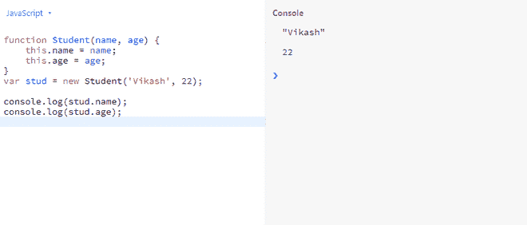

# JavaScript 中的新关键词是什么？

> 原文:[https://www . geesforgeks . org/什么是 javascript 中的新关键字/](https://www.geeksforgeeks.org/what-is-the-new-keyword-in-javascript/)

在这篇文章中，我们将确切地了解什么是新关键字，以及我们为什么使用新关键字，以及我们如何使用新关键字。

**JavaScript 中的新关键字:**新关键字用于创建用户定义的对象类型和构造函数的实例。它用于构造和返回构造函数的对象。

**语法:**

```
new constructor[([arguments])]
```

**我们为什么要在 JavaScript 中使用 new 关键字？**

以下是使用新关键字的功能:

*   new 关键字创建一个新的空对象，对象类型为。
*   新关键字设置构造函数的内部原型属性。
*   new 关键字将此变量绑定到新创建的对象。
*   new 关键字返回新对象。

**示例 1:** 在下面的示例中，我们将创建一个消息函数来打印带有问候语的姓名，并且我们将创建一个消息函数的实例。

## java 描述语言

```
<script>
    function message(name) {
        this.greeting = "Hey " + name;
    }
    name = "Vikash";
    var m = new message(name);

    console.log(m.greeting);
</script>
```

**输出:**控制台上的输出

```
Hey Vikash
```

**示例 2:** 在下面的示例中，我们将创建一个学生函数，并使用如下所示的新关键字创建该函数的实例。

## java 描述语言

```
<script>

    // Function declaration
    function Student(name, age) {
        this.name = name;
        this.age = age;
    }

    // Create an instance of function
    var stud = new Student('Vikash', 22);

    console.log(stud.name);
    console.log(stud.age);
</script>
```

**输出:**

