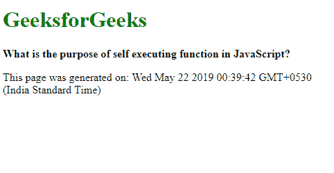
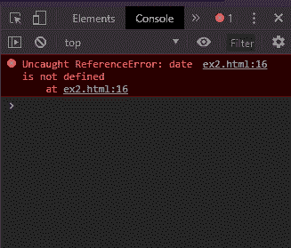
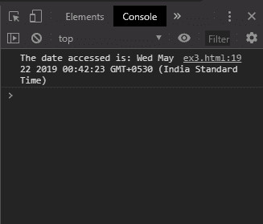

# JavaScript 中的自执行函数的目的是什么？

> 原文:[https://www . geesforgeks . org/JavaScript 中的自动执行函数的目的是什么/](https://www.geeksforgeeks.org/what-is-the-purpose-of-self-executing-function-in-javascript/)

自执行匿名函数是一种特殊的函数，它在定义后立即被调用。不需要在脚本的任何地方调用这个函数。这种类型的函数没有名字，因此被称为匿名函数。该函数有一组尾随括号。这个函数的参数可以在括号中传递。

**语法:**

```
(function (parameters) {
    // Function body
})(parameters);

```

**示例:**

```
<!DOCTYPE html>
<html>

<head>
    <title>
        What is the purpose of self
        executing function in JavaScript?
    </title>
</head>

<body>
    <h1 style="color: green">
        GeeksforGeeks
    </h1>

    <b>
        What is the purpose of self 
        executing function in JavaScript?
    </b>

    <p>
        This page was generated on: 
        <span class="output"></span>
    </p>

    <script type="text/javascript">
        (function () {
            date = new Date().toString();

            document.querySelector('.output').textContent
                        = date;
        })();
    </script>
</body>

</html>
```

**输出:**


**为什么使用匿名函数？**
使用匿名函数而不是直接编写代码的优势在于匿名函数内定义的变量和函数对其外部的代码不可用。这可以防止全局命名空间中散落着可能不再需要的变量和函数。它也可以用于只允许访问变量和函数。这在以下示例中显示。

**从匿名函数外部访问变量:**本例显示从匿名函数外部访问日期对象会导致错误。

```
<!DOCTYPE html>
<html>

<head>
    <title>
        What is the purpose of self 
        executing function in JavaScript?
    </title>
</head>

<body>
    <h1 style="color: green">
        GeeksforGeeks
    </h1>

    <b>
        What is the purpose of self
        executing function in JavaScript?
    </b>

    <p>
        This page was generated on: 
        <span class="output"></span>
    </p>

    <script type="text/javascript">
        (function () {
            let date = new Date().toString();

            document.querySelector('.output').textContent
                    = date;
        })();

        console.log('The date accessed is: ' + date);
    </script>
</body>

</html>                    
```

**输出:**


**允许在函数外部访问一个变量:**这个例子表明，可以通过使日期变量成为全局变量来使其在函数外部可用。

```
<!DOCTYPE html>
<html>

<head>
    <title>
        What is the purpose of self 
        executing function in JavaScript?
    </title>
</head>

<body>
    <h1 style="color: green">
        GeeksforGeeks
    </h1>

    <b>
        What is the purpose of self 
        executing function in JavaScript?
    </b>

    <p>
        This page was generated on: 
        <span class="output"></span>
    </p>

    <script type="text/javascript">
        (function () {
            let date = new Date().toString();
            document.querySelector('.output').textContent = date;

            // Assign to global window making it
            // accessible to outside
            window.date = date;
        })();

        console.log('The date accessed is: ' + date);
    </script>
</body>

</html>                    
```

**输出:**
