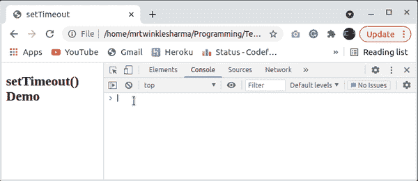
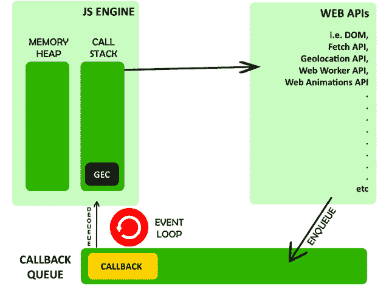

# JavaScript 中 setTimeout()函数的目的是什么？

> 原文:[https://www . geesforgeks . org/settimeout-function-in-JavaScript/](https://www.geeksforgeeks.org/what-is-the-purpose-of-settimeout-function-in-javascript/)的目的是什么

**[**setTimeout()**](https://www.geeksforgeeks.org/java-script-settimeout-setinterval-method/)是 window 对象内部的一个方法，它调用指定的函数或者在给定的时间段后计算一个作为字符串提供的 JavaScript 表达式，只计算一次。以下输出显示了窗口对象内部存在 **setTimeout()** 方法。**

****

**我们都用过几次警报或提醒，这个 **setTimeout()** 方法在 web 应用中也有同样的用途。我们用这个来推迟某种处决。它也用于 jquery 中的动画和 DOM 操作。**

****语法:****

```
setTimeout(function, time);
```

****参数:****

*   ****函数:**是对给定时间后将要运行的函数的引用。**
*   ****时间:**给定函数执行的毫秒数。**

****返回值:**它返回一个定时器标识，如果您想清除该功能的倒计时定时器，该标识在以后会很有用。**

****例 1:** 下面演示 setTimeout()方法的基本演示。**

**在 Javascript 中，一切都在执行上下文中执行。因此，将创建一个全局执行上下文，并将其推送到 JavaScript 引擎的调用堆栈中。在全局执行上下文中，内存分配阶段开始，所有变量和函数在内存堆中获得空间。名为**alertafter3 秒**的函数将在堆中获得空间，并且没有变量。**

**执行线程开始，JavaScript 引擎遇到控制台日志语句，因此，chrome developers 工具的控制台上会打印一行。setTimeout()函数将提供的函数注册为一个参数，在提供的(3000)毫秒后执行。浏览器在内部保存了一个记录，一旦定时器到期，它就将该函数排入回调队列。现在，一旦调用堆栈变成空的，一直运行的事件循环将会注意到它，并将回调函数从回调队列中取出，并将其推入调用堆栈。在这种情况下，只有一个全局执行上下文，一旦 *console.log* 语句执行，调用堆栈中就没有任何内容，因此事件循环将回调函数从回调队列中出列，并将其推入调用堆栈。**

**当我们的回调函数在调用栈中时，很明显就能理解将要发生什么。在函数内部，有一个简单的警报。**

**** 

## **超文本标记语言**

```
<!DOCTYPE html>
<html>

<body>
    <script>
        console.log("This is the demo of setTimeout");

        function alertAfter3Seconds() {
            alert("3 Second completed hi!");
        }
        setTimeout(alertAfter3Seconds, 3000);
    </script>
</body>

</html>
```