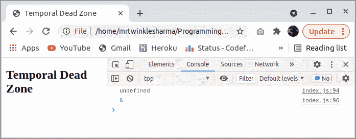

# ES6 中的时间死区是什么？

> 原文:[https://www . geesforgeks . org/什么是 es6 中的时间死区/](https://www.geeksforgeeks.org/what-is-the-temporal-dead-zone-in-es6/)

**介绍:**开始之前，先想想这 3 个字在说什么？时间意味着暂时的东西，而不是永久的，死亡意味着不工作的东西，或者可以说它处于无生命的状态，区域表示一个区域，但是这里我们在编程中，所以这个术语区域将是与内存相关的东西，或者区域也可以被认为是时间段或阶段。因此，合并这些术语说明某个实体暂时处于无生命或无活动状态，不能用于任何工作。你要有[的知识，让](https://www.geeksforgeeks.org/javascript-let/#:~:text=let%20is%20a%20keyword%20used,to%20declare%20variables%20in%20javascript.)和[在 javascript 中常量](https://www.geeksforgeeks.org/javascript-const/)关键词，轻松理解题目。

**时间死区为什么存在？**

这个问题可能会出现，它们不在早期的 javascript 中，那么我们为什么需要它们，为什么 ECMAscript 在新的更新中引入了这个额外的东西，实际上在程序中，在赋值之前访问变量是不好的，好吧，假设 javascript 在内存中给了变量一些空间，只是因为有一个特定的原因，你可能会在那里存储一些数据，那么为什么要在实际放入之前提取这些数据。对于这种情况，大多数编程语言都有不同的配置，比如 C++在初始化之前会存储垃圾，python 变量甚至不会在初始化之前创建，java 会存储一个默认值。
所以 javascript 没有定义，但是由于内存分配阶段，变量的提升发生了，在线程执行阶段，我们可以访问它们，因此，该值看起来没有定义。后来当**让** **&** **const** 被引入时，它们对访问有一些限制，只是为了帮助 javascript 开发人员编写好代码并使调试变得容易，因此出现了时间死区的新概念，它帮助我们捕捉错误，因为在提供之前访问一些数据是错误的。这是一种语言结构，可以让我们避免很多意想不到的错误。

现在让我们用不同的例子来理解。

**示例 1:** 在这个示例中，我们只是使用一个 javascript 代码片段，并使用 var 关键字来查看内存分配是如何进行的。

## index.js

```
<script>
    console.log(x);
    var x = 6;
    console.log(x);
</script>
```

**输出:**



**说明:**

1.  首先，将创建全局执行上下文。
2.  然后内存分配阶段开始，在此期间，变量 x 在内存中有了一个位置，javascript 在那里放置了 undefined。
3.  然后线程执行阶段开始，在这个控制台期间，log(x)语句执行并打印 x 中的值存储，这是未定义的。
4.  在下一行中，x 被赋值为 6，x 的未定义值被替换为 6。
5.  同样在下一个 console.log(x)中，x 被打印为 6。

**示例 2:** 现在让我们使用 let 或 const 关键字测试相同的代码片段。

## index.js

```
<script>
    console.log(x);
    console.log(z);
    var x = 6;
    let z = 6;
    console.log(x);
    console.log(z);
</script>
```