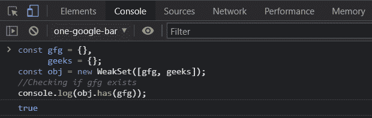
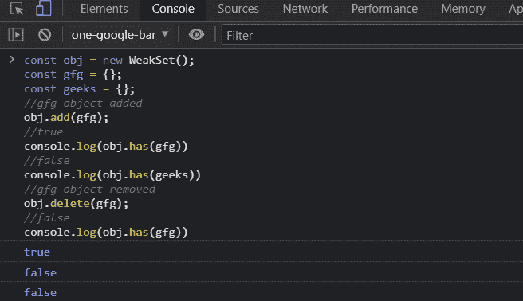

# 一个 WeakSet 对象在 JavaScript 中有什么用？

> 原文:[https://www . geesforgeks . org/什么是 javascript 中的 weakset 对象的用途/](https://www.geeksforgeeks.org/what-is-the-use-of-a-weakset-object-in-javascript/)

**简介:**JavaScript WeakSet 对象是一种集合，它允许我们存储仅松散保存的项目。WeakSet 与 Set 不同，它只是一个项目集合。它不包括任意值。它具有与集合相同的特性，因为它不包含重复项。弱集和集合的主要区别在于弱集是对象的集合，而不是某一类型的值。它支持像 Set 这样的添加、拥有和删除，但不支持 size、key()或迭代。

**语法:**

```
new WeakSet([iterable])  
```

**参数:**

*   **可迭代:**它是一个可迭代对象，其元素将被添加到一个新的 WeakSet 中。

**使用 WeakSet 对象的优势:**

*   WeakSet 的内容可以被垃圾收集。
*   降低内存利用率的可能性。
*   对类别品牌化有用

的**特征**弱集对象:****

*   WeakSet 对象只包括唯一的项目。
*   如果 WeakSet 中没有对存储对象的引用，它将被作为垃圾收集的目标。
*   WeakSet 中的项目不可枚举。因此，它不提供任何获取请求对象的机制。
*   它支持像 Set 这样的添加、拥有和删除，但不支持 size、key()或迭代。

**与 WeakSet 对象一起使用的方法:**

*   **add(value):** 在该方法中，值被附加到 WeakSet 对象。
*   **有(值):**它返回一个布尔值，指示该值是否存在于 WeakSet 对象中。
*   ***删除(值):*** 该方法从 WeakSet 中删除一个值。WeakSet.prototype.has(值)将返回 false。

**示例 1:** 在本例中，我们将使用 WeakSet()构造函数来构建新的 WeakSet。这将生成一个新的 WeakSet，然后您可以使用它来存储数据。当您使用它来构建一个新的 WeakSet 时，您可以提供一个可迭代的包含值作为参数。要确定给定对象是否存在于 WeakSet 中，请使用 has(值)。

**index.js**

## java 描述语言

```
<script>
   const gfg = {},
   geeks = {};  
   const obj = new WeakSet([gfg, geeks]);

   // Checking if gfg exists
   console.log(obj.has(gfg));
</script>
```

**输出:**



例 1

**示例 2:** 在本例中，我们将使用 weakset 构造函数创建 WeakSet 对象，然后使用 add 函数添加值。接下来，我们验证添加的对象是否存在。然后使用 delete 方法将对象从 weakset 中删除，然后我们再次验证对象是否被成功删除。

**index.js**

## java 描述语言

```
<script>
  const obj = new WeakSet();
  const gfg = {};
  const geeks = {};

  // gfg object added
  obj.add(gfg);
  console.log(obj.has(gfg)) // true
  console.log(obj.has(geeks)) // false

  // gfg object removed
  obj.delete(gfg);
  console.log(obj.has(gfg)) // false
</script>
```

**输出:**



例 2