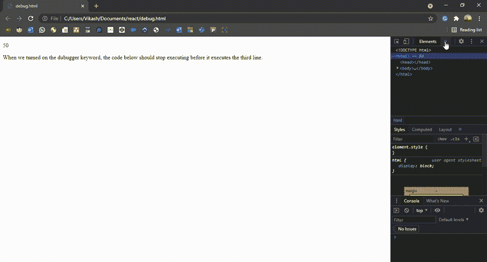

# 调试器关键字在 JavaScript 中有什么用？

> 原文:[https://www . geeksforgeeks . org/什么是调试器使用-javascript 中的关键字/](https://www.geeksforgeeks.org/what-is-the-use-of-debugger-keyword-in-javascript/)

**调试**是编程的一个非常重要的方面，以确定系统或应用程序为什么行为不端。这是一个测试和发现错误以减少计算机程序错误的过程。在本文中，我们将了解 JavaScript 中的调试器关键字。要了解更多调试信息，请查看[软件工程|调试](https://www.geeksforgeeks.org/software-engineering-debugging/)。

**JavaScript 中的调试器关键字:**调试器关键字是 JavaScript 中的调试工具之一。编写代码时，程序中出现错误是非常常见的。这些错误可能是逻辑错误或语法错误。调试是识别降低程序效率的关键和小错误的方法之一。在 javascript 中，当调试器关键字打开时，它会停止 JavaScript 代码的执行，如果调试函数可用，它会调用调试函数。否则，没有任何效果。

**语法:**调试器关键字的一般语法。

```
debugger;
```

**示例:**它将在 JavaScript 中描述调试器关键字。

## 超文本标记语言

```
<!DOCTYPE html>
<html>
  <body>
    <p id="para"></p>

    <p>
      When we turned on the debugger keyword, 
      the code below should stop executing before
      it executes the third line.
    </p>

    <script>
      let a = 10 * 5;
      debugger;
      document.getElementById("para").innerHTML = a;
    </script>
  </body>
</html>
```

**输出:**HTML 代码以 HTML 中的静态内容加载到 web 浏览器上，但动态变化最初不会出现在 web 浏览器上，因为在 DOM 函数上方，当调试器关键字出现在脚本代码中时，脚本代码的执行会停止。只有在单击 resume 选项时，才会继续执行代码。

