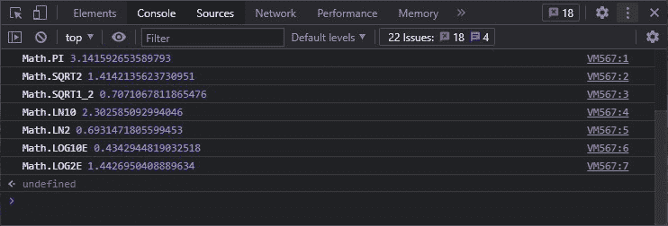
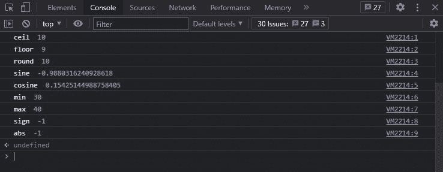

# Math 对象在 JavaScript 中有什么用？

> 原文:[https://www . geeksforgeeks . org/数学对象在 javascript 中的用途是什么/](https://www.geeksforgeeks.org/what-is-the-use-of-math-object-in-javascript/)

数学是一个内置的对象，它有数学函数和常数的属性和方法。它不是函数对象。数学对象适用于数字类型。数学对象没有构造函数。数学的所有属性和方法都是固定/静态的。余弦函数被称为数学，而常数π被称为数学。PI，其中 y 是方法的参数。数学的所有属性和方法都是静态的，可以通过将数学用作对象来调用，而无需创建它。在本文中，我们将讨论 Javascript 中使用的各种可用方法和属性。我们将从 Javascript 中的数学属性开始。

**静态数学属性:**数学属性&它们的描述如下:

**语法:**

```html
Math.property
```

<figure class="table">

| 

#### Property

 | 

#### Description

 | 

#### Return value

 |
| --- | --- | --- |
| [数学。E](https://www.geeksforgeeks.org/javascript-math-e-function/) | 欧拉常数，自然对数的基数大约是 2.718。 | 欧拉数 |
| [数学。LN2](https://www.geeksforgeeks.org/javascript-math-ln2-property/) | 2 的自然对数，约为 0.693147180。 | 2 的自然对数 |
| [数学。LN10](https://www.geeksforgeeks.org/javascript-math-ln10-property/) | 10 的自然对数，约为 2.302585。 | 10 的自然对数 |
| [数学。LOG2E](https://www.geeksforgeeks.org/javascript-math-log2e-property/) | E 的以 2 为底的对数，约为 1.442695。 | E 的基数 2 对数 |
| [数学。LOG10E](https://www.geeksforgeeks.org/javascript-math-log10e-property/) | E 的以 10 为底的对数，约为 0.43429844。 | 以 E 的 10 个对数为基数 |
| [数学。PI](https://www.geeksforgeeks.org/javascript-math-pi-property/) | 圆的周长与其直径之比，即 3.14159。 | P 值 |
| [数学. SQRT1_2](https://www.geeksforgeeks.org/javascript-math-sqrt1_2-property/) | 1/2 的平方根约为 0.70710678。 | 1/2 的平方根 |
| [数学。SQRT2](https://www.geeksforgeeks.org/javascript-math-sqrt2-property/) | 2 的平方根约为 1.41421356。 | 2 的平方根 |

</figure>

**示例:**

## 超文本标记语言

```html
<!DOCTYPE html>
<html lang="en">
  <head>
    <meta charset="UTF-8" />
    <meta http-equiv="X-UA-Compatible" 
          content="IE=edge" />
    <meta name="viewport" 
          content="width=device-width, 
                   initial-scale=1.0" />
    <title>Document</title>
  </head>

  <body>
    <script>
      console.log("Math.PI", Math.PI);
      console.log("Math.SQRT2", Math.SQRT2);
      console.log("Math.SQRT1_2", Math.SQRT1_2);
      console.log("Math.LN10", Math.LN10);
      console.log("Math.LN2", Math.LN2);
      console.log("Math.LOG10E", Math.LOG10E);
      console.log("Math.LOG2E", Math.LOG2E);
    </script>
  </body>
</html>
```

**输出:**



**静态数学方法:**下面列出了与数学对象相关联的方法及其描述。

**语法:**

```html
Math.method(number)
```

<figure class="table">

| 

#### Method

 | 

#### Description

 |
| --- | --- |
| [**数学(y)**](https://www.geeksforgeeks.org/javascript-math-abs-method/) | 返回 y 的正值。 |
| [**数学(y)**](https://www.geeksforgeeks.org/javascript-math-acos-method/) | 返回 y 的反余弦值。 |
| [**数学(y)**](https://www.geeksforgeeks.org/math-acosh-javascript/) | 返回 y 的双曲反余弦。 |
| [**数学(y)**](https://www.geeksforgeeks.org/javascript-math-asin-method/) | 返回 y 的反正弦。 |
| [**数学(y)**](https://www.geeksforgeeks.org/math-asinh-javascript/) | 返回一个数字的双曲反正弦。 |
| [**数学(y)**](https://www.geeksforgeeks.org/javascript-math-atan-method/) | 返回 y 的反正切。 |
| [**数学(y)**](https://www.geeksforgeeks.org/javascript-math-atanh-function/) | 返回 y 的双曲反正切。 |
| [**数学 2(y，x)**](https://www.geeksforgeeks.org/javascript-math-atan2-method/) | 返回其参数商的反正切。 |
| [**数学(y)**](https://www.geeksforgeeks.org/javascript-math-cbrt-method/) | 返回 y 的立方根。 |
| [**数学(y)**](https://www.geeksforgeeks.org/javascript-math-ceil-function/) | 返回大于或等于 y 的最小整数。 |
| [**数学**](https://www.geeksforgeeks.org/javascript-math-clz32-function/) | 返回 32 位整数 y 的前导零位数。 |
| [**奥数(y)**](https://www.geeksforgeeks.org/javascript-math-cos-method/) | 返回角度 y 的余弦值。 |
| [**数学(y)**](https://www.geeksforgeeks.org/javascript-math-cosh-method/) | 返回 y 的双曲余弦值。 |
| [**【y】**](https://www.geeksforgeeks.org/javascript-math-exp-method/) | 返回 e^(y)，x 为输入，e 为欧拉常数(2.718…，自然对数的底数)。 |
| [**数学 1(y)**](https://www.geeksforgeeks.org/javascript-math-expm1-function/) | 返回从 exp(y)中减去 1。 |
| [**数学楼(y)**](https://www.geeksforgeeks.org/javascript-math-floor-method/) | 返回小于或等于 y 的最大整数。 |
| [**数学(y)**](https://www.geeksforgeeks.org/javascript-math-fround-function/) | 返回最接近的数字的单精度浮点表示。 |
| [**数学海波([x[，y[，…]])**](https://www.geeksforgeeks.org/javascript-math-hypot-function/) | 返回其参数平方和的平方根。 |
| [**数学(x，y)**](https://www.geeksforgeeks.org/javascript-math-imul-function/) | 返回 x 和 y 的 32 位整数乘法的结果。 |
| [**数学日志(y)**](https://www.geeksforgeeks.org/javascript-math-log-method/) | 返回数字的自然对数。 |
| [**数学对数 1p(y)**](https://www.geeksforgeeks.org/javascript-math-log1p/) | 对于数字 y，返回 1 + y 的自然对数。 |
| [**数学 10(y)**](https://www.geeksforgeeks.org/javascript-math-log10-function/) | 返回 y 的以 10 为底的对数。 |
| [**数学 2(y)**](https://www.geeksforgeeks.org/javascript-math-log2-function/) | 返回 y 的以 2 为底的对数。 |
| [**Math.max([x[，y[，…]])**](https://www.geeksforgeeks.org/javascript-math-max-method/) | 从 x，y 返回最大数字。 |
| [**Math.min([x[，y[，…]])**](https://www.geeksforgeeks.org/javascript-math-min-method/) | 所有数字中最小的从 x，y 返回。 |
| [**数学幂(x，y)**](https://www.geeksforgeeks.org/javascript-math-pow-method/) | 返回基值 x(即 x^y).)的指数幂 y |
| [](https://www.geeksforgeeks.org/javascript-math-random-method/) | 返回一个介于 0 和 1 之间的任意数字。 |
| [**奥数(y)**](https://www.geeksforgeeks.org/javascript-math-round-function-2/) | 返回舍入到最接近整数的 y 值。 |
| [**数学符号(y)**](https://www.geeksforgeeks.org/javascript-math-sign-function/) | 返回 y 的符号，表示 y 是正的、负的还是零。 |
| [**数学(y)**](https://www.geeksforgeeks.org/javascript-math-sin-method/) | 返回角度 y 的正弦值。 |
| [**数学(y)**](https://www.geeksforgeeks.org/javascript-math-sinh-function/) | 返回 y 的双曲正弦值。 |
| [**数学(y)**](https://www.geeksforgeeks.org/javascript-math-sqrt-method/) | 返回 y 的正平方根。 |
| [**数学(y)**](https://www.geeksforgeeks.org/javascript-math-tan-method/) | 返回 y 的正切值。 |
| [**数学(y)**](https://www.geeksforgeeks.org/javascript-math-tanh-method/) | 返回 y 的双曲正切值。 |
| [**数学(y)**](https://www.geeksforgeeks.org/javascript-math-trunc-method/) | 从 x 中移除所有小数并返回其整数部分。 |

</figure>

**示例:**

## 超文本标记语言

```html
<!DOCTYPE html>
<html lang="en">
  <head>
    <meta charset="UTF-8" />
    <meta http-equiv="X-UA-Compatible" 
          content="IE=edge" />
    <meta name="viewport" 
          content="width=device-width, 
                   initial-scale=1.0" />
    <title>Document</title>
  </head>
  <body>
    <script>
      console.log("ceil ", Math.ceil(9.6));
      console.log("floor ", Math.floor(9.6));
      console.log("round ", Math.round(9.6));
      console.log("sine ", Math.sin(30));
      console.log("cosine ", Math.cos(30));
      console.log("min ", Math.min(30, 40));
      console.log("max ", Math.max(30, 40));
      console.log("sign ", Math.sign(-40));
      console.log("abs ", Math.sign(-40));
    </script>
  </body>
</html>
```

**输出:**

