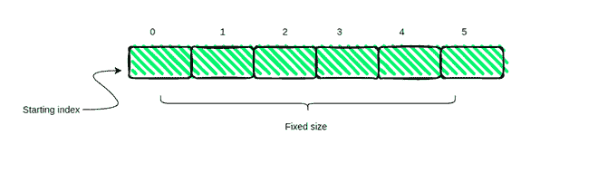

# TypedArray Object 在 JavaScript 中有什么用？

> 原文:[https://www . geeksforgeeks . org/type darray-object-in-JavaScript/](https://www.geeksforgeeks.org/what-is-the-use-of-typedarray-object-in-javascript/)的用途是什么

**简介:**Java 和 C++中的数组都是数据结构，都是**固定大小的连片**并且存储同构数据。这些阵列利用连续性和缓存来提高性能，从而减少随机访问时间。然而，JavaScript 数组是不同的野兽。与典型的数组不同，它们是动态的、稀疏的和非齐次的。起初，这给了他们低性能的假设(由于缓存功能的无能)，但实际情况是不同的。Javascript 引擎是非常聪明的动物。只要数据不是稀疏的，并且是同类的，Javascript 就会透明地将它们存储在连续的内存块中。因此行为有点像典型的阵列，并为我们提供了改进的性能。



**type darrys 的需求:**虽然 Javascript 数组表现不错，但是由于添加了 WebGL、Sockets 等，web 应用程序有所改进。需要改进性能。JavaScript 代码需要能够快速轻松地操作原始二进制数据。这就是**打字雷达**进入画面的地方。但是问题来了:如果**的 JavaScript 引擎**可以**优化下面的东西，为什么我们需要 TypesArrays？**要回答这个问题，我们需要知道数字和 JavaScript 数组是如何表现的？实际上，根据 [IEEE-754 标准](https://www.geeksforgeeks.org/ieee-standard-754-floating-point-numbers/)，JavaScript 中的所有数字都是 64 位浮点数，效率并不高。但是，**typedarray**允许我们拥有有符号和无符号整数的连续块 **8、** **16** 、 **32** 和 **64 位**以及 32 位和 64 位浮点数。

这使我们能够更加高效，因为它指定了要使用多少内存，并有助于以预期格式传输二进制数据。

**TypedArrays 的用途:**如果我们想以 16 位连续整数格式而不是传统的 64 位浮点格式传输二进制数据，TypedArrays 将是高效的。简单地说，使用 TypedArrays，我们正在创建内容受到严格控制的数组。

**示例 1:** 假设您想要在 web 上渲染一些 3d 图形。这需要能够将数字数组(比如像素值为 RGB)或一些数据传输到本机接口，该接口需要特定的大小(对于(0，255) 中的 **RGBA)。但是对于 TypedArrays，我们会实现大量的数据处理来确保事情正常工作，这也是 64 位浮点格式。**

## java 描述语言

```
<script>

    // pixelData array with pixel values
    const pixelData = [143, 1432, 728,
        913, 182, 64, 023, 343, 183, 194]

    // To convert pixel data into RGBA range ie. (0,255)
    const clampedRGBA = new Uint8ClampedArray(pixelData);

    console.log("Clamped PixelData: " + clampedRGBA)
</script>
```

**输出:**

```
Clamped PixelData: 143,255,255,255,182,64,19,255,183,194
```

**解释:**上面的输出显示了使用 Uint8ClampedArray 在不需要任何显式数据处理的情况下实现像素值箝位是多么容易。

**示例 2:** 在这个示例中，我们将看到如何将类型化的数组视图和 DataViews 附加到缓冲区，以读取指定文件的内容。许多应用编程接口使用类型数据，如**文件阅读器。文件阅读器可以作为数组缓冲区读取文件内容。**

## 超文本标记语言

```
<!DOCTYPE html>
<html lang="en">

<body>

    <input type="file" onchange='readFile(event)' />

    <br><br>
    <textarea cols="50" rows="10"></textarea>

    <script>
        var readFile = function (event) {
            var input = event.target;
            var text = "";
            var reader = new FileReader();

            reader.onload = function () {
                var arrayBuffer = reader.result;
                var idView = new Uint8Array(arrayBuffer);
                idView.forEach(function (alpha) {

                    // console.log(String.fromCharCode(alpha))
                    text = text + String.fromCharCode(alpha)
                });
                console.log(text);
                document.getElementsByTagName(
                    'textarea')[0].innerText = text;
            };
            reader.readAsArrayBuffer(input.files[0]);
        };
    </script>
</body>

</html>
```

**输出:**


**说明:**上面的例子向我们展示了如何借助 FileReader API 和 TypedArray 视图，查看文件或 blob 的内容。