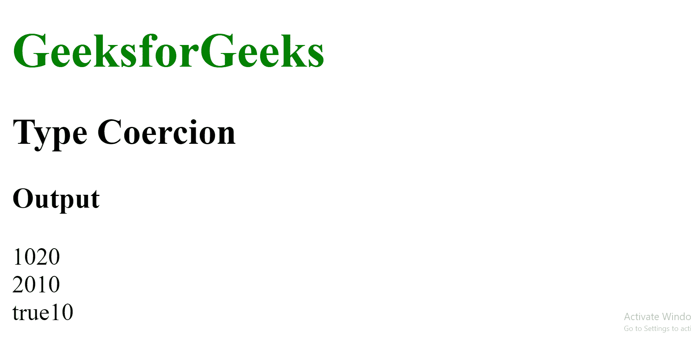
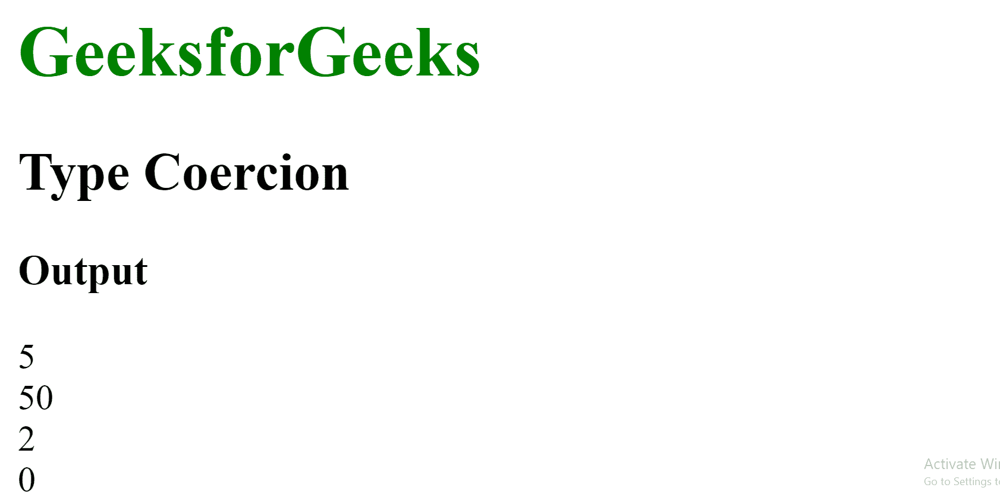
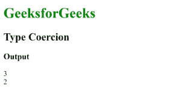

# 什么是 JavaScript 中的类型强制？

> 原文:[https://www . geesforgeks . org/什么是 javascript 中的类型强制/](https://www.geeksforgeeks.org/what-is-type-coercion-in-javascript/)

**类型强制**是指值从一种数据类型自动或隐式转换为另一种数据类型的过程。这包括从数字到字符串、字符串到数字、布尔到数字等的转换。当对值应用不同类型的运算符时。

如果隐式转换的行为不确定，数据类型的构造函数可用于将任何值转换为该数据类型，如 **Number()** 、 **String()** 或 **Boolean()** 构造函数。

**1。字符串到数字的转换:**当任何字符串或非字符串值被添加到字符串时，它总是隐式地将非字符串值转换为字符串。当字符串“Rahul”加到数字 10 时，JavaScript 不会给出错误。它使用强制将数字 10 转换为字符串“10”，然后将两个字符串连接起来。下面是更多的例子。

**示例:**

```html
<!DOCTYPE html>
<html>

<head>
    <title>
        What is Type Coercion 
        in JavaScript?
    </title>
</head>

<body>
    <h1 style="color: green;">
        GeeksforGeeks
    </h1>

    <h2>Type Coercion</h2>

    <h3>Output</h3>

    <script>

        // The Number 10 is converted to
        // string '10' and then '+'
        // concatenates both strings   
        var x = 10 + '20';
        var y = '20' + 10;

        // The Boolean value true is converted
        // to string 'true' and then '+'
        // concatenates both the strings
        var z = true + '10';

        document.write(x);
        document.write("<br>");
        document.write(y);
        document.write("<br>");
        document.write(z);
    </script>
</body>

</html>
```

**输出:**



**2。字符串到数字的转换:**当执行减法(-)、乘法(*)、除法(/)或模(%)等运算时，所有不是数字的值都会转换为数字数据类型，因为这些运算只能在数字之间执行。这方面的一些例子如下所示。

**示例:**

```html
<!DOCTYPE html>
<html>

<head>
    <title>
        What is Type Coercion
        in JavaScript?
    </title>
</head>

<body>
    <h1 style="color: green;">
        GeeksforGeeks
    </h1>

    <h2>Type Coercion</h2>

    <h3>Output</h3>

    <script>

        // The string '5' is converted
        // to number 5 in all cases
        // implicitly 
        var w = 10 - '5';
        var x = 10 * '5';
        var y = 10 / '5';
        var z = 10 % '5';

        document.write(w);
        document.write("<br>")
        document.write(x);
        document.write("<br>")
        document.write(y);
        document.write("<br>")
        document.write(z);         
    </script>
</body>

</html>
```

**输出:**



**3。将布尔值转换为数字:**当将布尔值添加到数字时，布尔值会转换为数字，因为将布尔值转换为数字值更安全、更容易。布尔值可以表示为“假”的 0 或“真”的 1。这方面的一些例子如下所示。

**示例:**

```html
<!DOCTYPE html>
<html>

<head>
    <title>
        What is Type Coercion
        in JavaScript?
    </title>
</head>

<body>
    <h1 style="color: green;">
        GeeksforGeeks
    </h1>

    <h2>Type Coercion</h2>

    <h3>Output</h3>

    <script>
        // The Boolean value true is
        // converted to number 1 and
        // then operation is performed
        var x = true + 2;

        // The Boolean value false is
        // converted to number 0 and
        // then operation is performed
        var y = false + 2;

        document.write(x);
        document.write("<br>")
        document.write(y);         
    </script>
</body>

</html>
```

**输出:**



**4。等式运算符:**等式运算符(==)可用于比较值，而不管其类型如何。这是通过将非数字数据类型强制转换为数字来实现的。这方面的一些例子如下:

**示例:**

```html
<!DOCTYPE html>
<html>

<head>
    <title>
        What is Type Coercion
        in JavaScript?
    </title>
</head>

<body>
    <h1 style="color: green;">
        GeeksforGeeks
    </h1>

    <h2>Type Coercion</h2>

    <h3>Output</h3>

    <script>

        // Should output 'true' as string '10'
        // is coerced to number 10 
        var x = (10 == '10');

        // Should output 'true', as boolean true
        // is coerced to number 1
        var y = (true == 1);

        // Should output 'false' as string 'true'
        // is coerced to NaN which is not equal to
        // 1 of Boolean true
        var z = (true == 'true');

        document.write(x);
        document.write("<br>");
        document.write(y);
        document.write("<br>");
        document.write(z);
    </script>
</body>

</html>
```

**输出:**

