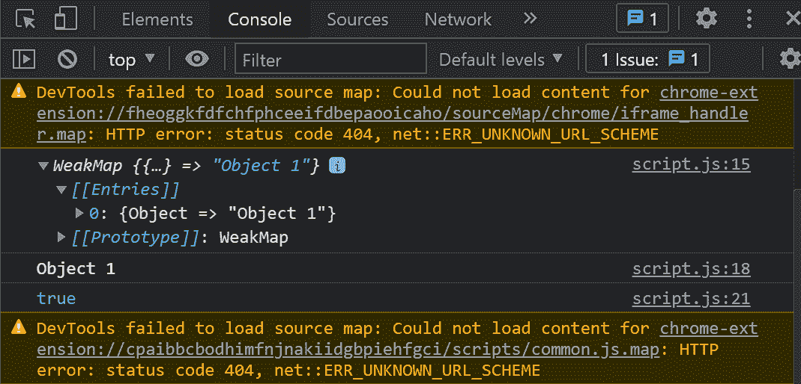

# ES6 中的 WeakMap 是什么？

> 原文:[https://www.geeksforgeeks.org/what-is-weakmap-in-es6/](https://www.geeksforgeeks.org/what-is-weakmap-in-es6/)

WeakMap 是 ES6 中引入的一种新的数据结构或集合。WeakMaps 允许您存储键值对的集合。它采用了地图的相同属性。主要区别在于 WeakMap 的键不能是原始数据类型。键必须是对象类型，值可以是任何数据类型。

另一个主要区别是 WeakMap 的**键**被弱引用。这意味着每当一个对象被用作 WeakMap 的密钥时，该对象都可以被垃圾收集。当对该对象的引用丢失时(即，将该对象引用指定为空)，就会发生这种情况。当对象不再使用时， [JavaScript 垃圾收集](https://www.geeksforgeeks.org/garbage-collection-in-javascript/)会检测到它，并将其从内存中释放出来。因此弱映射的键被弱引用。

**语法:**

```
const m = new WeakMap();
```

**参数:**它是一个可迭代对象，其元素采用键值对的形式。

**weak map 的功能:**

*   **[set(键，值)](https://www.geeksforgeeks.org/javascript-weakmap-set-with-examples/) :** 用于向 WeakMap 对象添加元素(键-值对)。
*   **[获取(键)](https://www.geeksforgeeks.org/javascript-weakmap-get/) :** 返回与指定“键”关联的值。
*   **[有(键)](https://www.geeksforgeeks.org/javascript-weakmap-has/) :** 该功能用于检查 WeakMap 中是否存在指定的“键”。如果存在，返回**真**，如果不存在，返回**假**。
*   **[删除(键)](https://www.geeksforgeeks.org/javascript-weakmap-delete/) :** 从武器地图对象中删除指定“键”的元素。

**示例:**显示这些函数工作情况的 JavaScript 代码。

## java 描述语言

```
// Creating a WeakMap Object
const m = new WeakMap();

// Adding elements in it

// Remember, only object can
// be a key in WeakMap
obj1 = {} 
m.set(obj1, "Object 1");
obj2 = {}
m.set(obj2, "Object 2");

// Use delete() function
m.delete(obj2);

// Print the WeakMap
console.log(m);

// Using get() function to get 
// specific element in WeakMap
console.log(m.get(obj1));

// Using has() function to check
// if a particular element is 
// present in WeakMap or not.
console.log(m.has(obj1));
```

**输出:**以下是上述代码在浏览器中的输出。



**说明:**

*   第一行是打印 WeakMap 的内容。
*   我们在打印 obj2 之前删除了它，因此它不会显示在控制台中。
*   在第二行中，我们使用了。函数，因此它返回了值，即对象 1。
*   第三行是我们试图找到 obj1 在 WeakMap 'm '中是否存在，它返回 **true** 。