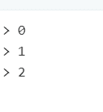
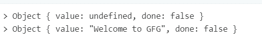

# JavaScript 中的 yield 关键字是什么？

> 原文:[https://www . geeksforgeeks . org/what-yield-关键字 in-javascript/](https://www.geeksforgeeks.org/whats-the-yield-keyword-in-javascript/)

**yield** 关键字用于异步恢复或暂停生成器功能。生成器函数就像普通函数一样，但不同的是，每当函数返回任何值时，它都会借助“yield”关键字来完成，而不是返回它。不能从嵌套函数或回调中调用 Yield。

yield 表达式返回一个具有两个属性的对象，**“值”**是实际值，**“完成”**是布尔值，当生成器函数完全完成时，它返回 *true* ，否则返回 false。

如果我们暂停 yield 表达式，生成器函数也将暂停，并且只有在我们调用 next()方法时才会恢复。当遇到 *next()* 方法时，函数继续工作，直到它面临另一个 yield 或返回表达式。

**例 1:**

```
function* showPrices(i) {
    while (i < 3) {
        yield i++;
    }
}

//creating an object for our function showPrices
const gfg = showPrices(0); 

//return 0 because 0 value is passed to the showPrices yield expression
console.log(gfg.next().value); 

// return 1
console.log(gfg.next().value); 

//return 2
console.log(gfg.next().value); 
```

**输出:**


**例 2:**

```
function* geeksforGeeks() {

  /*expression paused here and return
  value is undefined as nothing is declared*/
    yield; 

    //wait for next() to finish
    gfg(yield "Welcome to GFG"); 
}

function gfg(x) {
    console.log("Hello World ", x)
}

var generator = geeksforGeeks();

//return undefined
console.log(generator.next()); 

//return Welcome to GFG 
console.log(generator.next()); 

/*done remains false as we have not called next 
so that "Hello World" is still left there to process*/
```

**输出:**
