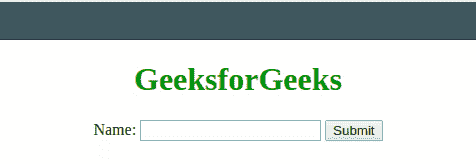

# 在 JavaScript 中什么时候为什么要‘返回 false’？

> 原文:[https://www . geeksforgeeks . org/何时以及为什么要在 javascript 中返回 false/](https://www.geeksforgeeks.org/when-and-why-to-return-false-in-javascript/)

在编程语言中，Return 语句用于跳过当前正在执行的函数并返回到调用者函数。Return 语句可以/不可以返回值。下面是 JavaScript 中一个返回语句的例子。

*   **例 1:**

    ```
    // The return statement returns
    // the product of 'a' and 'b'
    function myFunction(a, b) {
      return a * b;   
    }
    ```

*   **示例 2:** 同样，我们可以在一个简单的 JavaScript 函数中返回 true 或 false。

    ```
    function isEqual(num1, num2) {
        if (num1 == num2) {
            return true;
        } else {
            return false;
        }
    }
    ```

这些是 JavaScript 中 return false 语句的一些基本实现。然而，还有一些更有趣的实现。网络开发人员以不同的方式使用“返回假”。在表单提交过程中，如果某个条目未填写，return false 用于阻止表单的提交。

下面的例子说明了这种方法:

*   **例:**

    ```
    <!DOCTYPE html>
    <html>

    <head>
        <title>
            Return false
        </title>
        <script>
            function validateForm() {
                var x = document.forms["myForm"]["fname"].value;
                if (x == "") {
                    alert("Please fill all the entries");
                    return false;
                }
            }
        </script>
    </head>

    <body style="text-align:center;">
        <h1 style="color: green;"> 
                GeeksforGeeks 
        </h1>
        <form name="myForm" 
              action="/action_page.php" 
              onsubmit="return validateForm()" 
              method="post">
            Name:
            <input type="text" name="fname">
            <input type="submit" value="Submit">
        </form>
    </body>

    </html>
    ```

*   **输出:**
    