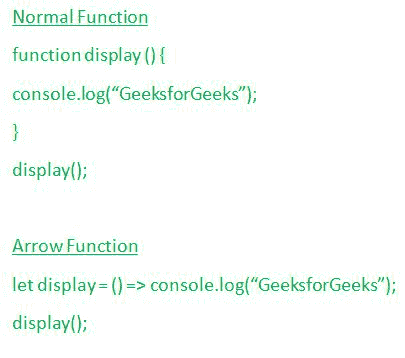

# 什么时候应该在 ES6 中使用 Arrow 函数？

> 原文:[https://www . geesforgeks . org/when-one-use-arrow-functions-in-es6/](https://www.geeksforgeeks.org/when-should-one-use-arrow-functions-in-es6/)

在本文中，我们将借助一些示例来尝试理解何时应该在 ES6 中使用 Arrow 函数而不是传统函数的语法。

在分析为什么我们应该使用箭头函数之前，让我们首先了解与箭头函数相关的基本细节(包括箭头函数的语法和更多细节)。

**箭头功能:**借助下面的图示，我们将尝试了解与箭头功能相关的基本细节。



正如我们可以想象的那样，传统的函数语法，大括号的使用，后面是函数关键字，并且它需要更多数量的可执行行，但是正如我们可以看到的事实，箭头函数允许任何用户以更紧凑的方式缩短编写传统函数的语法。

**编写箭头函数的语法:**下面是编写箭头函数的简单语法:

```
let name_of_function = (parameters) => ...
```

我们还可以在大括号内包含任意数量的参数(以此来显示变量被视为函数)。

**使用箭头功能的优势:**以下几点将描述与使用箭头功能而不是正常功能相关的优势列表–

*   这个箭头函数减少了大量代码，使模式更易读。
*   Arrow 函数语法自动将“this”绑定到周围代码的上下文。
*   写箭头 **= >** 比写**功能**关键字更灵活。

**什么时候应该使用 arrow 函数:**由于在前面的章节中，我们已经讨论了与 arrow 函数语法相关的语法、优点和灵活性，这里我们将看到并分析什么时候应该使用 Arrow 函数而不是普通函数。

*   我们可以在与数组相关联的方法中使用箭头函数语法，如 **map()、reduce()、filter()** ，因为通过使用箭头函数语法而不是使用普通函数语法，可以更容易地阅读和理解以及更有效地编写代码。
*   如果我们可以在声明承诺和回调时使用箭头函数，那么任何用户都更容易理解它们背后的概念，否则通过使用传统的函数语法概念，如回调 hells，承诺链接最终会变得更难理解，甚至编写会变得有点复杂。

让我们看一些例子，其中我们将只使用箭头函数语法，此外，我们将与箭头函数相关的良好的可读效果。

**示例 1:** 在本例中，我们将使用箭头功能来检查用户输入的数字是否大于 10。

## java 描述语言

```
<script>
    let checkNumber = (num) => num > 10 ? 
        console.log("Yes") : console.log("No");

    checkNumber(5);
    checkNumber(10);
    checkNumber(20);
    checkNumber(32);
</script>
```

**输出:**上述代码片段的输出如下:

```
No
No
Yes
Yes
```

**示例 2:** 在本例中，我们将使用数组方法(如 map、reduce 和 filter)对数组元素执行不同的操作。

## java 描述语言

```
<script>
    let array = [1, 3, 5, 8, 9, 7, 6, 2];

    let sumOfElements = 
        array.reduce((a, b) => a + b);
    console.log(sumOfElements);

    let multiplyElements = 
        array.map((element) => element * 10);
    console.log(multiplyElements);

    let filterElements = array.filter(
        (element) => element % 2 === 0);
    console.log(filterElements);
</script>
```

**输出:**上述代码片段的输出如下:

```
41
[
 10, 30, 50, 80,
 90, 70, 60, 20 
]
[ 8, 6, 2 ]
```

**使用箭头函数的限制:**以下是使用箭头函数的某些限制:

*   箭头函数没有自己的绑定。
*   箭头函数不能用作构造函数。
*   箭头函数不能在其体内使用 yield。